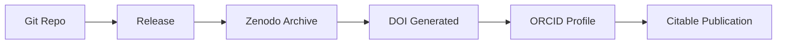

Have you ever seen something like `https://orcid.org/0000-0002-1825-0097` in a GitHub profile and wondered what it was? Or noticed those mysterious DOI badges on some repositories?

Today, I'll show you how to transform your GitHub repositories from "just another repo" into citable, trackable publications that can boost your professional profile.
<!--truncate-->

## What Are ORCID and DOI?

**ORCID** (Open Researcher and Contributor ID) is like a "social security number" for anyone who contributes to research and knowledge. Despite the name, you don't need to be a traditional researcher to get one.

**DOI** (Digital Object Identifier) is a permanent link to digital content. Think of it as a persistent URL that never breaks, even if your repository moves. More importantly, it ensures your work is preserved across multiple servers worldwide—so even if GitHub disappears tomorrow, your code remains accessible forever.

### Why Should Developers Care?

Instead of just saying "I build cool stuff," you can now say "I have 8 citable publications with measurable impact." <ins>Here's why this matters:</ins>

- **Professional credibility**: Your code becomes as credible as academic publications
- **Impact tracking**: See who cites your work and how it's being used
- **Long-term preservation**: Your work is archived on multiple servers worldwide
- **Platform independence**: Your code survives even if hosting platforms disappear
- **Career opportunities**: Stand out when applying to research-focused companies
- **Networking**: Connect with researchers and industry experts
- **Future-proofing**: If you ever want to transition into research or deep tech

### The Preservation Advantage

Here's something most developers don't think about: **digital preservation**. When you get a DOI through Zenodo, your code isn't just stored in one place—it's replicated across multiple servers in different countries, backed by institutions like CERN. 

<ins>This means:</ins>

- Your work survives platform shutdowns (remember SourceForge's decline?)
- No vendor lock-in—your DOI works regardless of where you host
- Academic-grade preservation standards (think centuries, not years)
- Automatic format migration when technologies become obsolete

## The Magic Triangle: Git Hosting → Zenodo → ORCID

<ins>Here's how the integration works:</ins>




<ins>Every time you create a release, Zenodo automatically:</ins>
1. Archives your code permanently
2. Generates a unique DOI
3. Makes it citable in academic papers
4. Updates your ORCID profile

### Platform Options

While this guide focuses on **GitHub** (most popular), Zenodo also integrates with:
- **[Codeberg](https://codeberg.org)** - Privacy-focused, European-based alternative
- **GitLab** - Self-hosted or GitLab.com
- **Direct upload** - For any git repository

**Why consider Codeberg?**
- Open source and community-driven
- No corporate surveillance
- European data protection (GDPR)
- Same Zenodo integration as GitHub

## Setting It Up (15 Minutes)

### Step 1: Get Your ORCID ID

1. Go to [orcid.org](https://orcid.org) and register (it's free!)
2. You'll get an ID like `0000-0002-1825-0097`
3. Add it to your GitHub profile

### Step 2: Prepare Your Repository

Create a `CITATION.cff` file in your repo root:

```yaml
cff-version: 1.2.0
title: "My Awesome Library"
message: "If you use this software, please cite it"
authors:
  - family-names: "Your Last Name"
    given-names: "Your First Name"
    orcid: "https://orcid.org/0000-0000-0000-0000"
repository-code: "https://github.com/yourusername/yourrepo"
license: MIT
version: "1.0.0"
date-released: "2025-06-29"
```

### Step 3: Connect to Zenodo

1. Go to [zenodo.org](https://zenodo.org)
2. Sign in with your preferred platform:
   - **GitHub** (most common)
   - **Codeberg** (privacy-focused alternative)
   - **GitLab** 
3. Go to your profile → Platform settings (e.g., "GitHub" or "GitLab")
4. Find your repository and **flip the switch** (important: do this before releasing!)

:::tip Codeberg Users
If you're using Codeberg, the process is identical—just select "GitLab" in Zenodo (Codeberg uses GitLab's API) and use your Codeberg credentials.
:::

### Step 4: Create Your First Release

```bash
git tag v1.0.0
git push origin v1.0.0
```

Or use GitHub's web interface: Releases → Create new release

### Step 5: Add the DOI Badge

After Zenodo processes your release (takes a few minutes), add this to your README:

```markdown
[](https://zenodo.org/badge/latestdoi/YOUR_REPO_ID)
```

Replace `YOUR_REPO_ID` with your GitHub repository ID available at `https://api.github.com/repos/username/repo-name`

## Automation with GitHub Actions

Here is how to harness GitHub Actions to automate two key tasks in your project’s lifecycle: updating your DOI metadata on every release (so your CITATION.cff always reflects the right version and date) and keeping a live, up-to-date mirror of your repository on Codeberg.

### Want to fully automate your DOI updates?

Create `.github/workflows/update-doi.yml`:

```yaml
name: Update DOI and Citation

on:
  release:
    types: [published]

permissions:
  contents: write

jobs:
  update-citation:
    runs-on: ubuntu-latest
    steps:
      - name: Checkout
        uses: actions/checkout@v4
        with:
          token: ${{ secrets.GITHUB_TOKEN }}

      - name: Wait for Zenodo processing
        run: sleep 300

      - name: Update CITATION.cff
        run: |
          sed -i "s/^version:.*/version: ${{ github.event.release.tag_name }}/" CITATION.cff
          sed -i "s/^date-released:.*/date-released: $(date +%Y-%m-%d)/" CITATION.cff

      - name: Commit changes
        run: |
          git config --local user.name "GitHub Action"
          git config --local user.email "action@github.com"
          git add CITATION.cff
          git commit -m "Update citation info for ${{ github.event.release.tag_name }}" || exit 0
          git push
```

### Want to mirror your repo for an extra backup on Codeberg?

Sign up for a Codeberg account and generate your `CODEBERG_TOKEN`.

Create a Codeberg repository using **the same name as your GitHub repo**.

Add a new workflow file at `.github/workflows/mirror.yml`:

```yaml
name: Mirror to Codeberg

on:
  workflow_dispatch:
  schedule:
    - cron: '30 0 * * 0'  # every Sunday at 00:30
  push:
    branches:
      - main

permissions:
  contents: read    # you’re only reading from GH

jobs:
  mirror:
    runs-on: ubuntu-latest

    # pull your Codeberg API token from secrets
    env:
      CODEBERG_TOKEN: ${{ secrets.CODEBERG_TOKEN }}

    steps:
      - name: Checkout full history
        uses: actions/checkout@v4
        with:
          fetch-depth: 0

      - name: Configure Git author
        run: |
          git config --global user.name "GitHub Actions"
          git config --global user.email "actions@github.com"

      - name: Add Codeberg remote & push
        run: |
          REMOTE="https://${CODEBERG_TOKEN}@codeberg.org/${{ github.repository }}.git"
          git remote add codeberg "$REMOTE" || true
          git push codeberg --all --force
          git push codeberg --tags --force
```


## Real-World Impact

<ins>Here are some examples of how this can change your career trajectory:</ins>

- **Data Science Libraries**: If you create ML tools, researchers will cite your work in papers. Pandas has 10,000+ citations!
- **Developer Tools**: Build something useful for the scientific community, and watch your reputation grow.
- **Algorithm Implementations**: Turn your clever algorithms into cited publications.

## Who's Already Doing This

<ins>Many successful developers use this approach:</ins>

- **Hadley Wickham** (ggplot2, dplyr) - thousands of citations led to leadership roles
- **Wes McKinney** (pandas) - leveraged citations to found new projects and companies
- **John Hunter** (matplotlib) - became a legend in the Python community

## Getting Started Today

The best time to start was when you created your first repository. The second-best time is now.

1. **Pick your best repository** - something you're proud of
2. **Follow the 5 steps above** - takes 15 minutes
3. **Create a release** - watch the magic happen
4. **Share it** - add your ORCID to your email signature, LinkedIn, etc.

## The Bottom Line

In a world where everyone codes, this is how you make your contributions **measurable**, **discoverable**, and **permanent**. It's not about ego—it's about building a professional identity that opens doors and ensuring your work survives the test of time.

Think about it: how many great projects have been lost to dead links, disappeared platforms, or forgotten repositories? With DOIs and proper archiving, your contributions become part of the permanent scientific and technical record.

Your code deserves to be more than just another repository that might vanish someday. Make it count, make it last.

## Resources

- [ORCID.org](https://orcid.org) - Get your researcher ID
- [Zenodo.org](https://zenodo.org) - Archive your code and get DOIs
- [Citation File Format](https://citation-file-format.github.io/) - Learn more about CITATION.cff
- [GitHub-Zenodo Integration Guide](https://guides.github.com/activities/citable-code/) - Official documentation
- [Codeberg.org](https://codeberg.org) - Privacy-focused Git hosting alternative