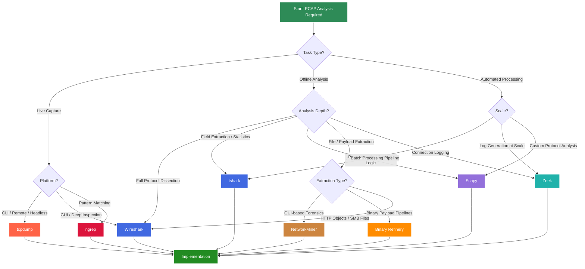
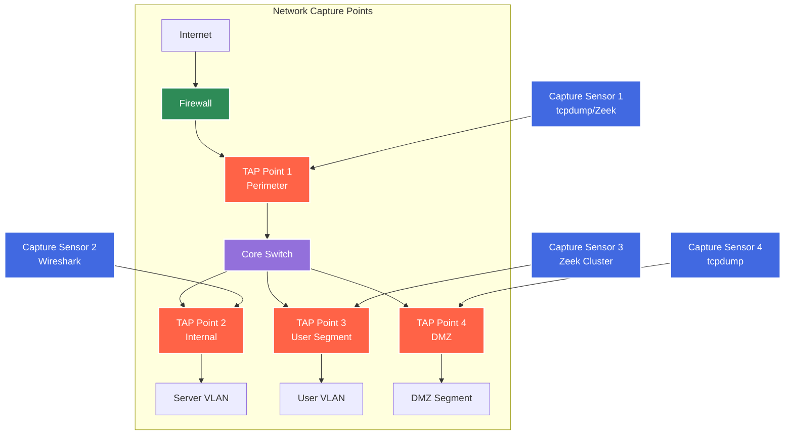

# Comprehensive PCAP Analysis and Network Forensics: An Academic Reference Manual

## Abstract

This comprehensive academic reference presents an exhaustive analysis of packet capture methodologies, traffic analysis frameworks, and network forensics techniques employed in modern cybersecurity operations. We examine eight primary analysis frameworks — tcpdump, Wireshark, tshark, Scapy, Binary Refinery, Zeek, NetworkMiner, and ngrep — providing detailed implementation examples, analytical workflows, and advanced detection techniques. This manual serves as both theoretical foundation and practical implementation guide for cybersecurity researchers, incident responders, CTF competitors, and network forensics practitioners.

## 1. Introduction

Packet capture analysis constitutes the foundational discipline of network forensics, enabling security professionals to reconstruct network communications, identify malicious activity, and extract forensic artifacts from recorded traffic. The ability to capture, parse, and interpret network packets at scale is essential for incident response, threat hunting, malware analysis, and security research.

### 1.1 PCAP Fundamentals

A packet capture (PCAP) file is a binary recording of network frames as observed by a network interface. Each captured packet preserves the complete frame including link-layer headers, network-layer addressing, transport-layer state, and application-layer payload. This preservation enables post-hoc reconstruction of network sessions with full fidelity.

The fundamental capture process operates at the kernel level through the Berkeley Packet Filter (BPF) subsystem on Unix-like systems and the WinPcap/Npcap driver on Windows. BPF provides a register-based virtual machine that evaluates filter expressions against each packet before copying it to userspace, minimizing the performance impact of capture operations.

### 1.2 Capture File Formats

| Format | Extension | Max Packet Size | Metadata Support | Nanosecond Precision | Tool Support |
|--------|-----------|-----------------|------------------|----------------------|-------------|
| PCAP (libpcap) | `.pcap` | 65535 bytes | Minimal | No | Universal |
| PCAPng | `.pcapng` | Configurable | Rich (comments, interfaces, statistics) | Yes | Wireshark, tshark, dumpcap |
| ERF (Endace) | `.erf` | Hardware-dependent | Hardware timestamps | Yes | Endace DAG, Wireshark |
| snoop | `.snoop` | 65535 bytes | Minimal | No | Solaris, Wireshark |
| NetMon | `.cap` | 65535 bytes | Microsoft-specific | No | Microsoft Network Monitor |

:::note
PCAPng is the modern standard and default format for Wireshark and dumpcap. It supports multiple capture interfaces in a single file, packet annotations, name resolution records, and custom metadata blocks. When compatibility with legacy tools is required, classic PCAP (libpcap) remains the safest choice. Use `editcap -F pcap input.pcapng output.pcap` to convert between formats.
:::

### 1.3 OSI Model and Tool Coverage

Understanding which tools operate at which OSI layers is critical for selecting the right analysis approach. The following diagram maps the eight tools covered in this manual to their primary analysis layers:

```mermaid
graph TB
    subgraph "OSI Layer Coverage by Tool"
        L7["Layer 7: Application<br/>HTTP, DNS, SMB, TLS"]
        L6["Layer 6: Presentation<br/>SSL/TLS, Encoding"]
        L5["Layer 5: Session<br/>NetBIOS, RPC"]
        L4["Layer 4: Transport<br/>TCP, UDP"]
        L3["Layer 3: Network<br/>IP, ICMP, ARP"]
        L2["Layer 2: Data Link<br/>Ethernet, 802.11"]
    end

    T1["tcpdump"] --> L2
    T1 --> L3
    T1 --> L4

    T2["Wireshark"] --> L2
    T2 --> L3
    T2 --> L4
    T2 --> L5
    T2 --> L6
    T2 --> L7

    T3["tshark"] --> L2
    T3 --> L3
    T3 --> L4
    T3 --> L5
    T3 --> L6
    T3 --> L7

    T4["Scapy"] --> L2
    T4 --> L3
    T4 --> L4
    T4 --> L7

    T5["Binary Refinery"] --> L7

    T6["Zeek"] --> L3
    T6 --> L4
    T6 --> L7

    T7["NetworkMiner"] --> L3
    T7 --> L4
    T7 --> L7

    T8["ngrep"] --> L3
    T8 --> L4
    T8 --> L7

    style L7 fill:#4169e1,stroke:#fff,stroke-width:2px,color:#fff
    style L6 fill:#5a7ec2,stroke:#fff,stroke-width:2px,color:#fff
    style L5 fill:#7393c3,stroke:#fff,stroke-width:2px,color:#fff
    style L4 fill:#8ca8c4,stroke:#fff,stroke-width:2px,color:#fff
    style L3 fill:#a5bdc5,stroke:#fff,stroke-width:2px,color:#fff
    style L2 fill:#bed2c6,stroke:#fff,stroke-width:2px,color:#fff

    style T1 fill:#ff6347,stroke:#fff,stroke-width:2px,color:#fff
    style T2 fill:#2e8b57,stroke:#fff,stroke-width:2px,color:#fff
    style T3 fill:#2e8b57,stroke:#fff,stroke-width:2px,color:#fff
    style T4 fill:#9370db,stroke:#fff,stroke-width:2px,color:#fff
    style T5 fill:#ff8c00,stroke:#fff,stroke-width:2px,color:#fff
    style T6 fill:#20b2aa,stroke:#fff,stroke-width:2px,color:#fff
    style T7 fill:#cd853f,stroke:#fff,stroke-width:2px,color:#fff
    style T8 fill:#dc143c,stroke:#fff,stroke-width:2px,color:#fff
```



### 1.4 Tool Selection Decision Framework

The following flowchart provides a systematic approach for selecting the appropriate PCAP analysis tool based on the task at hand:



### 1.5 Evaluation Framework

Each tool is evaluated across six critical dimensions relevant to PCAP analysis:

| Tool | Live Capture | Offline Analysis | Protocol Depth | Scriptability | Performance | GUI |
|------|-------------|-----------------|----------------|---------------|-------------|-----|
| tcpdump | Excellent | Basic | L2-L4 | BPF filters | Excellent | No |
| Wireshark | Excellent | Excellent | L2-L7 (3000+ protocols) | Lua, display filters | Moderate | Yes |
| tshark | Excellent | Excellent | L2-L7 (3000+ protocols) | Shell pipelines | Good | No |
| Scapy | Good | Excellent | L2-L7 (custom) | Full Python | Moderate | No |
| Binary Refinery | No | Payload-focused | L7 payload | Pipeline syntax | Good | No |
| Zeek | Excellent | Excellent | L3-L7 (connection-level) | Zeek scripting | Excellent | No |
| NetworkMiner | No | Excellent | L3-L7 (forensic focus) | Limited | Moderate | Yes |
| ngrep | Excellent | Good | L3-L7 (regex) | BPF + regex | Good | No |

:::note
Evaluation criteria are based on operational field experience, tool documentation, and comparative analysis in controlled environments. Ratings represent relative assessments under typical deployment scenarios. Tool capabilities may vary based on version, platform, and specific configuration.
:::

---

## 2. tcpdump: Command-Line Packet Capture

:::note
The following tcpdump commands require root/sudo privileges for live capture. Reading existing PCAP files does not require elevated privileges. All BPF filter expressions use the libpcap syntax shared by tcpdump, Wireshark capture filters, and ngrep.
:::

tcpdump is the canonical Unix packet capture utility and the most widely deployed network analysis tool in existence. Its importance extends beyond simple capture — the BPF (Berkeley Packet Filter) syntax it popularized has become the universal language for kernel-level packet filtering across virtually all capture tools. Understanding tcpdump means understanding the foundation upon which all other tools build.

### 2.1 Basic Capture Operations

The fundamental capture workflow involves selecting an interface, applying filters, and directing output to a file or terminal:

```bash
# List available interfaces
# The -D flag enumerates all interfaces the system can capture on,
# including loopback, physical NICs, and virtual adapters
tcpdump -D

# Capture on a specific interface with no DNS resolution
# -i specifies the interface, -n disables DNS lookups (critical for
# performance — reverse DNS queries can slow capture dramatically
# and may alert the target to your monitoring)
tcpdump -i eth0 -n

# Capture to file with packet count limit
# -w writes raw packets to file (not text), -c stops after N packets
# The pcap file preserves full packet data for later analysis
tcpdump -i eth0 -w capture.pcap -c 10000

# Read from existing capture file
# -r reads a pcap file instead of capturing live
# -n prevents DNS resolution (faster, deterministic output)
tcpdump -r capture.pcap -n

# Capture with timestamp precision
# -tttt prints human-readable timestamps with date
# Essential for incident timelines and log correlation
tcpdump -i eth0 -tttt -n

# Capture with increased verbosity
# -v, -vv, -vvv progressively increase protocol decode detail
# -vv shows TTL, IP ID, total length, checksum, and TCP options
tcpdump -i eth0 -vv -n
```

### 2.2 BPF Filter Syntax

BPF filters are the kernel-level mechanism that determines which packets are captured. Understanding BPF is essential because these filters execute inside the kernel's packet processing path — packets that don't match the filter are never copied to userspace, making BPF filters dramatically more efficient than capturing everything and filtering post-hoc.

```bash
# Filter by host (matches source OR destination)
tcpdump -i eth0 host 192.168.1.100

# Filter by source or destination specifically
tcpdump -i eth0 src host 10.0.0.1
tcpdump -i eth0 dst host 10.0.0.1

# Filter by network (CIDR notation)
# 'net' matches any packet where source OR destination falls in the subnet
tcpdump -i eth0 net 192.168.1.0/24

# Filter by port
tcpdump -i eth0 port 443
tcpdump -i eth0 src port 80
tcpdump -i eth0 dst port 53

# Filter by port range
tcpdump -i eth0 portrange 8000-9000

# Filter by protocol
tcpdump -i eth0 tcp
tcpdump -i eth0 udp
tcpdump -i eth0 icmp

# Compound filters using boolean operators
# 'and' (&&), 'or' (||), 'not' (!)
tcpdump -i eth0 'tcp and port 80 and host 192.168.1.100'
tcpdump -i eth0 'not port 22 and not port 53'
tcpdump -i eth0 '(dst port 80 or dst port 443) and src net 10.0.0.0/8'
```

### 2.3 Advanced BPF: TCP Flags and Byte Offsets

BPF's power comes from its ability to inspect arbitrary byte offsets within packets. This enables filtering on protocol fields that have no named filter primitive:

```bash
# TCP SYN packets only (flags byte = 0x02)
# tcp[13] accesses byte offset 13 in the TCP header (the flags byte)
# SYN=0x02 means only the SYN bit is set (no ACK, RST, etc.)
tcpdump -i eth0 'tcp[13] == 0x02'

# TCP SYN-ACK packets (flags = 0x12, SYN+ACK bits set)
tcpdump -i eth0 'tcp[13] == 0x12'

# TCP RST packets (connection resets — often indicates scanning or firewall blocks)
tcpdump -i eth0 'tcp[13] & 0x04 != 0'

# TCP packets with PSH flag set (data push — common in interactive sessions)
tcpdump -i eth0 'tcp[13] & 0x08 != 0'

# TCP packets with URG flag (rare in normal traffic — can indicate covert channels)
tcpdump -i eth0 'tcp[13] & 0x20 != 0'

# HTTP GET requests (match "GET " at the start of TCP payload)
# tcp[((tcp[12:1] & 0xf0) >> 2):4] calculates the TCP data offset
# dynamically and reads 4 bytes of payload
tcpdump -i eth0 'tcp[((tcp[12:1] & 0xf0) >> 2):4] = 0x47455420'

# DNS queries (UDP port 53, not responses)
# udp[10] is the flags byte in DNS; & 0x80 checks the QR bit
# QR=0 means query, QR=1 means response
tcpdump -i eth0 'udp port 53 and udp[10] & 0x80 = 0'
```

### 2.4 Hex Dump and Content Inspection

```bash
# Display packet contents in hex and ASCII
# -X shows both hex dump and ASCII decode side by side
# Essential for identifying cleartext credentials, protocol anomalies
tcpdump -r capture.pcap -X -n

# Hex dump only (no ASCII interpretation)
tcpdump -r capture.pcap -x -n

# Display link-layer header (Ethernet MAC addresses, VLAN tags)
# -e is critical for 802.1Q VLAN analysis and ARP investigations
tcpdump -r capture.pcap -e -n

# Capture with snap length control
# -s 0 captures full packets (default on modern systems)
# -s 96 captures only headers (saves disk space for connection-level analysis)
tcpdump -i eth0 -s 0 -w full_capture.pcap
tcpdump -i eth0 -s 96 -w headers_only.pcap

# Print packet contents as ASCII only (useful for cleartext protocols)
# -A is ideal for quickly spotting HTTP headers, SMTP commands, FTP credentials
tcpdump -r capture.pcap -A -n 'port 80'
```

### 2.5 Rotating Captures and Long-Running Collection

For continuous monitoring or incident capture, tcpdump supports file rotation to prevent disk exhaustion:

```bash
# Rotate capture files every 100MB, keeping 10 files
# -C specifies file size in millions of bytes (not megabytes — 100 = 100MB)
# -W limits the number of files (oldest is overwritten in ring buffer fashion)
tcpdump -i eth0 -w /captures/trace.pcap -C 100 -W 10 -n

# Rotate by time interval (every 3600 seconds = 1 hour)
# -G specifies rotation interval in seconds
# -w uses strftime format codes for unique filenames
tcpdump -i eth0 -w '/captures/trace_%Y%m%d_%H%M%S.pcap' -G 3600 -n

# Combined: rotate every 50MB OR every hour, keep 24 files
tcpdump -i eth0 -w '/captures/trace_%Y%m%d_%H%M%S.pcap' -C 50 -G 3600 -W 24 -n

# Background capture with logging
# nohup ensures capture survives terminal disconnect
nohup tcpdump -i eth0 -w '/captures/trace_%Y%m%d_%H%M%S.pcap' \
  -G 3600 -C 100 -W 48 -n \
  'not port 22' > /var/log/tcpdump.log 2>&1 &
```

### 2.6 Practical tcpdump Workflows

```bash
# Extract all unique destination IPs from a capture
tcpdump -r capture.pcap -n 'ip' 2>/dev/null | \
  awk '{print $5}' | cut -d. -f1-4 | sort -u

# Count packets per source IP (find noisy hosts)
tcpdump -r capture.pcap -n 2>/dev/null | \
  awk '{print $3}' | cut -d. -f1-4 | sort | uniq -c | sort -rn | head -20

# Extract DNS queries from capture
tcpdump -r capture.pcap -n 'udp port 53' 2>/dev/null | grep -oP 'A\? \K[^ ]+'

# Monitor for potential port scans (SYN without SYN-ACK from many ports)
tcpdump -i eth0 -n 'tcp[13] == 0x02' 2>/dev/null | \
  awk '{print $3, $5}' | sort | uniq -c | sort -rn | head -20
```

---

## 3. Wireshark: Deep Packet Inspection

:::note
Wireshark provides the most comprehensive protocol dissection available, supporting over 3,000 protocols. The following sections focus on practical analysis techniques. For live capture, Wireshark uses the same BPF filter syntax as tcpdump (Section 2.2) for capture filters, but uses a separate, more powerful display filter syntax for analysis.
:::

Wireshark is the de facto standard for interactive packet analysis. Its significance lies not merely in its GUI, but in the depth of its protocol dissection engine — the same engine that powers tshark (Section 4). Understanding Wireshark's display filter language is arguably the most important PCAP analysis skill, as it translates directly to tshark automation.

### 3.1 Capture Filters vs Display Filters

A critical distinction that often confuses newcomers: Wireshark has **two completely different filter systems** that serve different purposes.

**Capture filters** (BPF syntax) determine which packets are saved to the capture buffer. They execute in the kernel and cannot be changed after capture starts. They use the same syntax as tcpdump (Section 2.2).

**Display filters** are Wireshark's proprietary filter language applied post-capture. They operate on dissected protocol fields and can be modified at any time during analysis. Display filters are far more expressive than BPF because they have access to the full protocol dissection tree.

```
# CAPTURE FILTER (BPF syntax - applied before capture)
tcp port 80 and host 192.168.1.100

# DISPLAY FILTER (Wireshark syntax - applied after capture)
http.request.method == "GET" && ip.addr == 192.168.1.100
```

### 3.2 Essential Display Filters

Display filters use a `protocol.field` syntax with comparison operators. Every field visible in Wireshark's packet detail pane can be used as a filter:

```
# Filter by IP address (source or destination)
ip.addr == 192.168.1.100
ip.src == 10.0.0.1
ip.dst == 10.0.0.1

# Filter by subnet
ip.addr == 192.168.1.0/24

# Filter by TCP port
tcp.port == 443
tcp.srcport == 80
tcp.dstport == 8080

# Filter by protocol
http
dns
tls
smb
smb2
ftp
smtp

# HTTP-specific filters
http.request.method == "POST"
http.response.code == 200
http.response.code >= 400
http.host contains "example.com"
http.request.uri contains "/api/"
http.content_type contains "json"
http.cookie contains "session"
http.user_agent contains "curl"

# DNS-specific filters
dns.qry.name contains "evil.com"
dns.qry.type == 1          # A records
dns.qry.type == 28         # AAAA records
dns.qry.type == 16         # TXT records (common in tunneling)
dns.flags.response == 1    # DNS responses only
dns.resp.len > 100         # Large DNS responses (possible tunneling)

# TLS/SSL filters
tls.handshake.type == 1    # Client Hello
tls.handshake.type == 2    # Server Hello
tls.handshake.extensions_server_name contains "example.com"  # SNI
tls.record.version == 0x0303  # TLS 1.2

# TCP analysis filters (Wireshark's TCP expert info)
tcp.analysis.retransmission           # Retransmissions
tcp.analysis.duplicate_ack            # Duplicate ACKs
tcp.analysis.zero_window              # Zero window (flow control)
tcp.analysis.reset                    # Connection resets
tcp.flags.syn == 1 && tcp.flags.ack == 0  # SYN only (connection initiation)

# Frame and general filters
frame.len > 1500           # Jumbo frames or fragmentation
frame.time >= "2024-01-15 08:00:00" && frame.time <= "2024-01-15 09:00:00"

# Compound filters
http.request && ip.src == 192.168.1.0/24
dns && !dns.flags.response  # DNS queries only
tcp.port == 445 && smb2     # SMB2 traffic on expected port
```

### 3.3 Following Streams

Stream following is one of Wireshark's most powerful features. It reconstructs the bidirectional conversation between two endpoints, presenting the data as the applications saw it:

- **Follow TCP Stream** (`Analyze > Follow > TCP Stream` or right-click a packet): Reconstructs the full TCP session. Critical for analyzing HTTP conversations, SMTP exchanges, FTP commands, and any cleartext protocol. The stream view color-codes client data (red) and server data (blue).

- **Follow UDP Stream**: Reconstructs UDP exchanges between two endpoints on specific ports. Essential for DNS analysis, TFTP transfers, and SIPS/RTP.

- **Follow TLS Stream**: If TLS keys are loaded (Section 3.6), reconstructs the decrypted application data.

- **Follow HTTP Stream**: Reconstructs HTTP request/response pairs with automatic decompression of gzip/deflate content encoding.

```
# Display filter to isolate a specific TCP stream
# The stream index is assigned sequentially by Wireshark
tcp.stream eq 42

# Filter all streams involving a specific host
ip.addr == 192.168.1.100 && tcp.stream

# Filter a specific UDP stream
udp.stream eq 7
```

### 3.4 Statistics and Analysis Menus

Wireshark's Statistics menu provides aggregate views that are essential for understanding traffic patterns:

- **Conversations** (`Statistics > Conversations`): Shows all endpoint pairs with byte counts, packet counts, and duration. Sort by bytes to find the largest data transfers. The TCP tab is most useful for identifying persistent connections.

- **Protocol Hierarchy** (`Statistics > Protocol Hierarchy`): Tree view showing the percentage of traffic by protocol. Immediately reveals unusual protocols or unexpected traffic composition.

- **Endpoints** (`Statistics > Endpoints`): Lists all unique endpoints (IP, TCP, UDP, Ethernet) with traffic statistics. Essential for identifying the most active hosts.

- **IO Graphs** (`Statistics > IO Graphs`): Time-series visualization of traffic volume. Add display filters as separate graph lines to compare traffic patterns. Useful for identifying beaconing behavior.

- **DNS** (`Statistics > DNS`): Aggregate DNS statistics including query types, response codes, and timing.

- **HTTP** (`Statistics > HTTP`): Request/response statistics, load distribution, and packet counters by server.

- **Expert Information** (`Analyze > Expert Information`): Wireshark's automated analysis showing warnings, errors, and anomalies detected in the capture. Categories include:
  - **Errors**: Malformed packets, checksum failures
  - **Warnings**: Retransmissions, out-of-order segments, zero windows
  - **Notes**: TCP window updates, connection resets
  - **Chats**: Normal protocol operations (SYN, FIN)

### 3.5 Exporting Objects and Artifacts

Wireshark can reassemble and export files transferred over several protocols:

- **Export HTTP Objects** (`File > Export Objects > HTTP`): Extracts all files downloaded over HTTP — HTML pages, images, JavaScript, uploaded files. Essential for malware download analysis.

- **Export SMB Objects** (`File > Export Objects > SMB`): Extracts files transferred via SMB/CIFS. Critical for investigating lateral movement and data exfiltration in Windows environments.

- **Export IMF Objects** (`File > Export Objects > IMF`): Extracts email messages from SMTP traffic (Internet Message Format).

- **Export TFTP Objects** (`File > Export Objects > TFTP`): Extracts files from TFTP transfers (common in network device configuration and PXE boot scenarios).

```
# Display filter to identify HTTP file downloads
http.content_type contains "application"
http.response.code == 200 && http.content_length > 10000

# Identify SMB file transfers
smb2.cmd == 5  # SMB2 CREATE (file open/create)
smb2.cmd == 8  # SMB2 READ
smb2.cmd == 9  # SMB2 WRITE
```

### 3.6 TLS Decryption

Wireshark can decrypt TLS traffic using pre-master secrets logged by browsers or applications. This is essential for analyzing HTTPS traffic, encrypted C2 communications, and TLS-wrapped protocols.

**Method 1: Pre-Master Secret Log (Browser)**

Set the `SSLKEYLOGFILE` environment variable before launching the browser. The browser writes TLS session keys to this file:

```bash
# Linux/macOS
export SSLKEYLOGFILE=/tmp/tls_keys.log
firefox &

# Windows (PowerShell)
$env:SSLKEYLOGFILE="C:\temp\tls_keys.log"
Start-Process chrome
```

In Wireshark: `Edit > Preferences > Protocols > TLS > (Pre)-Master-Secret log filename` — set to the key log file path. All captured TLS sessions matching keys in the file will be decrypted in real-time.

**Method 2: RSA Private Key (Server-side)**

If you possess the server's RSA private key and the session uses RSA key exchange (not ECDHE/DHE), configure it in `Edit > Preferences > Protocols > TLS > RSA keys list`:

```
IP: 10.0.0.1, Port: 443, Protocol: http, Key File: /path/to/server.key
```

:::note
RSA key decryption only works when the TLS session uses RSA key exchange (not forward-secret cipher suites like ECDHE). Modern TLS configurations use forward secrecy by default, making the pre-master secret log method (Method 1) the only viable approach in most cases.
:::

### 3.7 Custom Profiles and Columns

Wireshark profiles allow you to maintain different display configurations for different analysis tasks:

- **Create Profile**: `Edit > Configuration Profiles > New` or press `Ctrl+Shift+A`
- **Useful custom columns** (right-click column header > Column Preferences):
  - `tcp.stream` — Stream index for tracking conversations
  - `http.host` — HTTP Host header
  - `tls.handshake.extensions_server_name` — TLS SNI (Server Name Indication)
  - `dns.qry.name` — DNS query name
  - `http.request.uri` — HTTP request URI
  - `tcp.len` — TCP payload length (excluding headers)
  - `ip.ttl` — IP TTL (useful for OS fingerprinting and traceroute detection)

### 3.8 Command-Line Wireshark Operations

```bash
# Open specific file with display filter applied
wireshark -r capture.pcap -Y "http.request"

# Open file and jump to specific packet
wireshark -r capture.pcap -g 1500

# Merge multiple capture files
mergecap -w merged.pcap capture1.pcap capture2.pcap capture3.pcap

# Split capture by time intervals (1 hour per file)
editcap -i 3600 large_capture.pcap split_output.pcap

# Extract specific packet range
editcap -r capture.pcap subset.pcap 100-200

# Remove duplicate packets
editcap -d capture.pcap deduped.pcap

# Convert file format
editcap -F pcap input.pcapng output.pcap
editcap -F pcapng input.pcap output.pcapng

# Trim packet snaplen (anonymize payloads, reduce file size)
editcap -s 64 capture.pcap headers_only.pcap
```

---

## 4. tshark: Command-Line Protocol Analysis

:::note
tshark is Wireshark's command-line counterpart, sharing the exact same dissection engine and display filter language. The key advantage of tshark over Wireshark is automation — tshark can be embedded in shell scripts, piped to other tools, and run on headless servers where no GUI is available.
:::

tshark bridges the gap between tcpdump's simplicity and Wireshark's analytical depth. It provides full protocol dissection via the command line, making it indispensable for batch processing, automated analysis pipelines, and remote server investigations.

### 4.1 Basic tshark Operations

```bash
# Read a capture file with default output (similar to tcpdump)
tshark -r capture.pcap

# Apply display filter (same syntax as Wireshark)
tshark -r capture.pcap -Y "http.request"

# Limit output to first N packets
tshark -r capture.pcap -c 100

# Live capture with display filter
tshark -i eth0 -Y "dns" -n

# Capture with ring buffer (similar to tcpdump rotation)
tshark -i eth0 -b filesize:100000 -b files:10 -w /captures/ring.pcap
```

### 4.2 Field Extraction with -T fields

The `-T fields` output mode is tshark's most powerful feature for data extraction. It outputs only the specified fields, tab-separated, one packet per line — perfect for piping to awk, sort, cut, or any other Unix tool:

```bash
# Extract source IP, destination IP, and destination port
tshark -r capture.pcap -T fields \
  -e ip.src -e ip.dst -e tcp.dstport

# Extract HTTP request details
# -E header=y adds a header row, separator=, produces CSV output
tshark -r capture.pcap -Y "http.request" -T fields \
  -e frame.time -e ip.src -e http.host -e http.request.uri \
  -e http.user_agent -E header=y -E separator=,

# Extract DNS queries with response IPs
tshark -r capture.pcap -Y "dns.flags.response == 1" -T fields \
  -e dns.qry.name -e dns.a -E separator=,

# Extract TLS Server Name Indication (SNI) from Client Hello
tshark -r capture.pcap -Y "tls.handshake.type == 1" -T fields \
  -e ip.src -e tls.handshake.extensions_server_name

# Extract all unique JA3 hashes
tshark -r capture.pcap -Y "tls.handshake.type == 1" -T fields \
  -e ip.src -e tls.handshake.ja3

# Extract TCP stream data as hex
tshark -r capture.pcap -q -z "follow,tcp,hex,0"
```

### 4.3 JSON and XML Output

For structured data processing, tshark can output full packet dissections as JSON or XML:

```bash
# Full packet dissection as JSON
tshark -r capture.pcap -T json -c 10 > packets.json

# JSON output with specific fields only
tshark -r capture.pcap -Y "http.request" -T ek \
  -e ip.src -e http.host -e http.request.uri > http_requests.jsonl

# PDML (Packet Details Markup Language) XML output
tshark -r capture.pcap -T pdml -c 10 > packets.xml

# JSON with elapsed time (useful for latency analysis)
tshark -r capture.pcap -T json -e frame.time_delta_displayed \
  -e ip.src -e ip.dst -e tcp.analysis.ack_rtt
```

### 4.4 Statistics with -z

The `-z` flag provides pre-built statistical analysis identical to Wireshark's Statistics menu:

```bash
# Protocol hierarchy (what percentage of traffic is each protocol?)
tshark -r capture.pcap -q -z io,phs

# Conversation statistics (top talkers)
tshark -r capture.pcap -q -z conv,tcp
tshark -r capture.pcap -q -z conv,ip

# Endpoint statistics
tshark -r capture.pcap -q -z endpoints,ip

# HTTP request/response statistics
tshark -r capture.pcap -q -z http,tree
tshark -r capture.pcap -q -z http_req,tree
tshark -r capture.pcap -q -z http_srv,tree

# DNS statistics
tshark -r capture.pcap -q -z dns,tree

# IO statistics at 30-second intervals (identify traffic spikes)
tshark -r capture.pcap -q -z io,stat,30

# IO statistics with display filter (compare normal vs suspicious traffic)
tshark -r capture.pcap -q -z io,stat,60,"dns","http","tcp.analysis.retransmission"

# Follow a specific TCP stream
tshark -r capture.pcap -q -z "follow,tcp,ascii,0"

# Expert info summary (errors, warnings, notes)
tshark -r capture.pcap -q -z expert

# SMB command summary
tshark -r capture.pcap -q -z smb,srt

# RPC program statistics
tshark -r capture.pcap -q -z rpc,programs
```

### 4.5 Automation Pipelines

tshark's real power emerges when combined with shell pipelines for automated analysis:

```bash
# Top 20 DNS domains queried
tshark -r capture.pcap -Y "dns.flags.response == 0" -T fields \
  -e dns.qry.name 2>/dev/null | sort | uniq -c | sort -rn | head -20

# HTTP requests grouped by host, sorted by count
tshark -r capture.pcap -Y "http.request" -T fields \
  -e http.host 2>/dev/null | sort | uniq -c | sort -rn

# Extract all unique User-Agent strings
tshark -r capture.pcap -Y "http.user_agent" -T fields \
  -e http.user_agent 2>/dev/null | sort -u

# Identify potential beaconing (regular interval connections)
tshark -r capture.pcap -Y "ip.dst == 10.10.10.10" -T fields \
  -e frame.time_epoch 2>/dev/null | \
  awk 'NR>1{print $1-prev}{prev=$1}' | sort | uniq -c | sort -rn | head -10

# Extract all downloaded files' hashes
tshark -r capture.pcap -Y "http.response && http.content_type contains application" \
  -T fields -e http.content_type -e http.response.code \
  -e tcp.stream 2>/dev/null

# List all TLS certificate subjects
tshark -r capture.pcap -Y "tls.handshake.type == 11" -T fields \
  -e tls.handshake.certificate 2>/dev/null

# Count packets per minute (traffic timeline)
tshark -r capture.pcap -T fields -e frame.time_epoch 2>/dev/null | \
  awk '{print int($1/60)*60}' | sort | uniq -c

# Export specific TCP stream payload to file
tshark -r capture.pcap -q -z "follow,tcp,raw,5" 2>/dev/null | \
  tail -n +7 | xxd -r -p > stream5_payload.bin
```

### 4.6 Batch Processing Multiple PCAPs

```bash
# Process all pcap files in a directory
for f in /captures/*.pcap; do
  echo "=== Processing: $f ==="
  tshark -r "$f" -q -z io,phs 2>/dev/null
done

# Merge and analyze multiple captures
mergecap -w /tmp/merged.pcap /captures/*.pcap
tshark -r /tmp/merged.pcap -q -z conv,tcp

# Parallel processing with GNU parallel
find /captures/ -name "*.pcap" | parallel -j4 \
  'tshark -r {} -Y "dns" -T fields -e dns.qry.name 2>/dev/null' | \
  sort | uniq -c | sort -rn > all_dns_queries.txt
```

---

## 5. Scapy: Programmatic Packet Analysis

:::note
Scapy is a Python-based packet manipulation library that provides full programmatic control over packet construction, transmission, and analysis. Install with `pip install scapy`. Scapy excels when you need custom analysis logic that goes beyond what filter expressions can express.
:::

Scapy occupies a unique position in the PCAP analysis toolkit. While tcpdump and tshark operate on predefined protocol dissections, Scapy gives you Python-level access to every byte of every packet. This makes it the tool of choice for custom protocol analysis, packet crafting, unusual format handling, and any analysis that requires programmatic logic.

### 5.1 Reading and Basic Analysis

```python
from scapy.all import *

# Read a PCAP file
packets = rdpcap("capture.pcap")

# Basic information
print(f"Total packets: {len(packets)}")
print(f"First packet: {packets[0].summary()}")
print(f"Capture duration: {packets[-1].time - packets[0].time:.2f} seconds")

# Display packet structure (shows all layers and fields)
packets[0].show()

# Access specific layers
# Scapy uses the layer class name to index into the packet
pkt = packets[0]
if pkt.haslayer(IP):
    print(f"Source: {pkt[IP].src}")
    print(f"Destination: {pkt[IP].dst}")
    print(f"TTL: {pkt[IP].ttl}")
    print(f"Protocol: {pkt[IP].proto}")

if pkt.haslayer(TCP):
    print(f"Source port: {pkt[TCP].sport}")
    print(f"Dest port: {pkt[TCP].dport}")
    print(f"Flags: {pkt[TCP].flags}")
    print(f"Sequence: {pkt[TCP].seq}")
```

### 5.2 Filtering and Iteration

```python
from scapy.all import *
from collections import Counter

packets = rdpcap("capture.pcap")

# Filter packets using list comprehension
# This is equivalent to a display filter but with full Python expressiveness
http_packets = [p for p in packets if p.haslayer(TCP) and
                (p[TCP].dport == 80 or p[TCP].sport == 80)]
dns_packets = [p for p in packets if p.haslayer(UDP) and
               (p[UDP].dport == 53 or p[UDP].sport == 53)]

# Count packets by destination IP
dst_counts = Counter()
for pkt in packets:
    if pkt.haslayer(IP):
        dst_counts[pkt[IP].dst] += 1

print("Top 10 destination IPs:")
for ip, count in dst_counts.most_common(10):
    print(f"  {ip}: {count} packets")

# Calculate bytes transferred per conversation
conversations = {}
for pkt in packets:
    if pkt.haslayer(IP) and pkt.haslayer(TCP):
        key = tuple(sorted([
            f"{pkt[IP].src}:{pkt[TCP].sport}",
            f"{pkt[IP].dst}:{pkt[TCP].dport}"
        ]))
        conversations[key] = conversations.get(key, 0) + len(pkt)

# Sort by bytes transferred
for conv, bytes_total in sorted(conversations.items(),
                                 key=lambda x: x[1], reverse=True)[:10]:
    print(f"  {conv[0]} <-> {conv[1]}: {bytes_total} bytes")
```

### 5.3 Payload Extraction

```python
from scapy.all import *

packets = rdpcap("capture.pcap")

# Extract raw TCP payload from a specific stream
def extract_stream(packets, stream_src, stream_dst, sport, dport):
    """Reassemble a TCP stream's payload (simplified, no reordering)."""
    payload = b""
    for pkt in packets:
        if (pkt.haslayer(TCP) and pkt.haslayer(Raw) and
            pkt[IP].src == stream_src and pkt[IP].dst == stream_dst and
            pkt[TCP].sport == sport and pkt[TCP].dport == dport):
            payload += bytes(pkt[Raw])
    return payload

# Extract HTTP responses
for pkt in packets:
    if pkt.haslayer(TCP) and pkt.haslayer(Raw):
        payload = bytes(pkt[Raw])
        if b"HTTP/1.1 200" in payload:
            print(f"HTTP 200 from {pkt[IP].src}:{pkt[TCP].sport}")
            # Find content after headers
            if b"\r\n\r\n" in payload:
                headers, body = payload.split(b"\r\n\r\n", 1)
                print(f"  Headers: {headers[:200]}")
                print(f"  Body length: {len(body)} bytes")

# Extract DNS queries
for pkt in packets:
    if pkt.haslayer(DNSQR):
        qname = pkt[DNSQR].qname.decode()
        qtype = pkt[DNSQR].qtype
        print(f"DNS query: {qname} (type {qtype})")

# Write extracted payload to file
stream_data = extract_stream(packets, "192.168.1.100", "10.10.10.10", 49152, 80)
with open("extracted_payload.bin", "wb") as f:
    f.write(stream_data)
```

### 5.4 Packet Crafting and Replay

Scapy's packet crafting capabilities are essential for testing and validation:

```python
from scapy.all import *

# Craft a simple TCP SYN packet
syn = IP(dst="192.168.1.1")/TCP(dport=80, flags="S")

# Craft an ICMP ping
ping = IP(dst="192.168.1.1")/ICMP()

# Craft a DNS query
dns_query = IP(dst="8.8.8.8")/UDP(dport=53)/DNS(
    rd=1, qd=DNSQR(qname="example.com", qtype="A")
)

# Craft a custom HTTP GET request
http_req = (IP(dst="192.168.1.100")/TCP(dport=80, flags="PA")/
            Raw(load="GET / HTTP/1.1\r\nHost: example.com\r\n\r\n"))

# Read PCAP, modify packets, write new PCAP
# Useful for anonymizing captures or creating test data
packets = rdpcap("original.pcap")
modified = []
for pkt in packets:
    if pkt.haslayer(IP):
        # Anonymize source IPs in 192.168.x.x range
        if pkt[IP].src.startswith("192.168."):
            pkt[IP].src = "10.0.0.1"
        # Recalculate checksums (del forces Scapy to recompute)
        del pkt[IP].chksum
        if pkt.haslayer(TCP):
            del pkt[TCP].chksum
    modified.append(pkt)
wrpcap("anonymized.pcap", modified)
```

### 5.5 Custom Dissectors

```python
from scapy.all import *

# Define a custom protocol layer
# This example shows a simple binary protocol with:
#   - 2-byte message type
#   - 4-byte payload length
#   - Variable payload
class CustomProto(Packet):
    name = "CustomProtocol"
    fields_desc = [
        ShortField("msg_type", 0),
        IntField("payload_len", 0),
        StrLenField("payload", b"",
                     length_from=lambda pkt: pkt.payload_len)
    ]

# Bind the custom protocol to a specific TCP port
bind_layers(TCP, CustomProto, dport=9999)
bind_layers(TCP, CustomProto, sport=9999)

# Now Scapy will automatically dissect traffic on port 9999
packets = rdpcap("custom_protocol.pcap")
for pkt in packets:
    if pkt.haslayer(CustomProto):
        print(f"Type: {pkt[CustomProto].msg_type}")
        print(f"Payload: {pkt[CustomProto].payload}")
```

### 5.6 Statistical Analysis with Scapy

```python
from scapy.all import *
import statistics

packets = rdpcap("capture.pcap")

# Analyze packet inter-arrival times (detect beaconing)
timestamps = [float(pkt.time) for pkt in packets
              if pkt.haslayer(IP) and pkt[IP].dst == "10.10.10.10"]

if len(timestamps) > 1:
    intervals = [timestamps[i+1] - timestamps[i]
                 for i in range(len(timestamps)-1)]
    print(f"Mean interval: {statistics.mean(intervals):.3f}s")
    print(f"Std deviation: {statistics.stdev(intervals):.3f}s")
    print(f"Median interval: {statistics.median(intervals):.3f}s")
    # Low standard deviation relative to mean suggests beaconing
    cv = statistics.stdev(intervals) / statistics.mean(intervals)
    print(f"Coefficient of variation: {cv:.3f}")
    if cv < 0.1:
        print("WARNING: Very regular intervals — possible beaconing!")

# Packet size distribution
sizes = [len(pkt) for pkt in packets]
print(f"\nPacket size stats:")
print(f"  Min: {min(sizes)}, Max: {max(sizes)}")
print(f"  Mean: {statistics.mean(sizes):.1f}")
print(f"  Median: {statistics.median(sizes)}")

# TTL analysis (OS fingerprinting)
ttl_counts = Counter()
for pkt in packets:
    if pkt.haslayer(IP):
        ttl_counts[pkt[IP].ttl] += 1
print(f"\nTTL distribution: {ttl_counts.most_common(5)}")
# Common initial TTLs: 64 (Linux), 128 (Windows), 255 (Solaris/Cisco)
```

---

## 6. Binary Refinery: Payload Extraction Pipelines

:::note
Binary Refinery (binref) is a Python-based toolkit for binary data transformation using a Unix pipeline metaphor. Install with `pip install binary-refinery`. Its strength lies in chaining transformation units to decode, decrypt, decompress, and extract payloads from captured network data — operations that would require extensive custom code in other tools.
:::

Binary Refinery addresses a gap that other PCAP tools leave open: once you've extracted a binary payload from a network stream, you often need to decode, decrypt, or decompress it through multiple transformation stages. Binary Refinery provides composable transformation units that chain together via shell pipes, enabling complex payload processing in a single command line.

### 6.1 Pipeline Architecture

[Binary Refinery's core concept](../reverse/binary_refinery.md) is the **unit** — a single-purpose transformation. Units are chained with pipes (`|`), each consuming the output of the previous unit. This mirrors the Unix philosophy but operates on binary data rather than text.

```bash
# Basic pipeline: read file, decode base64, decompress gzip
emit payload.bin | b64 | zl | dump extracted.bin

# The pipeline reads left to right:
# 1. emit: read the input file
# 2. b64: base64 decode
# 3. zl: zlib decompress
# 4. dump: write output to file
```

### 6.2 Common Transformation Units

```bash
# Base64 decode
emit encoded.txt | b64 | dump decoded.bin

# Hex decode
emit hex_data.txt | hex | dump decoded.bin

# XOR with a known key
emit encrypted.bin | xor h:DEADBEEF | dump decrypted.bin

# XOR with single-byte brute force (common in malware)
emit encrypted.bin | xor -r 1 | carve -p MZ | dump malware.exe

# Decompress zlib (commonly used in HTTP compressed responses)
emit compressed.bin | zl | dump decompressed.bin

# Decompress gzip
emit compressed.gz | gz | dump decompressed.bin

# URL decode
emit url_encoded.txt | url | dump decoded.txt

# AES decrypt (CBC mode with known key and IV)
emit encrypted.bin | aes -m cbc h:0011223344556677... h:AABBCCDD... | dump decrypted.bin

# RC4 decrypt
emit encrypted.bin | rc4 h:SECRETKEY | dump decrypted.bin

# Extract strings (like Unix strings command but with more options)
emit binary.bin | strings -n 8 | dump strings.txt

# Extract PE files from binary data
emit memory_dump.bin | carve -p MZ | dump extracted_%d.exe

# Extract URLs from binary data
emit binary.bin | urlguard | dump urls.txt
```

### 6.3 Integrating with tshark

The real power of Binary Refinery emerges when combined with tshark to extract and transform network payloads:

```bash
# Extract HTTP response body, base64 decode it
tshark -r capture.pcap -q -z "follow,tcp,raw,0" 2>/dev/null | \
  tail -n +7 | xxd -r -p | emit - | carve -p JFIF | dump image.jpg

# Extract DNS TXT record data (common exfiltration channel)
tshark -r capture.pcap -Y "dns.txt" -T fields -e dns.txt 2>/dev/null | \
  tr -d '"' | emit - | b64 | dump exfiltrated_data.bin

# Process a payload through multiple deobfuscation stages
# This example handles: base64 -> XOR -> gzip -> PE extraction
tshark -r capture.pcap -q -z "follow,tcp,raw,3" 2>/dev/null | \
  tail -n +7 | xxd -r -p | emit - | b64 | xor h:41 | zl | dump stage2.bin

# Extract and decode PowerShell from HTTP traffic
tshark -r capture.pcap -q -z "follow,tcp,raw,5" 2>/dev/null | \
  tail -n +7 | xxd -r -p | \
  emit - | carve -p "powershell" | b64 | utf16 | dump ps_commands.txt
```

### 6.4 Decoding Multi-Stage Payloads

Malware and C2 frameworks frequently use layered encoding. Binary Refinery excels at peeling these layers:

```bash
# Typical staged dropper: Base64 -> AES-CBC -> Gzip -> PE
emit stage1_payload.bin | \
  b64 | \
  aes -m cbc h:$(cat key.hex) h:$(cat iv.hex) | \
  zl | \
  dump final_payload.exe

# Cobalt Strike beacon extraction from encoded shellcode
emit beacon_data.bin | xor h:2E | carve -p MZ | dump beacon.dll

# Extract and decode base64-encoded chunks from a text file
# (common in data exfiltration via DNS or HTTP)
emit chunks.txt | \
  resub "^[^=]+=(.+)$" "\\1" | \
  b64 | \
  dump reassembled.bin
```

### 6.5 PCAP-Specific Workflows

```bash
# Extract all HTTP objects from a PCAP using tshark + binref
# Step 1: Identify interesting streams
tshark -r capture.pcap -Y "http.content_type contains application/octet-stream" \
  -T fields -e tcp.stream 2>/dev/null | sort -u | while read stream; do
  echo "Extracting stream $stream..."
  tshark -r capture.pcap -q -z "follow,tcp,raw,$stream" 2>/dev/null | \
    tail -n +7 | xxd -r -p | emit - | dump "stream_${stream}.bin"
done

# Decode encoded cookies (session hijacking analysis)
tshark -r capture.pcap -Y "http.cookie" -T fields -e http.cookie 2>/dev/null | \
  grep -oP 'session=\K[^;]+' | while read cookie; do
  echo "$cookie" | emit - | b64 | dump -
done

# Extract certificate data from TLS handshakes
tshark -r capture.pcap -Y "tls.handshake.certificate" -T fields \
  -e tls.handshake.certificate 2>/dev/null | while read cert_hex; do
  echo "$cert_hex" | emit - | hex | dump cert_$(date +%s%N).der
done
```

---

## 7. Zeek: Network Security Monitor

:::note
Zeek (formerly Bro) is a network analysis framework that transforms raw packet captures into structured, high-level logs. Unlike packet-level tools, Zeek operates at the connection and application level, generating typed log files that describe network activity semantically. Install from [zeek.org](https://zeek.org/) or via package managers.
:::

Zeek represents a fundamentally different approach to PCAP analysis. Where Wireshark and tshark dissect individual packets, Zeek reconstructs connections and generates structured logs that describe what happened at the application level. A single HTTP transaction that spans dozens of packets becomes a single line in `http.log` with fields for method, URI, status code, MIME type, and more. This abstraction makes Zeek the preferred tool for large-scale traffic analysis and threat hunting.

### 7.1 Offline PCAP Processing

```bash
# Process a PCAP file with Zeek (generates log files in current directory)
zeek -r capture.pcap

# Process with additional scripts
zeek -r capture.pcap local

# Process with specific protocol analyzers
zeek -r capture.pcap protocols/ssl/extract-certs-pem.zeek

# Process with JA3 fingerprinting
zeek -r capture.pcap ja3

# Process and specify output directory
mkdir -p zeek_logs
cd zeek_logs && zeek -r ../capture.pcap local
```

### 7.2 Zeek Log Types

Zeek generates multiple log files, each focused on a specific protocol or analysis dimension:

| Log File | Description | Key Fields |
|----------|-------------|------------|
| `conn.log` | All connections (TCP, UDP, ICMP) | `id.orig_h`, `id.resp_h`, `duration`, `orig_bytes`, `resp_bytes`, `service` |
| `dns.log` | DNS queries and responses | `query`, `qtype`, `answers`, `rcode` |
| `http.log` | HTTP requests and responses | `method`, `host`, `uri`, `status_code`, `user_agent`, `mime_type` |
| `ssl.log` | TLS/SSL handshake details | `server_name`, `subject`, `issuer`, `ja3`, `ja3s`, `version` |
| `files.log` | File analysis metadata | `mime_type`, `filename`, `md5`, `sha1`, `sha256`, `total_bytes` |
| `x509.log` | X.509 certificate details | `certificate.subject`, `certificate.issuer`, `certificate.not_valid_after` |
| `smtp.log` | SMTP email transactions | `mailfrom`, `rcptto`, `subject`, `from`, `to` |
| `weird.log` | Protocol anomalies and violations | `name`, `addl`, `notice` |
| `notice.log` | Zeek-generated alerts | `note`, `msg`, `sub`, `src`, `dst` |
| `pe.log` | Portable Executable metadata | `machine`, `compile_ts`, `has_debug_data`, `subsystem` |
| `dpd.log` | Dynamic protocol detection | `service`, `failure_reason` |
| `tunnel.log` | Tunneling protocols detected | `tunnel_type`, `action` |

### 7.3 Analyzing Zeek Logs

Zeek logs are tab-separated by default, with field names in the header. The `zeek-cut` utility extracts specific columns:

```bash
# Extract source IP, destination IP, and service from connection log
cat conn.log | zeek-cut id.orig_h id.resp_h service

# Top 10 destination IPs by connection count
cat conn.log | zeek-cut id.resp_h | sort | uniq -c | sort -rn | head -10

# All HTTP requests to a specific host
cat http.log | zeek-cut host uri method | grep "suspicious-domain.com"

# DNS queries for TXT records (potential tunneling)
cat dns.log | zeek-cut query qtype answers | grep "TXT"

# Long-duration connections (potential C2 beaconing)
cat conn.log | zeek-cut id.orig_h id.resp_h duration | \
  awk '$3 > 3600' | sort -t$'\t' -k3 -rn

# SSL certificates with expired validity
cat x509.log | zeek-cut certificate.not_valid_after certificate.subject

# All downloaded files with hashes
cat files.log | zeek-cut mime_type sha256 total_bytes filename | \
  sort -t$'\t' -k3 -rn

# Connections with high data transfer
cat conn.log | zeek-cut id.orig_h id.resp_h orig_bytes resp_bytes | \
  awk -F'\t' '{total=$3+$4; if(total>1000000) print $0, total}' | sort -k5 -rn
```

### 7.4 JA3 and JA4 Fingerprinting

JA3 creates an MD5 hash of specific fields in the TLS Client Hello message, providing a fingerprint that identifies the TLS client implementation regardless of destination. This is invaluable for identifying malware families, C2 frameworks, and unauthorized applications — even when the traffic is encrypted.

```bash
# Process PCAP with JA3 support
zeek -r capture.pcap ja3

# Extract JA3 hashes with associated connections
cat ssl.log | zeek-cut ja3 server_name id.orig_h | sort | uniq -c | sort -rn

# Known malicious JA3 hashes (examples — always verify against current threat intel)
# Cobalt Strike default: a0e9f5d64349fb13191bc781f81f42e1
# Metasploit Meterpreter: 72a589da586844d7f0818ce684948eea
cat ssl.log | zeek-cut ja3 id.orig_h id.resp_h server_name | \
  grep -E "a0e9f5d64349fb13191bc781f81f42e1|72a589da586844d7f0818ce684948eea"

# Group connections by JA3 hash (find unusual clients)
cat ssl.log | zeek-cut ja3 | sort | uniq -c | sort -rn | head -20
```

### 7.5 Custom Zeek Scripts

Zeek's scripting language enables custom detection logic that executes during PCAP processing:

```bash
# Create a custom Zeek script to detect large DNS TXT responses
cat > detect_dns_tunnel.zeek << 'ZEEKEOF'
@load base/protocols/dns

event dns_message(c: connection, is_orig: bool, msg: dns_msg, len: count)
{
    if ( !is_orig && msg$num_answers > 0 && len > 512 )
    {
        print fmt("Large DNS response: %s -> %s, %d bytes",
                   c$id$orig_h, c$id$resp_h, len);
    }
}
ZEEKEOF

zeek -r capture.pcap detect_dns_tunnel.zeek
```

```bash
# Detect potential beaconing based on connection regularity
cat > detect_beaconing.zeek << 'ZEEKEOF'
@load base/protocols/conn

global conn_times: table[addr, addr] of vector of time;

event connection_state_remove(c: connection)
{
    local src = c$id$orig_h;
    local dst = c$id$resp_h;

    if ( [src, dst] !in conn_times )
        conn_times[src, dst] = vector();

    conn_times[src, dst] += network_time();
}

event zeek_done()
{
    for ( [src, dst] in conn_times )
    {
        if ( |conn_times[src, dst]| >= 10 )
        {
            print fmt("Frequent connections: %s -> %s (%d connections)",
                       src, dst, |conn_times[src, dst]|);
        }
    }
}
ZEEKEOF

zeek -r capture.pcap detect_beaconing.zeek
```

---

## 8. NetworkMiner: Forensic Network Analysis

:::note
NetworkMiner is a network forensic analysis tool focused on host identification, file extraction, and credential harvesting from PCAP files. The free edition provides core functionality; the Professional edition adds advanced features. Available from [netresec.com](https://www.netresec.com/?page=NetworkMiner).
:::

NetworkMiner takes a host-centric approach to PCAP analysis. Instead of showing individual packets or connections, it reconstructs the network from the perspective of each participating host — what files they transferred, what credentials were observed, what operating system they appear to run, and what sessions they participated in. This makes NetworkMiner the preferred tool for rapid forensic triage when the question is "what did this host do?" rather than "what happened on the wire?"

### 8.1 Core Capabilities

**Host Profiling**: NetworkMiner automatically identifies hosts and their characteristics:
- Operating system fingerprinting (passive, based on TCP/IP stack behavior)
- Open ports and services detected
- MAC addresses and vendor identification
- Hostname resolution from DNS, NetBIOS, and DHCP

**File Extraction**: Automatically reassembles and extracts files from:
- HTTP transfers (uploads and downloads)
- SMB/CIFS file shares
- FTP data transfers
- SMTP email attachments
- TFTP transfers

**Credential Harvesting**: Extracts cleartext and encoded credentials from:
- HTTP Basic Authentication (Base64 decoded automatically)
- HTTP Form submissions (POST data)
- FTP username/password pairs
- SMTP AUTH credentials
- NTLM challenge/response pairs (can be passed to hashcat)
- Kerberos tickets

**Session Reconstruction**: Rebuilds application-level sessions for:
- HTTP request/response pairs
- Email conversations
- DNS query/response mapping

### 8.2 Command-Line Usage

```bash
# NetworkMiner can be invoked from command line on Windows
NetworkMiner.exe capture.pcap

# On Linux via Mono
mono NetworkMiner.exe capture.pcap

# Extract files to specific output directory
mono NetworkMiner.exe --output /forensics/extracted capture.pcap
```

### 8.3 Forensic Workflow

A structured forensic analysis with NetworkMiner follows this sequence:

1. **Load PCAP**: Open the capture file. NetworkMiner processes the entire file and populates all tabs.

2. **Review Hosts tab**: Identify all participating hosts, their operating systems, and network roles. Look for unexpected hosts or unusual OS fingerprints that don't match known infrastructure.

3. **Check Files tab**: Review all extracted files. Sort by file type and size. Calculate hashes of executables and check against threat intelligence (VirusTotal, MISP). Pay special attention to:
   - Executable files (`.exe`, `.dll`, `.ps1`, `.bat`, `.vbs`)
   - Archives (`.zip`, `.rar`, `.7z`) that may contain malware
   - Documents with macros (`.docm`, `.xlsm`)
   - Scripts and web shells

4. **Review Credentials tab**: Examine all captured credentials. Even in a legitimate environment, cleartext credentials indicate security vulnerabilities.

5. **Analyze Sessions tab**: Reconstruct application sessions to understand the sequence of user actions.

6. **Export Evidence**: Save extracted artifacts, generate host reports, and document findings for the forensic timeline.

---

## 9. ngrep: Network Grep

:::note
ngrep applies GNU grep-style pattern matching to network packet payloads, combining BPF capture filters with regular expression content matching. Install via package manager (`apt install ngrep`). ngrep excels at finding specific strings in network traffic — the network equivalent of `grep`.
:::

ngrep fills a specific niche: when you know what string or pattern you're looking for in network traffic, ngrep finds it faster than any other tool. It combines BPF's kernel-level packet filtering (what traffic to inspect) with regex pattern matching (what content to find), making it the ideal tool for rapid cleartext credential searches, protocol keyword detection, and content-based filtering.

### 9.1 Basic Pattern Matching

```bash
# Search for a string in all traffic on an interface
ngrep -d eth0 "password"

# Case-insensitive search
ngrep -i -d eth0 "password"

# Search in a PCAP file
ngrep -I capture.pcap "password"

# Search with BPF filter (only check HTTP traffic)
ngrep -I capture.pcap "password" "tcp port 80"

# Wide output (show full packet, not truncated)
ngrep -W byline -I capture.pcap "password"

# Quiet mode (show only matching payload, not packet headers)
ngrep -q -I capture.pcap "password" "tcp port 80"
```

### 9.2 Credential Discovery

```bash
# Search for authentication-related strings in cleartext protocols
ngrep -I capture.pcap -i "user|pass|login|auth|token|cookie|session" "tcp port 80 or tcp port 21 or tcp port 25 or tcp port 110"

# FTP credential extraction
ngrep -I capture.pcap "USER|PASS" "tcp port 21"

# HTTP Basic Authentication headers
ngrep -I capture.pcap "Authorization: Basic" "tcp port 80"

# HTTP form submissions (POST bodies with credentials)
ngrep -I capture.pcap -W byline "username=|password=|passwd=|pwd=" "tcp port 80"

# SMTP authentication
ngrep -I capture.pcap "AUTH|LOGIN" "tcp port 25 or tcp port 587"

# Telnet sessions (cleartext by definition)
ngrep -I capture.pcap -W byline "." "tcp port 23"
```

### 9.3 Protocol-Specific Searches

```bash
# HTTP Host headers (identify all websites visited)
ngrep -I capture.pcap -W byline "Host:" "tcp port 80"

# HTTP response status codes
ngrep -I capture.pcap "HTTP/1\.[01] [0-9]+" "tcp src port 80"

# SQL injection attempts in HTTP traffic
ngrep -I capture.pcap -i "union.*select|or.*1.*=.*1|drop.*table|insert.*into" "tcp port 80"

# Search for specific file types being transferred
ngrep -I capture.pcap "MZ|%PDF|PK\x03\x04" "tcp"

# DNS query names matching a pattern
ngrep -I capture.pcap -W byline "evil|malware|c2|beacon" "udp port 53"

# Live monitoring for specific patterns
ngrep -d eth0 -W byline "cmd\.exe|powershell|/bin/sh|/bin/bash" "tcp"
```

### 9.4 Output Formatting

```bash
# Timestamp each match
ngrep -t -I capture.pcap "password" "tcp port 80"

# Show only matching packets as hex+ASCII (useful for binary protocols)
ngrep -x -I capture.pcap "\x4d\x5a" "tcp"

# Match using hex patterns directly
ngrep -I capture.pcap -X "4d5a90" "tcp"

# Count matches only (no output)
ngrep -c -I capture.pcap "password" "tcp"
```

---

## 10. Advanced Analysis Techniques

### 10.1 DNS Tunneling Detection

DNS tunneling exploits the DNS protocol to exfiltrate data or establish covert communication channels. Because DNS is almost never blocked by firewalls, it is a favored technique for bypassing network restrictions. Detection relies on identifying anomalous DNS patterns that deviate from normal resolution behavior.

**Indicators of DNS tunneling:**
- Unusually long subdomain labels (legitimate domains rarely exceed 30 characters; tunneling often uses 50+ character encoded subdomains)
- High volume of TXT record queries to a single domain
- High entropy in query names (encoded/encrypted data appears random)
- Consistent query patterns to a single authoritative nameserver
- Response sizes significantly larger than typical DNS responses

```bash
# tshark: Find DNS queries with unusually long names
tshark -r capture.pcap -Y "dns.qry.name && !dns.flags.response" -T fields \
  -e dns.qry.name 2>/dev/null | awk 'length > 50'

# tshark: Extract TXT record queries (common tunneling channel)
tshark -r capture.pcap -Y "dns.qry.type == 16 && !dns.flags.response" \
  -T fields -e ip.src -e dns.qry.name 2>/dev/null

# tshark: Find domains with high query volume
tshark -r capture.pcap -Y "dns && !dns.flags.response" -T fields \
  -e dns.qry.name 2>/dev/null | \
  awk -F'.' '{print $(NF-1)"."$NF}' | sort | uniq -c | sort -rn | head -20

# Zeek: Analyze DNS log for tunneling indicators
cat dns.log | zeek-cut query qtype | grep "TXT" | \
  awk -F'.' '{print $(NF-1)"."$NF}' | sort | uniq -c | sort -rn

# Scapy: Calculate entropy of DNS query names
python3 << 'PYEOF'
from scapy.all import *
import math

def entropy(s):
    """Calculate Shannon entropy of a string."""
    prob = [float(s.count(c)) / len(s) for c in set(s)]
    return -sum(p * math.log2(p) for p in prob)

packets = rdpcap("capture.pcap")
for pkt in packets:
    if pkt.haslayer(DNSQR):
        qname = pkt[DNSQR].qname.decode().rstrip('.')
        ent = entropy(qname)
        # Normal domains: entropy ~2.5-3.5
        # Tunneling/encoded: entropy ~4.0+
        if ent > 4.0:
            print(f"HIGH ENTROPY ({ent:.2f}): {qname}")
PYEOF
```

### 10.2 HTTP/HTTPS Analysis

```bash
# Complete HTTP transaction analysis
# Extract all HTTP request/response pairs with timing
tshark -r capture.pcap -Y "http" -T fields \
  -e frame.time -e ip.src -e ip.dst \
  -e http.request.method -e http.host -e http.request.uri \
  -e http.response.code -e http.content_type \
  -e http.content_length -E separator="|" 2>/dev/null

# Identify suspicious HTTP patterns
# 1. POST requests to IP addresses (no domain name - potential C2)
tshark -r capture.pcap -Y 'http.request.method == "POST" && !http.host contains "."' \
  -T fields -e ip.dst -e http.request.uri 2>/dev/null

# 2. HTTP requests with no referrer (direct navigation - potential automated tool)
tshark -r capture.pcap -Y "http.request && !http.referer" -T fields \
  -e ip.src -e http.host -e http.request.uri -e http.user_agent 2>/dev/null

# 3. Large HTTP responses (potential data exfiltration via response)
tshark -r capture.pcap -Y "http.response && http.content_length > 1000000" \
  -T fields -e ip.src -e ip.dst -e http.content_length \
  -e http.content_type 2>/dev/null

# HTTPS analysis via TLS metadata (when decryption is not available)
# Extract SNI values (reveals destination even without decryption)
tshark -r capture.pcap -Y "tls.handshake.type == 1" -T fields \
  -e ip.src -e tls.handshake.extensions_server_name 2>/dev/null | \
  sort | uniq -c | sort -rn

# Identify self-signed certificates
tshark -r capture.pcap -Y "tls.handshake.type == 11" -T fields \
  -e tls.handshake.certificates 2>/dev/null
```

### 10.3 SMB and Lateral Movement Analysis

SMB traffic analysis is critical for detecting lateral movement in Windows environments. Attackers frequently use SMB for file transfers, remote execution (PsExec, WMI), and credential relay attacks.

```bash
# Identify SMB file access patterns
tshark -r capture.pcap -Y "smb2.cmd == 5" -T fields \
  -e ip.src -e ip.dst -e smb2.filename 2>/dev/null

# Detect potential PsExec activity
# PsExec creates a service executable on the target via SMB, then
# starts it via the Service Control Manager (SCM) RPC
tshark -r capture.pcap -Y 'smb2.filename contains "PSEXESVC"' -T fields \
  -e frame.time -e ip.src -e ip.dst -e smb2.filename 2>/dev/null

# Detect SMB-based lateral movement patterns
# Look for: ADMIN$ or C$ share access followed by service creation
tshark -r capture.pcap -Y 'smb2.share contains "$"' -T fields \
  -e frame.time -e ip.src -e ip.dst -e smb2.share 2>/dev/null

# NTLM authentication in SMB (credential harvesting for offline cracking)
tshark -r capture.pcap -Y "ntlmssp.auth.username" -T fields \
  -e ip.src -e ip.dst -e ntlmssp.auth.domain \
  -e ntlmssp.auth.username 2>/dev/null

# Zeek: Analyze SMB activity from logs
cat smb_files.log | zeek-cut ts id.orig_h id.resp_h action path name size 2>/dev/null
cat ntlm.log | zeek-cut ts id.orig_h id.resp_h username domainname 2>/dev/null
```

### 10.4 Encrypted Traffic Analysis

When decryption is not possible, metadata analysis of encrypted traffic can still reveal significant intelligence:

```bash
# TLS version analysis (identify outdated/vulnerable implementations)
tshark -r capture.pcap -Y "tls.handshake.type == 1" -T fields \
  -e ip.src -e tls.handshake.version \
  -e tls.handshake.extensions_server_name 2>/dev/null

# Certificate analysis (identify anomalous certificates)
tshark -r capture.pcap -Y "tls.handshake.type == 11" -T fields \
  -e ip.src -e ip.dst \
  -e x509sat.utf8String -e x509sat.printableString 2>/dev/null

# Encrypted payload size analysis (detect data exfiltration patterns)
# Large, sustained encrypted flows to unusual destinations may indicate exfiltration
tshark -r capture.pcap -Y "tls.record.content_type == 23" -T fields \
  -e ip.src -e ip.dst -e tls.record.length 2>/dev/null | \
  awk -F'\t' '{key=$1"\t"$2; sum[key]+=$3; count[key]++}
  END{for(k in sum) print k, sum[k], count[k]}' | sort -k3 -rn

# JA3 hash analysis for identifying known-bad TLS clients
tshark -r capture.pcap -Y "tls.handshake.type == 1" -T fields \
  -e ip.src -e tls.handshake.ja3 2>/dev/null | sort | uniq -c | sort -rn
```

### 10.5 Stream Reassembly and Reconstruction

```bash
# Reassemble and export all TCP streams
total_streams=$(tshark -r capture.pcap -T fields -e tcp.stream 2>/dev/null | \
  sort -un | tail -1)
echo "Total TCP streams: $total_streams"

# Export specific stream as ASCII
tshark -r capture.pcap -q -z "follow,tcp,ascii,0"

# Export stream as raw hex (for binary protocol analysis)
tshark -r capture.pcap -q -z "follow,tcp,raw,0"

# Reconstruct file from TCP stream using tshark
# Step 1: Identify the stream containing the file transfer
tshark -r capture.pcap -Y "http.response.code == 200 && http.content_type contains application" \
  -T fields -e tcp.stream -e http.content_type 2>/dev/null

# Step 2: Export the stream payload
tshark -r capture.pcap -q -z "follow,tcp,raw,42" 2>/dev/null | \
  tail -n +7 | xxd -r -p > raw_stream.bin

# Scapy: Full TCP stream reassembly with sequence number ordering
python3 << 'PYEOF'
from scapy.all import *

packets = rdpcap("capture.pcap")

# Group packets by TCP stream
streams = {}
for pkt in packets:
    if pkt.haslayer(TCP) and pkt.haslayer(Raw):
        key = (pkt[IP].src, pkt[TCP].sport, pkt[IP].dst, pkt[TCP].dport)
        if key not in streams:
            streams[key] = []
        streams[key].append((pkt[TCP].seq, bytes(pkt[Raw])))

# Reassemble each stream in sequence order
for key, segments in streams.items():
    segments.sort(key=lambda x: x[0])
    payload = b"".join(data for seq, data in segments)
    src, sport, dst, dport = key
    print(f"Stream {src}:{sport} -> {dst}:{dport}: {len(payload)} bytes")
PYEOF
```

---

## 11. CTF and Forensics Challenges

PCAP analysis is one of the most common categories in CTF competitions and digital forensics examinations. Understanding common challenge patterns and extraction techniques is essential for competitive success.

### 11.1 Common Challenge Types

| Challenge Type | Description | Primary Tools | Typical Flag Location |
|---------------|-------------|---------------|----------------------|
| Cleartext credentials | Unencrypted login sequences | ngrep, Wireshark Follow Stream | Username/password in FTP, HTTP, Telnet |
| HTTP file extraction | Files transferred over HTTP | Wireshark Export Objects, tshark | Inside downloaded files (images, archives) |
| DNS exfiltration | Data encoded in DNS queries | tshark DNS fields, Zeek dns.log | Base64/hex in subdomain labels |
| Steganography | Data hidden in transferred images | Wireshark Export + steg tools | Inside extracted image files |
| Protocol abuse | Custom data in protocol fields | Scapy, tshark field extraction | In ICMP payload, TCP options, IP ID field |
| Encrypted traffic | Keys provided separately | Wireshark TLS decryption | In decrypted application data |
| Network forensics | Reconstruct attacker actions | Zeek logs, full tool chain | Timeline of events reveals the flag |
| Covert channels | Data hidden in timing or headers | Scapy statistical analysis | Encoded in packet timing or field values |

### 11.2 Flag Extraction Techniques

```bash
# Search all TCP streams for flag patterns
for i in $(tshark -r challenge.pcap -T fields -e tcp.stream 2>/dev/null | sort -un); do
  result=$(tshark -r challenge.pcap -q -z "follow,tcp,ascii,$i" 2>/dev/null | \
    grep -iE "flag\{|ctf\{|HTB\{|picoCTF\{")
  if [ -n "$result" ]; then
    echo "Stream $i: $result"
  fi
done

# Search packet payloads for flag strings
ngrep -I challenge.pcap -i "flag\{|ctf\{" ""

# Extract data from ICMP payloads (common covert channel)
tshark -r challenge.pcap -Y "icmp.type == 8" -T fields \
  -e data.data 2>/dev/null | xxd -r -p

# Extract data from DNS query names (exfiltration challenge)
tshark -r challenge.pcap -Y "dns && !dns.flags.response" -T fields \
  -e dns.qry.name 2>/dev/null | \
  sed 's/\.evil\.com$//' | tr -d '.' | xxd -r -p

# Reassemble data from TCP urgent pointer field (covert channel)
python3 << 'PYEOF'
from scapy.all import *

packets = rdpcap("challenge.pcap")
data = ""
for pkt in packets:
    if pkt.haslayer(TCP) and pkt[TCP].flags & 0x20:  # URG flag
        data += chr(pkt[TCP].urgptr)
print(f"Extracted: {data}")
PYEOF

# Extract hidden data from packet timing
python3 << 'PYEOF'
from scapy.all import *

packets = rdpcap("challenge.pcap")
bits = ""
prev_time = None
for pkt in packets:
    if pkt.haslayer(ICMP):
        if prev_time is not None:
            delta = float(pkt.time) - prev_time
            # Timing channel: short interval = 0, long interval = 1
            bits += "1" if delta > 0.5 else "0"
        prev_time = float(pkt.time)

# Convert bits to ASCII
chars = [chr(int(bits[i:i+8], 2)) for i in range(0, len(bits)-7, 8)]
print(f"Decoded: {''.join(chars)}")
PYEOF
```

### 11.3 Walkthrough: Multi-Stage CTF Example

Consider a challenge PCAP that contains multiple exfiltration stages:

```bash
# Step 1: Initial triage — what protocols are present?
tshark -r challenge.pcap -q -z io,phs

# Step 2: Check for obvious cleartext
ngrep -I challenge.pcap -i "flag|password|secret" ""

# Step 3: Analyze DNS for unusual patterns
tshark -r challenge.pcap -Y "dns" -T fields \
  -e dns.qry.name -e dns.qry.type 2>/dev/null | sort | uniq -c | sort -rn | head -20

# Step 4: Extract HTTP objects
mkdir -p extracted
tshark -r challenge.pcap --export-objects "http,extracted/"

# Step 5: Check extracted files
file extracted/*
md5sum extracted/*

# Step 6: If base64 data found in DNS queries, decode
tshark -r challenge.pcap -Y "dns.qry.type == 16" -T fields \
  -e dns.qry.name 2>/dev/null | \
  sed 's/\.exfil\.evil\.com$//' | tr -d '\n' | base64 -d

# Step 7: Generate Zeek logs for comprehensive analysis
mkdir zeek_out && cd zeek_out
zeek -r ../challenge.pcap local
cat http.log | zeek-cut method host uri status_code
cat dns.log | zeek-cut query answers
cat files.log | zeek-cut mime_type sha256 filename
```

---

## 12. Capture Architecture and Infrastructure

### 12.1 Tap Placement

The location of your capture point fundamentally determines what traffic you can observe. Understanding network topology is essential for effective capture planning.



### 12.2 Inline vs Passive Capture

| Aspect | Passive TAP | SPAN/Mirror Port | Inline Capture |
|--------|-------------|-------------------|----------------|
| Impact on network | None | Minor CPU load on switch | Latency added |
| Full duplex capture | Yes (dedicated TAP) | Depends on config | Yes |
| Packet loss risk | Very low | Moderate (oversubscription) | None |
| Hardware cost | TAP device required | None (switch feature) | Appliance required |
| Failover behavior | Network unaffected | Mirror stops | Network break (without bypass) |
| Best use case | Production monitoring | Lab/temporary analysis | IPS, active blocking |
| Deployment complexity | Physical installation | Configuration only | Physical + configuration |

### 12.3 Storage and Rotation

```bash
# Calculate storage requirements
# Rule of thumb: 1 Gbps sustained = ~450 GB/hour of full packet capture
# With typical enterprise traffic patterns (not sustained line rate):
#   100 Mbps average = ~45 GB/hour = ~1 TB/day

# Efficient capture with BPF pre-filtering (capture only what you need)
tcpdump -i eth0 -w '/captures/filtered_%Y%m%d_%H%M.pcap' \
  -G 3600 -C 500 -W 168 \
  'not port 22 and not port 5900 and not (net 224.0.0.0/4)' -n

# Compression for long-term storage
# PCAPs compress well (typically 50-70% reduction)
find /captures/ -name "*.pcap" -mtime +1 -exec gzip {} \;

# Index captures for fast retrieval (using capinfos)
for f in /captures/*.pcap; do
  echo "=== $f ==="
  capinfos -Tmc "$f"  # Tab-separated: filename, packet count, capture duration
done > /captures/index.txt

# Automated cleanup: remove captures older than 30 days
find /captures/ -name "*.pcap*" -mtime +30 -delete
```

---

## 13. Detection and Threat Hunting

### 13.1 IOC Extraction

Indicators of Compromise (IOCs) can be systematically extracted from PCAP files to feed into threat intelligence platforms and detection rules:

```bash
# Extract all unique IP addresses
tshark -r capture.pcap -T fields -e ip.src -e ip.dst 2>/dev/null | \
  tr '\t' '\n' | sort -u | grep -v '^$' > iocs_ips.txt

# Extract all unique domain names from DNS
tshark -r capture.pcap -Y "dns" -T fields -e dns.qry.name 2>/dev/null | \
  sort -u | grep -v '^$' > iocs_domains.txt

# Extract all URLs from HTTP traffic
tshark -r capture.pcap -Y "http.request" -T fields \
  -e http.host -e http.request.uri 2>/dev/null | \
  awk -F'\t' '{print "http://"$1$2}' | sort -u > iocs_urls.txt

# Extract file hashes (requires Zeek)
cat files.log | zeek-cut sha256 mime_type filename | grep -v "^-" > iocs_hashes.txt

# Extract JA3 fingerprints
tshark -r capture.pcap -Y "tls.handshake.type == 1" -T fields \
  -e tls.handshake.ja3 2>/dev/null | sort -u > iocs_ja3.txt

# Extract User-Agent strings
tshark -r capture.pcap -Y "http.user_agent" -T fields \
  -e http.user_agent 2>/dev/null | sort -u > iocs_useragents.txt

# Combine all IOCs into a structured report
echo "=== IOC Summary ===" > ioc_report.txt
echo "IPs: $(wc -l < iocs_ips.txt)" >> ioc_report.txt
echo "Domains: $(wc -l < iocs_domains.txt)" >> ioc_report.txt
echo "URLs: $(wc -l < iocs_urls.txt)" >> ioc_report.txt
echo "File Hashes: $(wc -l < iocs_hashes.txt)" >> ioc_report.txt
echo "JA3 Hashes: $(wc -l < iocs_ja3.txt)" >> ioc_report.txt
```

### 13.2 Anomaly Detection

```bash
# Detect potential port scanning (many SYN packets to different ports on same host)
tshark -r capture.pcap -Y "tcp.flags.syn == 1 && tcp.flags.ack == 0" \
  -T fields -e ip.src -e ip.dst -e tcp.dstport 2>/dev/null | \
  awk -F'\t' '{print $1" -> "$2}' | sort | uniq -c | sort -rn | \
  awk '$1 > 100 {print "SCAN DETECTED:", $0}'

# Detect potential ARP spoofing (multiple MACs claiming same IP)
tshark -r capture.pcap -Y "arp.opcode == 2" -T fields \
  -e arp.src.proto_ipv4 -e arp.src.hw_mac 2>/dev/null | \
  sort -u | awk -F'\t' '{count[$1]++; macs[$1]=macs[$1]" "$2}
  END{for(ip in count) if(count[ip]>1) print "SPOOF:", ip, macs[ip]}'

# Detect DNS amplification (large DNS responses to spoofed sources)
tshark -r capture.pcap -Y "dns.flags.response == 1" -T fields \
  -e ip.dst -e dns.qry.name -e frame.len 2>/dev/null | \
  awk -F'\t' '$3 > 512 {print "LARGE DNS RESPONSE:", $0}'

# Detect potential data exfiltration (large outbound transfers)
tshark -r capture.pcap -q -z conv,tcp 2>/dev/null | \
  awk 'NR>5 && $0 !~ /^=/' | sort -k10 -rn | head -20
```

### 13.3 Beaconing Detection

Beaconing is a hallmark of C2 communications. Compromised hosts "check in" with their C2 server at regular intervals. Detecting this regularity in connection patterns is a powerful hunting technique.

```bash
# Extract connection timestamps to a specific destination
tshark -r capture.pcap -Y "ip.dst == 10.10.10.10 && tcp.flags.syn == 1 && tcp.flags.ack == 0" \
  -T fields -e frame.time_epoch 2>/dev/null > beacon_times.txt

# Analyze interval regularity
python3 << 'PYEOF'
import statistics

with open("beacon_times.txt") as f:
    times = [float(line.strip()) for line in f if line.strip()]

if len(times) > 2:
    intervals = [times[i+1] - times[i] for i in range(len(times)-1)]
    mean = statistics.mean(intervals)
    stdev = statistics.stdev(intervals) if len(intervals) > 1 else 0
    cv = stdev / mean if mean > 0 else float('inf')

    print(f"Connections: {len(times)}")
    print(f"Mean interval: {mean:.2f}s")
    print(f"Std deviation: {stdev:.2f}s")
    print(f"Coefficient of variation: {cv:.3f}")

    if cv < 0.15 and len(times) > 5:
        print(f"ALERT: Likely beaconing detected (interval ~{mean:.0f}s)")
    elif cv < 0.30 and len(times) > 5:
        print(f"WARNING: Possible jittered beaconing (interval ~{mean:.0f}s)")
PYEOF
```

### 13.4 MITRE ATT&CK Mapping

Network-observable techniques that can be detected through PCAP analysis:

| Technique ID | Technique Name | Network Indicators | Detection Query |
|-------------|---------------|-------------------|-----------------|
| T1071.001 | Application Layer Protocol: Web | HTTP/S to unusual domains, encoded POST data | `http.request.method == "POST" && http.content_length > 10000` |
| T1071.004 | Application Layer Protocol: DNS | Long DNS queries, high TXT record volume | `dns.qry.name matches "^.{50,}"` |
| T1048.003 | Exfiltration Over Unencrypted Protocol | Large outbound transfers over HTTP/FTP | `ftp-data or (http.response && http.content_length > 5000000)` |
| T1021.002 | Remote Services: SMB | ADMIN$/C$ access, lateral tool transfer | `smb2.share contains "$"` |
| T1557.001 | ARP Spoofing | Multiple MACs per IP, gratuitous ARP | `arp.opcode == 2 and arp.isgratuitous` |
| T1046 | Network Service Scanning | SYN scans, rapid port enumeration | SYN count per src-dst pair > threshold |
| T1573.002 | Encrypted Channel: Asymmetric | TLS to IPs (no domain), self-signed certs | `tls && !tls.handshake.extensions_server_name` |
| T1095 | Non-Application Layer Protocol | ICMP tunneling, custom IP protocols | `icmp.type == 8 && data.len > 64` |
| T1572 | Protocol Tunneling | DNS tunneling, HTTP tunneling | High entropy DNS names, CONNECT to unusual ports |
| T1040 | Network Sniffing | Promiscuous mode detection | ARP who-has storms from single host |

---

## 14. Automation and Scripting

### 14.1 Bash One-Liners for Rapid Analysis

```bash
# Quick PCAP triage: protocol breakdown, top talkers, duration
pcap_triage() {
  local f="$1"
  echo "=== File: $f ==="
  capinfos "$f" 2>/dev/null | grep -E "packets|duration|size"
  echo "--- Protocol Hierarchy ---"
  tshark -r "$f" -q -z io,phs 2>/dev/null | head -30
  echo "--- Top 10 Talkers ---"
  tshark -r "$f" -q -z endpoints,ip 2>/dev/null | head -15
  echo "--- Top 10 Conversations ---"
  tshark -r "$f" -q -z conv,ip 2>/dev/null | head -15
}

# Find all PCAPs containing a specific IP
find_ip_in_pcaps() {
  local target_ip="$1"
  local dir="${2:-.}"
  find "$dir" -name "*.pcap" -o -name "*.pcapng" | while read f; do
    count=$(tshark -r "$f" -Y "ip.addr == $target_ip" -T fields -e frame.number 2>/dev/null | wc -l)
    if [ "$count" -gt 0 ]; then
      echo "$f: $count packets"
    fi
  done
}

# Extract and hash all HTTP-transferred executables
extract_http_executables() {
  local pcap="$1"
  local outdir="${2:-./extracted}"
  mkdir -p "$outdir"
  tshark -r "$pcap" --export-objects "http,$outdir/" 2>/dev/null
  find "$outdir" -type f -exec file {} \; | grep -i "executable\|PE32\|ELF" | \
    while IFS=: read filepath filetype; do
      sha256=$(sha256sum "$filepath" | cut -d' ' -f1)
      echo "$sha256  $filepath  $filetype"
    done
}
```

### 14.2 Python Analysis Framework

```python
#!/usr/bin/env python3
"""PCAP analysis framework for automated threat hunting."""

from scapy.all import *
from collections import Counter, defaultdict
import json
import statistics
import sys


def analyze_pcap(pcap_path):
    """Run comprehensive analysis on a PCAP file."""
    packets = rdpcap(pcap_path)
    results = {
        "file": pcap_path,
        "total_packets": len(packets),
        "protocols": Counter(),
        "top_src_ips": Counter(),
        "top_dst_ips": Counter(),
        "top_dst_ports": Counter(),
        "dns_queries": Counter(),
        "http_hosts": Counter(),
        "alerts": []
    }

    for pkt in packets:
        # Protocol counting
        if pkt.haslayer(TCP):
            results["protocols"]["TCP"] += 1
        elif pkt.haslayer(UDP):
            results["protocols"]["UDP"] += 1
        elif pkt.haslayer(ICMP):
            results["protocols"]["ICMP"] += 1

        # IP analysis
        if pkt.haslayer(IP):
            results["top_src_ips"][pkt[IP].src] += 1
            results["top_dst_ips"][pkt[IP].dst] += 1

        # Port analysis
        if pkt.haslayer(TCP):
            results["top_dst_ports"][pkt[TCP].dport] += 1
        elif pkt.haslayer(UDP):
            results["top_dst_ports"][pkt[UDP].dport] += 1

        # DNS analysis
        if pkt.haslayer(DNSQR):
            qname = pkt[DNSQR].qname.decode().rstrip(".")
            results["dns_queries"][qname] += 1

        # HTTP host extraction
        if pkt.haslayer(TCP) and pkt.haslayer(Raw):
            payload = bytes(pkt[Raw])
            if b"Host: " in payload:
                try:
                    host = payload.split(b"Host: ")[1].split(b"\r\n")[0].decode()
                    results["http_hosts"][host] += 1
                except (IndexError, UnicodeDecodeError):
                    pass

    # Beaconing detection
    dst_times = defaultdict(list)
    for pkt in packets:
        if pkt.haslayer(IP) and pkt.haslayer(TCP):
            if pkt[TCP].flags & 0x02 and not (pkt[TCP].flags & 0x10):  # SYN only
                dst_times[pkt[IP].dst].append(float(pkt.time))

    for dst, times in dst_times.items():
        if len(times) >= 10:
            intervals = [times[i+1] - times[i] for i in range(len(times)-1)]
            if len(intervals) > 1:
                mean = statistics.mean(intervals)
                stdev = statistics.stdev(intervals)
                cv = stdev / mean if mean > 0 else float("inf")
                if cv < 0.15:
                    results["alerts"].append({
                        "type": "beaconing",
                        "dst": dst,
                        "interval": round(mean, 2),
                        "cv": round(cv, 3),
                        "connections": len(times)
                    })

    # Convert Counters for JSON serialization
    for key in ["protocols", "top_src_ips", "top_dst_ips",
                "top_dst_ports", "dns_queries", "http_hosts"]:
        results[key] = dict(results[key].most_common(20))

    return results


if __name__ == "__main__":
    if len(sys.argv) < 2:
        print(f"Usage: {sys.argv[0]} <pcap_file>")
        sys.exit(1)

    results = analyze_pcap(sys.argv[1])
    print(json.dumps(results, indent=2))
```

### 14.3 tshark Pipeline Library

A collection of reusable tshark pipelines for common analysis tasks:

```bash
# === Connection Timeline ===
# Generate a minute-by-minute connection timeline
tshark_timeline() {
  tshark -r "$1" -T fields -e frame.time_epoch 2>/dev/null | \
    awk '{t=int($1/60)*60; count[t]++}
    END{for(t in count) print strftime("%Y-%m-%d %H:%M",t), count[t]}' | sort
}

# === Protocol Summary ===
# Quick protocol percentage breakdown
tshark_protocols() {
  tshark -r "$1" -T fields -e frame.protocols 2>/dev/null | \
    tr ':' '\n' | sort | uniq -c | sort -rn | head -20
}

# === Suspicious DNS ===
# Find DNS queries with high entropy (potential tunneling)
tshark_sus_dns() {
  tshark -r "$1" -Y "dns && !dns.flags.response" -T fields \
    -e dns.qry.name 2>/dev/null | \
    awk '{
      s=$1; n=length(s); delete freq;
      for(i=1;i<=n;i++) freq[substr(s,i,1)]++;
      ent=0;
      for(c in freq) {p=freq[c]/n; ent-=p*log(p)/log(2)}
      if(ent>3.5) printf "%.2f %s\n", ent, s
    }' | sort -rn | head -20
}

# === Certificate Inventory ===
# List all TLS certificates observed
tshark_certs() {
  tshark -r "$1" -Y "tls.handshake.type == 11" -T fields \
    -e ip.src -e ip.dst -e x509sat.utf8String 2>/dev/null | sort -u
}

# === Data Transfer Summary ===
# Show data volume per conversation
tshark_transfers() {
  tshark -r "$1" -q -z conv,tcp 2>/dev/null | \
    awk 'NR>5 && $0 !~ /^=/ && NF>8 {print $0}' | sort -k10 -rn | head -20
}
```

---

## 15. Legal and Ethical Considerations

:::note
All packet capture and analysis activities must be performed with explicit written authorization. Network monitoring without proper authorization may violate federal and state wiretap laws, computer fraud statutes, and privacy regulations. Always maintain thorough documentation and comply with all relevant legal and ethical standards for your jurisdiction and engagement.
:::

### 15.1 Authorization Requirements

All packet capture and analysis techniques described in this manual must only be employed within the scope of:
- Authorized penetration testing engagements with explicit scope definitions
- Incident response activities under organizational authority
- Security research in controlled laboratory environments
- Network administration duties with documented policies
- CTF competitions and educational exercises
- Digital forensics investigations with proper legal authority (warrant, consent, or organizational policy)

### 15.2 Legal Framework

**United States:**
- The **Wiretap Act** (18 U.S.C. 2511) prohibits intentional interception of electronic communications without authorization. Exceptions exist for network operators, consent-based monitoring, and law enforcement with warrants.
- The **Stored Communications Act** (18 U.S.C. 2701) covers access to stored electronic communications.
- The **Computer Fraud and Abuse Act** (18 U.S.C. 1030) applies to unauthorized access to computer systems, which may include unauthorized packet capture.
- The **Pen Register Act** (18 U.S.C. 3121) covers the capture of communications metadata (source/destination, but not content).

**European Union:**
- **GDPR** (General Data Protection Regulation) applies to packet captures containing personal data (IP addresses, usernames, email addresses). Captures must have a lawful basis, be minimized in scope, and be securely stored with defined retention periods.
- **ePrivacy Directive** governs the confidentiality of electronic communications.

**General Guidelines:**
- Document authorization scope before beginning any capture
- Minimize capture scope (use BPF filters to avoid capturing irrelevant traffic)
- Encrypt stored captures containing sensitive data
- Define and enforce retention policies
- Maintain chain of custody for forensic captures
- Redact or anonymize captures before sharing

### 15.3 Ethical Guidelines

- Capture only traffic within your authorized scope
- Do not analyze personal communications unrelated to the investigation
- Report vulnerabilities discovered during analysis through proper channels
- Handle extracted credentials, personal data, and sensitive content with care
- Destroy captures and extracted artifacts according to policy after the engagement
- Consider the privacy implications of long-term packet storage
- When publishing research, anonymize captures to protect uninvolved parties

---

## 16. Conclusion

This comprehensive reference manual provides an exhaustive analysis of PCAP analysis methodologies across eight primary frameworks, addressing use cases spanning incident response, threat hunting, CTF competitions, forensic investigations, and network security monitoring.

### Key Takeaways by Audience

**Incident Responders:** tcpdump for rapid capture, Zeek for connection-level logging, tshark for automated IOC extraction, and Wireshark for deep-dive investigation form the essential toolkit. Prioritize structured log generation (Zeek) over full packet capture when storage is constrained.

**Threat Hunters:** Focus on behavioral analysis — beaconing detection through interval analysis, JA3 fingerprinting for client identification, DNS entropy analysis for tunneling detection, and encrypted traffic metadata analysis. tshark pipelines and Scapy scripts enable scalable hunting across large datasets.

**CTF Competitors:** Master Wireshark's Follow Stream, Export Objects, and display filter language. Combine tshark field extraction with shell pipelines for rapid flag discovery. Understand covert channels (ICMP payloads, DNS encoding, timing channels) and multi-stage decoding with Binary Refinery.

**Network Forensics Practitioners:** NetworkMiner for rapid triage, Zeek for comprehensive logging, and Wireshark for evidentiary analysis provide the forensic workflow. Maintain chain of custody, document all analysis steps, and preserve original captures.

The evolution of network encryption toward ubiquitous TLS, encrypted DNS (DoH/DoT), and encrypted SNI (ECH) continues to shift analysis from content inspection to metadata analysis and behavioral detection. Future research should focus on machine learning-based traffic classification, encrypted protocol fingerprinting, and integration with endpoint telemetry to compensate for reduced network visibility.

Security practitioners must balance the analytical capabilities described herein with robust privacy protections, legal compliance, and adherence to ethical guidelines to ensure the responsible advancement of network forensics knowledge and capabilities.

## References

1. [McCanne, S. & Jacobson, V. (1993). The BSD Packet Filter: A New Architecture for User-level Packet Capture. USENIX Winter Conference.](https://www.tcpdump.org/papers/bpf-usenix93.pdf)
2. [Wireshark User's Guide. Wireshark Foundation.](https://www.wireshark.org/docs/wsug_html_chunked/)
3. [tcpdump Manual Page. The Tcpdump Group.](https://www.tcpdump.org/manpages/tcpdump.1.html)
4. [Zeek Documentation. The Zeek Project.](https://docs.zeek.org/en/current/)
5. [Malcolm traffic analysis tool suite](https://github.com/cisagov/Malcolm)
6. [Scapy Documentation. SecDev.](https://scapy.readthedocs.io/en/latest/)
7. [Binary Refinery Documentation.](https://binref.github.io/)
8.  [Althouse, J. (2017). JA3 - A Method for Profiling SSL/TLS Clients.](https://github.com/salesforce/ja3)
9.  [MITRE ATT&CK: Network-Based Techniques.](https://attack.mitre.org/techniques/enterprise/)
10. [NetworkMiner - Network Forensic Analysis Tool. Netresec.](https://www.netresec.com/?page=NetworkMiner)
11. [ngrep - Network Grep.](https://github.com/jpr5/ngrep)
12. [Tuexen, M. et al. (2020). PCAP Next Generation (pcapng) Capture File Format. IETF Draft.](https://datatracker.ietf.org/doc/html/draft-tuexen-opsawg-pcapng)
13. [NIST Special Publication 800-86: Guide to Integrating Forensic Techniques into Incident Response.](https://nvlpubs.nist.gov/nistpubs/Legacy/SP/nistspecialpublication800-86.pdf)
